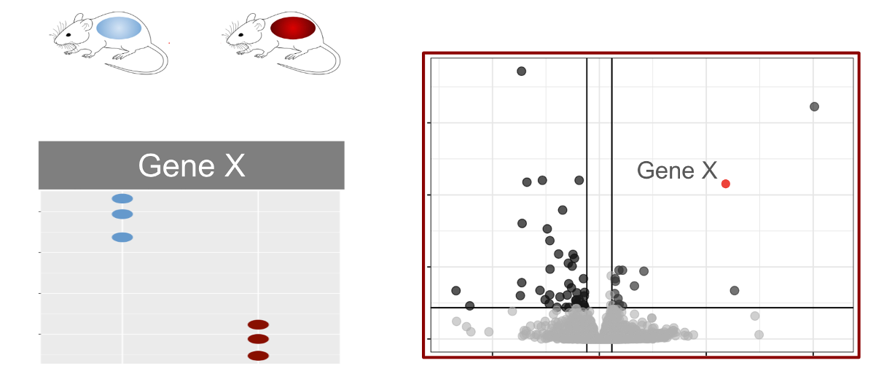
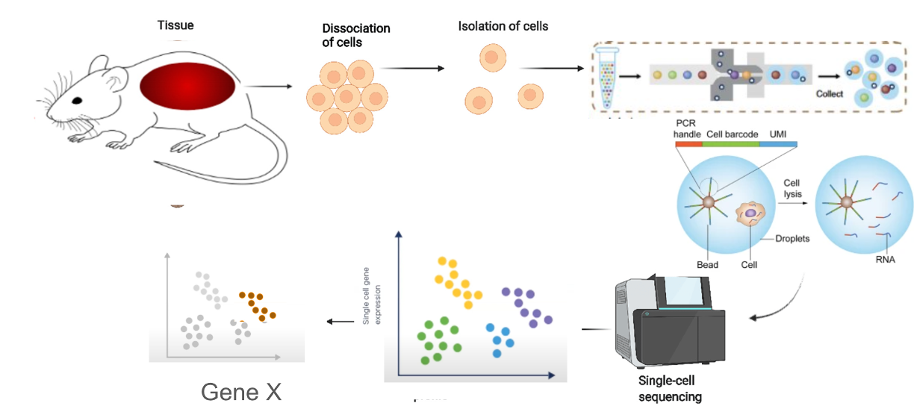
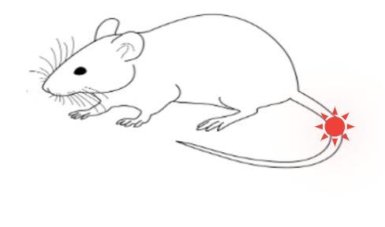
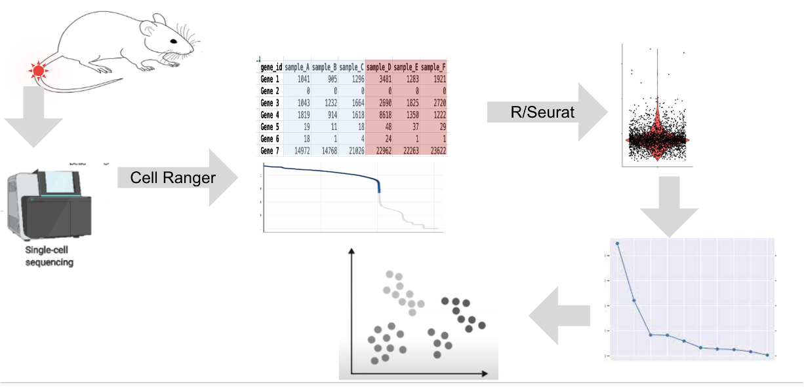

# Objectives

- Compare and contrast the capabilities and approach in scRNA-Seq vs bulk RNA-Seq approaches.
- Review the details of the 10x Genomics approach to single-cell sequencing
- Introduce a specific experimental model to guide discussion and learning
- Outline the high-level steps to analyze scRNA-Seq

## Bulk RNA-seq and scRNA-Seq
Bulk RNA-seq typically involves comparing the expression levels of genes between sets of tissues, such as untreated and treated mice. It allows researchers to characterize gene expression differences across entire tissues, providing a snapshot of the average expression program.

scRNA-seq leverages the approaches and protocols of bulk RNA-seq, but instead at the level of cells instead of tissues/bulk samples. There are several distinct ways to do this, but common steps include

### Key Advantages of Single-Cell RNA-Seq

1. **Cell-Level Insights:** Unlike bulk RNA-seq, single-cell analysis provides insights into expression programs at the individual cell or cell group level.
1. **Heterogeneity Detection:** Single-cell RNA-seq reveals variations in gene expression among different cell types within a tissue.
1. **Response to Interventions:** It enables the examination of cell-level responses to interventions, offering a detailed understanding of how individual cells react to stimuli.
1. **Temporal Analysis:** It allows the study of how cell states change over time and how cells differentiate.

### Challenges of Single-Cell RNA-Seq

While powerful, single-cell RNA-seq comes with added complexity and cost. The protocol requires nuanced decision-making, iterative analysis, and considerations for data storage and computational resources.

## A Practical Example

The blog post concludes with a focus on a specific experiment involving mice that underwent a soft tissue injury. The researchers aim to identify cell types associated with an aberrant injury response using single-cell RNA-seq techniques.

## Workshop Overview

The steps of the workshop, including running cell ranger to transform raw sequence data, generating a count matrix, and performing quality control evaluations. Further steps involve data analysis in RStudio, dimensional reduction to separate signal from noise, and potential projections to visualize cell populations.

Represented Another way:

## A whirlwind intro to 10x Genomics basics

One common microfluidic approach, like the 10X Genomics method, uses beads with unique identifiers. These beads, along with cells, pass through a microfluidic device, creating isolated reaction vessels.

The bead contains oligomers with a PCR handle, a cell barcode, and a unique molecular identifier (UMI). After cell lysis, transcripts are reverse transcribed, incorporating the cell-specific barcode. This enables the association of each transcript with a specific cell. Computational analysis of these barcodes allows the separation of transcripts into constituent cells.

# Conclusion

scRNA-seq offers a powerful and nuanced approach to studying gene expression at the cellular level. This technique can elaborate our understanding of cellular heterogeneity, responses to interventions, and the cell state dynamics.

 
 

| [Back to introduction](workshop_intro.html) | [Top of this lesson](#top) | [Next lesson](00B-CellRangerInAction.html) |
| :--- | :----: | ---: |

