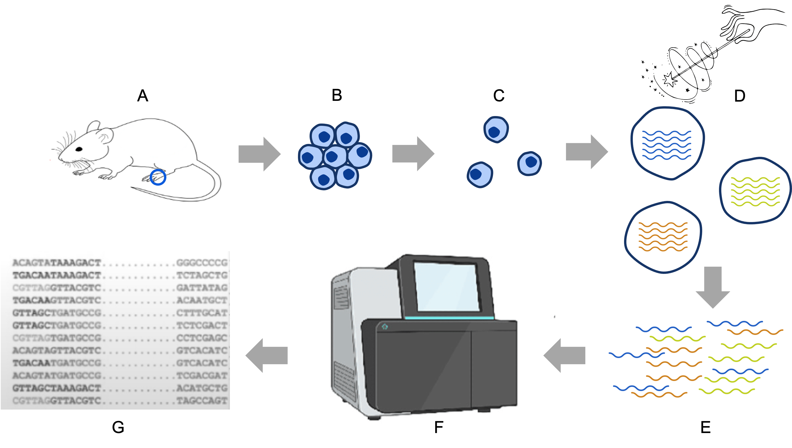
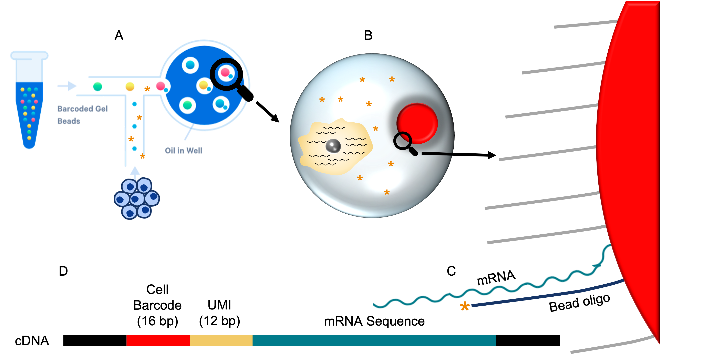

# Workflow Overview {.unlisted .unnumbered}

 

 
 

# Objectives

- List some applications of scRNA-Seq.
- Compare and contrast the capabilities and challenges in scRNA-Seq vs bulk RNA-Seq approaches.
- Introduce a specific experimental model to guide discussion and learning.
- Outline the abstract approach to single-cell sequencing and consider the 10x Genomics platform in more detail.
- Consider common challenges in executing these initial steps.

 
 

# Overview of bulk RNA-seq and scRNA-Seq

Next Generation Sequencing (NGS) enables many powerful experimental designs and
analysis approaches including variant identification, chromatin accessibility, 
gene expression, and more. Before we dive into the complexities of single-cell
RNA-Seq analysis, it's beneficial to review the new perspectives afforded by
a scRNA-Seq single cell approach and helpful to consider scRNA-Seq alongside a
traditional bulk RNA-Seq approach.

<table class='fig'><tr><th class='fig'>Bulk RNA-Seq approach</th></tr>
<tr><td class='fig'></td></tr>
<tr><td class='fig'>
Bulk RNA-seq typically involves comparing the expression levels of genes between
sets of tissues, e.g. untreated and treated mice. This enables researchers to 
characterize distinct expression patterns for a specific gene and also 
expression changes across functionally related genes or pathways. This is 
valuable because it provides an overall snapshot of the average expression 
program across the sample. However, considering the sample a single homogeneous
population of cells can obscure subtle changes or patterns in expression.
</td></tr>
</table>
 
 
<table class='fig'><tr><th class='fig'>Single-cell RNA-Seq approach</th></tr>
<tr><td class='fig'></td></tr>
<tr><td class='fig'>
Instead of looking at the whole forest, that is to say, the average of the gene 
expression in a tissue or a biofluid, single cell illuminates expression for a 
collection of individual cells (i.e. you can now see consider individual trees).
This enables similar perspectives to bulk (e.g. insight into biological 
mechanisms and distinct response to interventions) but also new views informed
by cellular heterogeneity:

1. What kinds of cells are present in this sample? 
1. How does the cell population structure change between groups/conditions?
1. What are the expression patterns between cell types or between groups/conditions?
1. How do cells change over time and how might we affect that development?

</td></tr>
</table>

 
 

# Consider a specific scRNA-Seq experiment

These concepts can be abstract. Acknowledging that the basic concepts are
broadly applicable, it's helpful to ground the conversation in a specific 
scRNA-Seq experiment.

<table class='fig'><tr><th class='fig'>Consider a specific experiment</th></tr>
<tr><td class='fig'></td></tr>
<tr><td class='fig'>
In this workshop we will be focusing on an experiment conducted at UM on a mouse 
model where a soft tissue injury is followed by an aberrant injury response
that generates bone tissue. For more details on this experiment, it's original
analysis and the biology of heterotopic ossification, see the full paper [[1]](#references).

A) A simplified version of the experiment:

1. A sample of mouse tissue is extracted from a healthy mouse.
1. The researcher induces a burn at the sample site.
1. The researchers re-sample tissue from the site at several time points.
1. Each sample undergoes scRNA-Seq prep and analysis.
(This is replicated across four mice.)

B) The scRNA-Seq analysis of this sample can reveal the population of cell types
present and also the gene expression patterns of each cell time over time.

</td></tr>
</table>

 
 

# How scRNA-Seq works

It's also useful to orient on how scRNA-Seq works at an abstract level. There 
are many different platforms and protocols, but many have steps similar to below.

<table class='fig'><tr><th class='fig'>Single cell protocol (from 30k feet)</th></tr>
<tr><td class='fig'></td></tr>
<tr><td class='fig'>

A) Sample tissue (or biofluid) is collected.  
B) Tissue is dissociated into a suspension of **healthy, intact** cells
C) Cells are physically isolated.
D) Cell transcripts converted to cDNA labeled with their cell of origin.
E) cDNAs from all cells is pooled
F) cDNAs undergo library prep and are sequenced
G) The resulting transcript sequences can be partitioned into (putative) cells computationally. 

</td></tr>
</table>

 
 

## 10x Genomics 3' gene expression

It's useful to elaborate how transcripts are labeled with their cell of origin
because this will help us understand how downstream QC and analysis works. The
specifics of the steps depend on the platform and the specific library prep 
protocol. We will focus on the **10x Genomics 3' gene expression** approach[[2]](#references).

<table class='fig'><tr><th class='fig'>A 10x Genomics single cell protocol (from 10k feet)</th></tr>
<tr><td class='fig'></td></tr>
<tr><td class='fig'>

A) 10x Genomics uses microfluidics to combine an isolated cell with a 
manufactured oligo-bead in an aqueous droplet in an oil emulsion. The oil 
isolates each droplet, effectively creating a reaction vessel for each cell-bead 
dyad.
B) Ideally, each droplet contains reaction enzymes (carried in the aqueous 
solution), a single bead and a single healthy, intact cell. The cell is lysed to
release the mRNA transcripts into the droplet.
C) The beads are covered with a lawn of millions of oligos. Each oligo is 
designed to interact with poly-A tailed mRNAs and the enzymes to produce a 
complementary DNA molecule (cDNA).
D) Each cDNA contains:
  - the sequence of an individual mRNA transcript (from the cell)
  - flanking sequence added for downstream library prep
  - a 12bp Unique Molecular Identifier (UMI): the UMIs are unique for each of the
    oligos on the bead ensuring **each UMI represents a single mRNA**.
    (This enables reliable de-duplication following sequencing.)
  - 16 bp barcode sequence: all barcodes are identical for a given bead, so the
    barcode sequence acts as a molecular label for each transcript; 
    **each barcode represent a distinct cell of origin for that mRNA**.
</td></tr>
</table>

 
 

<table class='fig'><tr><th class='fig'>Consider (just) two droplets</th></tr>
<tr><td class='fig'></td></tr>
<tr><td class='fig'>

- Each droplet converts mRNAs into cDNAs that contain the oligo sequence and the 
mRNA sequence.
- Each mRNA sequence will get a distinct UMI, so one UMI = one mRNA.
- For a single droplet, the cell barcodes will all match. Cell barcodes will be 
  distinct across droplets.

</td></tr>
</table>

 
 

<table class='fig'><tr><th class='fig'>From droplets to matrix</th></tr>
<tr><td class='fig'></td></tr>
<tr><td class='fig'>

A) Once mRNA transcripts have been converted to barcode-labeled cDNA the oil
emulsion can be broken and the cDNA molecules are pooled together.
B) cDNA molecules undergo several conventional library prep steps to enable
sequencing.
C) The sequencer calls bases for each sequence. For a large sequencing run, this
might contain many samples, several experiments, and even multiple experiment 
types.
D) The resulting 10x FASTQ files have a specific structure. 
- Read2 represents the mRNA sequence.
- Read1 represents the barcode and UMI
E) Specialized software bins each distinct barcode into a putative cell and
aligns the mRNA sequence against a genome build.
F) Alignments for features (genes) are quantified across all barcodes to create
a feature barcode matrix.
</td></tr>
</table>

 
 

# Common problems and challenges

<table class='fig'><tr><th class='fig'>Some droplets don't work as intended</th></tr>
<tr><td class='fig'></td></tr>
<tr><td class='fig'>

A) Interpreting the sequencing outputs is simplest when each droplet contains a 
single bead and a single healthy cell. The system is optimized for this outcome
and typically the majority of droplets will follow this pattern. However, in 
each run there are always a few complicating edge cases to consider. 
B) Sometimes a droplet contains a bead but no cell. This is actually common but
it's impact is slight because in the absence of mRNA, the enzymes won't produce
cDNA. In effect, the droplet appears empty and is discarded.
C) Sometimes two beads land in the same droplet with a cell. In theory, the 
cells mRNA would appear to come from two droplets (i.e. two cells) each with 
half the expected expression levels. In practice this rarely happens because the
microfluidics are tuned to avoid this.
D) Sometimes two cells join with a single bead in a droplet creating a 
**doublet**. This happens when some of the cells are not fully dissociated from 
each other. In this case, the mRNAs from two cells will receive the same label; 
the expression programs are merged and the overall expected expression is 
roughly doubled.
E) Sometimes the stress of the protocol induces cells to start apoptosis. This 
confounds analysis because the expression programs aren't about the model 
biology but instead artifacts from the experimental platform.
F) Sometimes dissociated cells become so stressed they start to break down in 
the suspension. When that happens, the mRNAs from the popped cell's combine
together in the aqueous flow to create a soup of ambient RNA. This appears as a 
droplet with extremely low expression.
</td></tr>
</table>

 
 

## Contrasting bulk RNA-seq with scRNA-Seq

Bulk and single-cell approaches are fundamentally complementary approaches where
bulk RNA-Seq provides a "forest-level" view while scRNA-Seq shows the individual 
trees. Compared to bulk RNA-Seq, scRNA-Seq provides powerful new perspectives. 
But it isn't without challenges or downsides.

<table class='fig'><tr><th class='fig'>Bulk vs. Single-Cell</th></tr>
<tr><td class='fig'></td></tr>
<tr><td class='fig'>

1. Single-cell is less mature than bulk.
1. Single-cell sample prep is more complex than bulk.
1. Single-cell typically sees only the subset of highly expressed genes.
1. Single cell analysis is typically more complex.
1. Single cell analysis costs more than bulk analysis.

</td></tr>
</table>

 
 

# Summary

- scRNA-seq offers a powerful and nuanced approach to studying gene expression at
the cellular level. This technique can illuminate biological mechanisms of 
healthy tissue or disease as well as extend our understanding of cellular
heterogeneity, responses to interventions, and the cell state dynamics.
- scRNA-Seq experiments are typically more complex and often more expensive than
bulk RNA-Seq.

<table class='fig'><tr><th class='fig'>scRNA-Seq steps in summary</th></tr>
  <tr><td class='fig'></td></tr>
<tr><td class='fig'>

A) A sample of tissue is extracted
B) Tissue is dissociated into a clean suspension of healthy cells
C) A reaction creates a cDNA molecule which combines a barcode label with mRNA sequence. 
D) cDNAs are pooled together, library prep'ed and sequenced
E) Computationally connect all the mRNAs back to a distinct cell of origin
F) Align the mRNA sequences to create a count matrix across all the features and all the cells
G) Bioinformatically separate the healthy cells from the experimental artifacts

The last three steps are complex and also computationally demanding. In 10x 
Genomics experiments, they are typically expedited by the tool **Cell Ranger** which
we cover in detail in the next lesson.

</td></tr>
</table>

 
 

# References

1. Sorkin, Michael et al. **“Regulation of heterotopic ossification by monocytes in a mouse model of aberrant wound healing.”**
   Nature communications vol. 11,1 722. 5 Feb. 2020. 
   [https://pubmed.ncbi.nlm.nih.gov/32024825](https://pubmed.ncbi.nlm.nih.gov/32024825){target="_blank"}
2. [10x Genomics 3' gene expression](https://www.10xgenomics.com/support/single-cell-gene-expression/documentation/steps/experimental-design-and-planning/getting-started-single-cell-3-gene-expression){target="_blank"}
 
 

| [Back to introduction](workshop_intro.html) | [Top of this lesson](#top) | [Next lesson](01-GettingStarted.html) |
| :--- | :----: | ---: |

