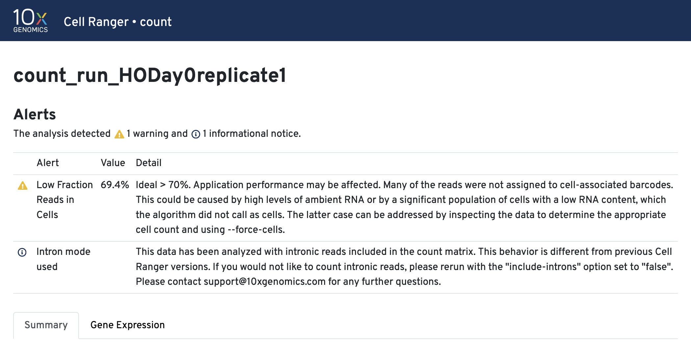

<style type="text/css">

body {
   font-size: 18px;
}
code.r{
  font-size: 12px;
}
pre {
  font-size: 12px
}

table, th, td {
  border: 1px solid black;
  border-collapse: collapse;
  padding: 15px;
}
</style>

# Workflow Overview {.unlisted .unnumbered}

<br/>

<br/>
<br/>

## Objectives
* Understand what Cell Ranger does and also how to run `cellranger count` 
* Describe the key inputs to Cell Ranger.
* Describe the purpose and overall structure of key Cell Ranger outputs.
* Interpret a `cellranger count` web_summary.html report to determine sample
  quality and inform decisions about additional sequencing.
* Understand when you would need to run Cell Ranger and the relevant system
  requirements.
<br/>
<br/>

## Cell Ranger Overview

The initial data processing steps in scRNA-Seq transform sample FASTQ files to 
gene expression counts. Some of these steps are similar to bulk RNA-Seq and some
are distinct. 10x Genomics provides a pipeline tool, Cell Ranger, to expedite
these initial transformations [[1]](#References).

<table>
<tr><th>Cell Ranger inputs and outputs</th></tr>
<tr><td></td></tr>
<tr><td>
Cell Ranger accepts a set of sample FASTQ files and a set of reference files. It 
produces a QC web summary (detailed below), a set of matrix files (also detailed 
below) along with a large collection of supporting files. The matrix files
can be used for downstream analysis in Seurat and other tools.
</td></tr>
</table>

<br/><br/>
<table>
<tr><th>A high level view of Cell Ranger steps</th></tr>
<tr><td></td></tr>
<tr><td>
  A. For each sequence, the barcode and UMI (on read 1) is used to label and bin
  the sequences by their barcodes.<br/>
  B. The transcript sequences are aligned to a genome reference using a modified
  version of the STAR aligner.<br/>
  C. For each transcript that falls in a gene, count the pile-up of sequences 
     aligned to each gene; deduplicate the reads based on UMI. Use these 
     deduplicated counts to build a feature barcode matrix.<br/>
  D. Apply a cell-calling algorithm to distinguish putative cells from background [[3,4]](#References)<br/>
  E. Subset the raw matrix to only putative cells to create the filtered matrix.<br/>
  F. Use information from all previous steps to build a web summary QC report as
  well as basic gene expression clustering visualizations and other supporting
  files.<br/>
</td></tr>
</table>

<br/>
<br/>

## Key inputs 

The basic data package from the UM Advanced Genomics Core includes:

- an **\*.md5** file to validate your data transfer.
- a **DemuxStats_\*.csv** that has some basic metrics about how your samples performed on the sequencer. 
- the **fastq_\*** folder containing the fastq.gz files
- a **README.txt** including details about how your samples were processed.

It looks like the tree below.

```
0000-SR
├── 0000-SR.md5
├── DemuxStats_0000-SR.csv
├── fastqs_0000-SR
│   ├── 0000-SR-1-GEX_S25_R1_001.fastq.gz
│   ├── 0000-SR-1-GEX_S25_R2_001.fastq.gz
│   ├── 0000-SR-2-GEX_S26_R1_001.fastq.gz
│   ├── 0000-SR-2-GEX_S26_R2_001.fastq.gz
│   ├── 0000-SR-3-GEX_S27_R1_001.fastq.gz
│   ├── 0000-SR-3-GEX_S27_R2_001.fastq.gz
│   ├── 0000-SR-4-GEX_S28_R1_001.fastq.gz
│   └── 0000-SR-4-GEX_S28_R2_001.fastq.gz
└── README.txt
```

All you need to run 10x cellranger count are the above 10x sample FASTQ files and the correctly formatted [reference genome files](https://www.10xgenomics.com/support/software/cell-ranger/downloads#reference-downloads){target="_blank"}. 
 
<table><tr><td>**As a researcher, what parts of these outputs should I download and save?**</td></tr>
<tr><td>
1. If we sent it to you, it is probably important for either downstream analysis or
publication of your sequencing data. So we recomend you download **all of it**. 
1. You can verify all of your files are intact using the *.md5 file.
1. Keep these data safe as you are responsible for the storage of your data for 
publication and archival purposes. (Typically sequencing providers will 
regularly delete project data following delivery.)
</td></tr></table>
<br/>
<br/>

## How to run Cell Ranger

Cell Ranger is run from a Linux/Unix command shell [[2]](#References). You can print the usage
statement to see what is needed to build the command: `cellranger count --help`

```
cellranger-count
Count gene expression (targeted or whole-transcriptome) and/or feature barcode reads from a single sample and GEM well
 
USAGE:
    cellranger count [FLAGS] [OPTIONS] --id &lt;ID&gt; --transcriptome &lt;PATH&gt;
     
FLAGS:
          --no-bam                  Do not generate a bam file
          --nosecondary             Disable secondary analysis, e.g. clustering. Optional
          --include-introns         Include intronic reads in count
          --no-libraries            Proceed with processing using a --feature-ref but no Feature Barcode libraries
                                    specified with the &#x27;libraries&#x27; flag
          --no-target-umi-filter    Turn off the target UMI filtering subpipeline. Only applies when --target-panel is
                            used
          --dry                     Do not execute the pipeline. Generate a pipeline invocation (.mro) file and stop
          --disable-ui              Do not serve the web UI
          --noexit                  Keep web UI running after pipestance completes or fails
          --nopreflight             Skip preflight checks
      -h, --help                    Prints help information
  ...
```


To run `cellranger count`, you need to specify:

* **`--id`**. This can be any string less than 64 characters. Cell Ranger
  creates an output directory named for the id string. 
* **`--fastqs`**  path to the directory containing the FASTQ files. 
* **`--sample`** argument to specify which subset of FASTQ files to use 
  (specified sample string should match the beginning of the FASTQ file name). 
* **`--transcriptome`** a path to the reference transcriptome. Typically you
  would download a specific transcript for your organism from [10x Genomics](https://www.10xgenomics.com/support/software/cell-ranger/downloads#reference-downloads){target="_blank"}.

Recall the directory of outputs from the sequencer (from above):

```
0000-SR
├── 0000-SR.md5
├── DemuxStats_0000-SR.csv
├── fastqs_0000-SR
│   ├── 0000-SR-1-GEX_S25_R1_001.fastq.gz
│   ├── 0000-SR-1-GEX_S25_R2_001.fastq.gz
│   ├── 0000-SR-2-GEX_S26_R1_001.fastq.gz
│   ├── 0000-SR-2-GEX_S26_R2_001.fastq.gz
│   ├── 0000-SR-3-GEX_S27_R1_001.fastq.gz
│   ├── 0000-SR-3-GEX_S27_R2_001.fastq.gz
│   ├── 0000-SR-4-GEX_S28_R1_001.fastq.gz
│   └── 0000-SR-4-GEX_S28_R2_001.fastq.gz
└── README.txt
``` 

We can create the `cellranger count` command:

```
cellranger count --id=Sample_0000-SR-1 \
   --fastqs=/nfs/turbo/path/to/0000-SR/0000-SR_fastqs \
   --sample=0000-SR-1\
   --transcriptome=path/to/refereces/cellranger_count/refdata-gex-GRCh38-2020-A`
```

Data from a typical sample can take several hours to complete, so we've 
completed this step for you.


<!-- This content will not appear in the rendered Markdown 
 but we're using a smaller data set that should process quickly.

The `cellranger count` screen output is similar to the following:

```
/mnt/yard/user.name/yard/apps/cellranger-7.2.0/bin
cellranger count (7.2.0)

cellranger count (7.2.0)
Copyright (c) 2021 10x Genomics, Inc.  All rights reserved.
-------------------------------------------------------------------------------

Martian Runtime - v4.0.6
...
2021-10-15 17:12:42 [perform] Serializing pipestance performance data.
Waiting 6 seconds for UI to do final refresh.
Pipestance completed successfully!
```

When the output of the `cellranger count` command says, “Pipestance completed successfully!”, this means the job is done.-->
<br/>
<br/>

## Key outputs

The `cellranger count` pipeline outputs are in the Sample directory in the outs folder (aka `~/ISC_Shell/cellranger_outputs/count_run_HODay0replicate1`).

The output is similar to the following:

```
count_run_HODay0replicate1
├──...
└──outs
	├── analysis 
	├── cloupe.cloupe
	├── filtered_feature_bc_matrix
	├── filtered_feature_bc_matrix.h5
	├── metrics_summary.csv
	├── molecule_info.h5
	├── possorted_genome_bam.bam
	├── possorted_genome_bam.bam.bai
	├── raw_feature_bc_matrix
	├── raw_feature_bc_matrix.h5
	└── web_summary.html
```

10x Genomics provides excellent documentation on all the Cell Ranger [outputs](https://www.10xgenomics.com/support/software/cell-ranger/latest/analysis/outputs/cr-outputs-gex-overview){target="_blank"}. Some of the most important outputs include:

* **web_summary.html** : A comprehensive report that includes quality control 
  information and basic analysis.
* **metrics_summary.csv** : Same data as the web_summary.html but in csv format.
* **raw_feature_bc_matrix**: A set of three files that represent the feature x 
  barcode count table; includes all detected barcodes. (Format details 
  elaborated below.)
* **filtered\_feature\_bc\_matrix** : As above, but filtered to include only
  barcodes that passed Cell Ranger's cell-calling algorithm [[3]](#References).
* **molecule.h5** : An HDF5 (binary) file all containing information for all 
  molecules assigned to a feature/barcode. See references [[6]](#References) for 
  more info on this format. 
* **cloupe file** : Used with the 10x Loupe Browser visualization software.


### Web Summary html report 
It is useful to look at the web_summary.html files to get an idea of how each of your samples performed in the 10x pipeline, epecially if there were errors/wanrings and/or if your research could benefit from additional sequencing. [10x provides a guide to interpreting this report](https://cdn.10xgenomics.com/image/upload/v1660261286/support-documents/CG000329_TechnicalNote_InterpretingCellRangerWebSummaryFiles_RevA.pdf){target="_blank"}.

Let's traverse to the outs directory for sample HODay0replicate1 and open the `web_summary.html`.
**[Example count\_run\_HODay0replicate1 web_summary.html](images/cellranger/HODay0replicate1_web_summary.html)**


The `cellranger count` web summary has errors/warnings at the top of the report (if any) with additional metrics in the `Summary` and `Gene Expression` tabs. 


The important parts of the web_summary.html we look at to determine the quality of the 10x analaysis include:

* **Warnings/Errors**
* **Barcode Rank Plot**
* **Sequencing Saturation Plot**
* Cell count
* reads/cell
* UMI count
* gene count
* mapping to reference

#### Warnings/Errors & remediations. 

[Alerts](https://www.10xgenomics.com/support/software/cell-ranger/latest/resources/cr-troubleshooting#alerts){target="_blank"} are generally the result of factors inherent in library preparation and sequencing or sample quality issues. Alerts do not affect the operation of the pipeline, but highlight potential causes for abnormal or missing data:</p> 

* **`WARNING`** alerts indicate that some parameter is suboptimal.
* **`ERROR`** alerts indicate a major issue.




Intron mode was used. [This helps with cell calling and is on by default.](https://www.10xgenomics.com/support/software/cell-ranger/latest/miscellaneous/cr-intron-mode-rec){target="_blank"}

#### Other alert examples


#### Summary tab

The run summary from `cellranger count` can be viewed by clicking `Summary` in the top left tab of the HTML file. The summary metrics describe sequencing quality and various characteristics of the detected cells.


#### More on the Barcode Rank Plot

 

The [GEX Barcode Rank Plot](https://www.10xgenomics.com/support/software/cell-ranger/latest/advanced/cr-barcode-rank-plot){target="_blank"} under the Cells dashboard is an interactive plot that shows all barcodes detected in an experiment, ranked from highest to lowest UMI count and which barcodes were inferred to be associated with cells. It is useful for understanding Cell Ranger’s cell calling algorithm and its performance on your data, and for providing insights into your sample quality.

Basically, all 10x Barcodes detected during sequencing (~100k) are plotted in decreasing order of the number of UMIs
associated with that particular barcode. The number of UMIs detected in each GEM is then used by Cell Ranger to identify barcodes/GEMs that are likely to contain an intact cell based on the expected cell number and UMI counts. Then distinguish low RNA content cells from empty droplets, since GEMs containing cells are expected to have a greater number of transcripts (and thus UMIs) associated with them than non-cell containing GEMs.  
 
Since barcodes can be associated with cells based on their UMI count or by their RNA profiles, some regions of the graph can contain both cell-associated and background-associated barcodes. 
The color of the graph represents the local density of barcodes that are cell-associated. 

A steep drop-off is indicative of good separation between the cell-associated barcodes and the barcodes associated with empty partitions.

#### Gene Expression tab
The automated secondary analysis results can be viewed by clicking the `Gene Expression` tab in the top left corner. Click the `?` icons next to each section title to display information about the secondary analyses shown in the dashboard.</p>

The t-SNE Projection section shows the data reduced to two dimensions, colored by UMI count (left) or clustering (right). It is a good starting point to explore structure in the data. The projection colored by UMI counts is indicative of the RNA content of the cells and often correlates with cell size - redder points are cells with more RNA in them. For the projection colored by clustering results, select the type of clustering analysis to display from the drop-down button on the upper right (Graph-based by default) - change the category to vary the type of clustering and/or number of clusters (K=2-10) that are assigned to the data.</p>

The Top Features By Cluster table shows which genes are differentially expressed in each cluster relative to all other clusters (Graph-based by default). To find the genes associated with a particular cluster, click the L2FC or p-value column headers associated with a given cluster number to sort the table by a specific cluster</p>


##### The Sequencing Saturation plot
The [Sequecing Saturation](https://kb.10xgenomics.com/hc/en-us/articles/115005062366-What-is-sequencing-saturation){target="_blank"} plot shows the effect of decreased sequencing depth on sequencing saturation, which is a measure of the fraction of library complexity that was observed. The right-most point on the line is the full sequencing depth obtained in this run.</p>

Similarly, the Median Genes per Cell plot shows the effect of decreased sequencing depth on median genes per cell, which is a way of measuring data yield as a function of depth. The right-most point on the line is the full sequencing depth obtained in this run.</p>


**The recommended sequencing saturation is >60%**. If you are below this threshold, you would probably benefit from additional sequencing for increased depth. 

To think of this another way, if you hit 60% saturation, for every additional 100 reads/cell you could expect to see 40 more genes. At 40% saturation you could expect to see 60 additional genes for every additional 100 reads/cell. At 20% saturation you could expect to see 80 additional genes for every additional 100 reads/cell and so on. Therefore if your sequencing saturation is high enough, you are unlikely to gain additional biologically  relevant data with additional sequencing. If your sequecing saturation is low, additional sequencing will improve your downstream analysis and reveal more about the underlying biology.

Assuming the Advanced Genomics Core has your samples it is relatively easy to request additional sequencing through the core. 

<br/>
<br/>

### Feature Barcode Matrices

```
cd ~/ISC_Shell/cellranger_outputs/count_run_HODay0replicate1/outs
tree raw_feature_bc_matrix
raw_feature_bc_matrix
    ├── barcodes.tsv.gz
    ├── features.tsv.gz
    └── matrix.mtx.gz
0 directories, 3 files
```
<table><tr><td>
A) <br/>

B) <br/>

</td></tr><tr><td>
(A) Each element of the feature-barcode matrix is the count of UMIs associated with a feature (row) and a barcode (column). Because the matrix is very sparse, storing the matrix as three individual, compressed files saves siginificant space. [[6]](#References)<br/>
(B) In relation to the Barcode Rank Plot, raw matrices include cells and background and the filtered matrix files only contain data for cells. Downstream analysis typically uses the **filtered** matrix files.
</td></tr>
</table>


<!--
<details>
<summary> Click to see more details about these files.</summary>

##### features.tsv.gz

Features correspond to row indices. For each feature, the feature ID and name are stored in the first and second column of the (unzipped) `features.tsv.gz` file, respectively. The third column identifies the type of feature, which will be one of `Gene Expression`, `Antibody Capture`, `CRISPR Guide Capture`, `Multiplexing Capture`, or `CUSTOM`, depending on the feature type. Below is a minimal example `features.tsv.gz` file showing data collected for three genes.</p>


```
ENSG00000141510       TP53         Gene Expression
ENSG00000012048       BRCA1        Gene Expression
ENSG00000139687       RB1          Gene Expression
```

Gene Expression</code> data, the ID corresponds to <code class="css-q0dnij">gene\_id</code> in the annotation field of the reference GTF. Similarly, the name corresponds to <code class="css-q0dnij">gene\_name</code> in the annotation field of the reference GTF. If no <code class="css-q0dnij">gene_name</code> field is present in the reference GTF, gene name is equivalent to gene ID. 

##### barcodes.tsv.gz

Barcode sequences correspond to column indices:</p>

```
head filtered_feature_bc_matrices/barcodes.tsv.gz

AAACCCAAGGAGAGTA-1      
AAACGCTTCAdvanced Genomics CoreCCAG-1
AAAGAACAGACGACTG-1
AAAGAACCAATGGCAG-1    
AAAGAACGTCTGCAAT-1    
AAAGGATAGTAGACAT-1    
AAAGGATCACCGGCTA-1    
AAAGGATTCAdvanced Genomics CoreTTGA-1    
AAAGGATTCCGTTTCG-1    
AAAGGGCTCATGCCCT-1
```

Each barcode sequence includes a suffix with a dash separator followed by a number:</p>

The matrix file (UMI counts) uses the [Market Exchange Format (MEX)](https://math.nist.gov/MatrixMarket/formats.html){target="_blank"}. It contains gzipped TSV files with feature and barcode sequences corresponding to row and column indices respectively.

<p class="css-d17snu">More details on the barcode sequence format are available in the <a href="/support/software/cell-ranger/latest/analysis/outputs/cr-outputs-bam" class="css-k0f5v edy1dh10" target="_blank" >barcoded BAM section</a>.</p>
</details>
-->
<br/>
<br/>

## Re-running Cell Ranger

It's most common for the sequence provider to run Cell Ranger on your behalf.
Cell Ranger's preliminary QC outputs give the provider key information about whether the
prep and sequencing run worked as expected. With that in mind it's entirely possible you may 
never have to run Cell Ranger yourself. 

There are a few scenarios when you might consider re-running Cell Ranger:

1. You need to combine new samples with previously processed samples and you 
   want all samples to be run through the same version of cell ranger
2. You need to adjust the run parameters (e.g. you want to exclude/include
   introns in the alignment).
3. You need to align against a custom reference ( e.g. one that includes a 
   transgene)

Also, keep in mind that if you or your collaborators have to re-run Cell Ranger
for any reason you will need the original FASTQ files. (**Again, you are 
repsonsible for your data.** Your sequencing provider may not retain a copy and 
even if they do there may be charge and/or delay for reprocessing).


### System Requirements for running Cell Ranger

 


Running Cell Ranger can be challenging because the [system requirements](https://www.10xgenomics.com/support/software/cell-ranger/downloads/cr-system-requirements){target="_blank"} exceed the specifications for a typical personal computer/laptop. In particiular, Cell Ranger pipelines run on Linux systems that meet these minimum requirements:

- 64-bit CentOS/RedHat 7.0 or Ubuntu 14.04
- 8-core Intel or AMD processor (16 cores recommended). 
- 64GB RAM (128GB recommended).  
- 1TB free disk space.  

Note that UM Advanced Genomics Core and Bioinformatics Core use the [Great Lakes Computing cluster](https://arc.umich.edu/greatlakes/){target="_blank"} to run Cell Ranger. If your lab has signed up for the [University of Michigan Research Computing Package (UMRCP)](https://arc.umich.edu/umrcp/){target="_blank"}, you can also get access to the cluster and the available software.

<br/>
<br/>


<br/>
<br/>

## Conclusions

* To run **`cellranger count`** you need a computing cluster, the **`--id`** and **`--fastqs`** for each  **`--sample`**, and the  path to the cellranger formated **`--transcriptome`** reference file.
* The Barcode Rank Plot shows how the software determined what were cells compared to background. The filtered matrix files only contain data for cells on the barcode rank plot, wheras the raw matrices include cells and background. 
* Additional sequencing is suggested if your sequencing saturation is low. 

<br/>
<br/>

## References

1. Sections of this lesson were adapted from 10x training materials. See the
   [10x Genomics support website](https://www.10xgenomics.com/support/software/cell-ranger/latest){target="_blank"}
   for additional information.
2. [10x Genomics Cell Ranger count tutorial](https://www.10xgenomics.com/support/software/cell-ranger/latest/tutorials/cr-tutorial-ct)
3. [10x Genomics cell-calling algorithm](https://www.10xgenomics.com/support/software/cell-ranger/latest/algorithms-overview/cr-gex-algorithm#cell_calling){target="_blank"}
4. [EmptyDrops method](https://genomebiology.biomedcentral.com/articles/10.1186/s13059-019-1662-y){target="_blank"}
5. [Intro to HDF5 format](https://portal.hdfgroup.org/documentation/index.html){target="_blank"}
6. [Detailed explanation of 10x molecule HDF5 format](https://www.10xgenomics.com/support/software/cell-ranger/latest/analysis/outputs/cr-outputs-molecule-info){target="_blank"}
6. [Market Exchange Format (MEX)](https://math.nist.gov/MatrixMarket/formats.html){target="_blank"}. 
