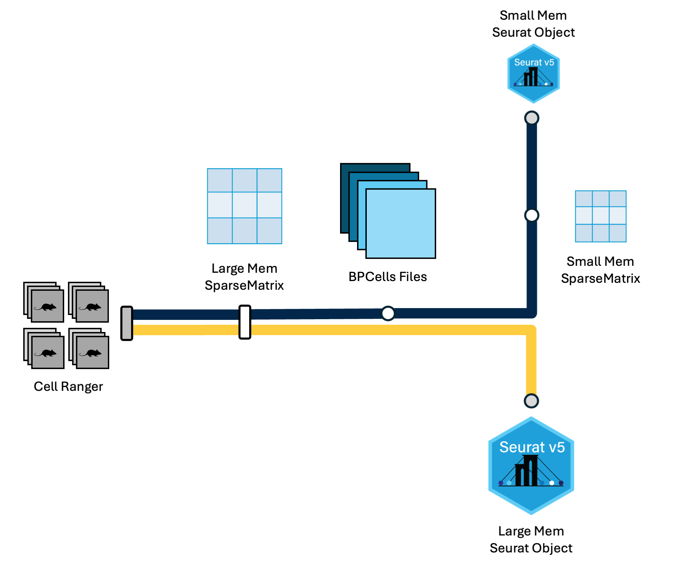

<style type="text/css">
body, td {
   font-size: 18px;
}
code.r{
  font-size: 12px;
}
pre {
  font-size: 12px
}

table{
   width:100%;
}

table.fig, th.fig, td.fig {
  border: 1px solid lightgray;
  border-collapse: collapse;
  padding: 12px;
}

.pro_tip {
  border-radius: 10px;
  padding: 5px 5px 5px 95px;
  background: #EBF7FF left 10px top 10px / 85px no-repeat;
}

.pro_tip_icon {
  background-image: url("images/curriculum/pro-tip.png");
}

</style>

```{r klippy, echo=FALSE, include=TRUE}
klippy::klippy(lang = c("r", "markdown", "bash"), position = c("top", "right"))
```

```{css, echo=FALSE}
.doNotRun {
background-color: CornSilk;
}
```

```{r, include = FALSE}
source("../bin/chunk-options.R")
knitr_fig_path("01-GettingStarted/01-")
```

```{r, include = FALSE}
source("../bin/set_values.R")
```

<br/>

<br/>
<br/>

# Introduction

<table class='fig'><tr><td class='fig'>

</td></tr><tr><td class='fig'>
Cell Ranger outputs can be read into R via the triple of files directly, or via a memory saving route with the BPCells package. We provide code for both routes in this section.
</td></tr></table>
<br/>

## Objectives

- Orient on RStudio.
- Create an RStudio project for analysis.
- Create directory structure for analysis.
- Learn how to read Cell Ranger data into Seurat.
- Introduce the Seurat object, and how to access parts of it.

---

# Server login

Let's log in to the workshop server: [`r workshop_vars$rstudio_server_url`](`r workshop_vars$rstudio_server_url`){target="blank"}

The login page for the server looks like:


Enter your user credentials and click <kbd>Sign In</kbd>. The RStudio interface should load and look like:


**Checkpoint**

# Create a project

We will create an RStudio Project to easily keep track of our working directory. See the [Projects](https://r4ds.hadley.nz/workflow-scripts.html#projects) section of [R for Data Science](https://r4ds.hadley.nz/) for a more in-depth description of what a project is and how it's helpful.

To create a Project, click <kbd>File</kbd> then <kbd>New Project...</kbd>. In the New Project Wizard window that opens, select <kbd>Existing Directory</kbd>, then <kbd>Browse...</kbd>. In the Choose Directory window, select the `ISC_R` folder by clicking it once, and then click the <kbd>Choose</kbd> button. Finally, click <kbd>Create Project</kbd>.

Once we do this, RStudio will restart and the Files pane (lower right) should put us in the `~/ISC_R` folder where there is an `inputs/` folder and an `ISC_R.Rproj` file.

**Checkpoint**

# The RStudio interface

RStudio is an integrated development environment where you can write, execute, and see the results of your code. The interface is arranged in different panes:

- The **Console pane** along the left where you can enter commands and execute them.
- The **Environment pane** in the upper right shows any variables you have created, along with their values.
- The pane in the lower right has a few functions:
    - The **Files tab** let's you navigate the file system.
    - The **Plots tab** displays any plots from code run in the Console.
    - The **Help tab** displays the documentation of functions.

## Commands in the Console

Working directly in the console is working directly with R. Commands can be entered and run with the <KBD>Enter</KBD> key:

~~~
> 2+2
[1] 4
~~~


**Checkpoint**

## Commands in a Script

Instead of entering commands directly into the Console, we'll record them in and run them from a script. Some benefits to using a script rather than using the Console pane:

- Scripts record the steps taken to analyze the data.
- Scripts can be re-run, allowing for reproducibility.
- Scripts are can be shared.

We'll create a script file by clicking on the icon in the upper-left of the interface (a blank piece of paper with a + sign), and selecting <KBD>R Script</KBD>.


 The new pane that opens is the **Source pane**, and you can think of it as a text editor:


Code entered in a script file **must explicitly be sent to the Console for execution** with the <KBD>Ctrl + Enter</KBD> command. Enter the following command into the script file and execute it with <KBD>Ctrl + Enter</KBD>:

~~~
3+2
~~~

Looking in the Console we see the executed line and its result. Note that pressing <KBD>Enter</KBD> in the script creates a new line and does not execute the code as in the Console.


## Console vs Script

The key differences between the Console and Script panes in RStudio:

| Console          | Script            |
|:-----------------|:------------------|
| Reset across sessions | Preserved acros sessions |
| Run with <KBD>Enter</KBD> | Run with <KBD>Ctrl + Enter</KBD> |
| Inconvenient to share    | Convenient to share     |

## Configuring RStudio

All of the panes in RStudio have configuration options. For example, you can minimize/maximize a pane or resize panes by dragging the borders. The most important customization options for pane layout are in the <KBD>View</KBD> menu. Other options such as font sizes, colors/themes, and more are in the <KBD>Tools</KBD> menu under <KBD>Global Options</KBD>.

We can enable soft-wrapping of code by selecting <KBD>Code</KBD> and then <KBD>Soft Wrap Long Lines</KBD>.


# Workshop flow

To accommodate different learning styles and to keep us moving along, we'll provide code in three different ways, and you can get that code into RStudio in corresponding ways:

| Source of Code   | Execution of Code |
|:-----------------|:------------------|
| Zoom screen share            | Type the code yourself.                            |
| Slack            | Copy and paste into RStudio.                  |
| Website          | Copy with code block button and paste into RStudio. |

**Questions?**

# Directory structure

Before we begin, the folder structure of a project organizes all the relevant files. Typically we make directories for the following types of files:

- Raw data, called `data`, `input`, etc,
- Results, often `results` or `output` with subfolders for `tables`, `figures`, and `rdata`, and
- Scripts, often `scripts`.

We've already provided the raw data in the `data/` folder, and it's generally a good idea to keep raw data in its own folder.

Let's create some folders for our analysis scripts and results thereof.

```{r create_structure}
# -------------------------------------------------------------------------
# Create directory structure

dir.create('scripts', recursive = TRUE, showWarnings = FALSE)
dir.create('results/figures', recursive = TRUE, showWarnings = FALSE)
dir.create('results/tables', recursive = TRUE, showWarnings = FALSE)
dir.create('results/rdata', recursive = TRUE, showWarnings = FALSE)
```

# Saving scripts

Let's save our currently open script by clicking <KBD>File</KBD> and then <KBD>Save</KBD>. Double click the `scripts/` folder and enter the file name `ISC_day1.R`.

**Checkpoint**

# Loading libraries

We begin our analysis script by loading the libraries we expect to use. It's generally good practice to include all `library()` calls at the top of a script for visibility.

```{r, load_libraries, warning = FALSE, message = FALSE}
# -------------------------------------------------------------------------
# Load libraries
library(Seurat)
library(BPCells)
library(tidyverse)

options(future.globals.maxSize = 1e9)
```

The libraries that we are loading are:

- The `Seurat` library, developed by the [Satija lab](https://satijalab.org/), which will provide the essential functions used in our single-cell analysis. The [Seurat documentation](https://satijalab.org/seurat/) is extensive and indispensible.
- The `BPCells` library, developed by [Benjamin Parks](https://bnprks.github.io/BPCells/authors.html#citation), is a recent package with the primary goal of efficiently storing single-cell data to reduce its memory footprint. The [BPCells documentation](https://bnprks.github.io/BPCells/index.html) includes many useful tutorials.
- The `tidyverse` library, developed by Posit, is an essential package for data manipulation and plotting. The [tidyverse documentation](https://www.tidyverse.org/) is essential for getting a handle on the array of functions in the many packages contained therein.

# Read in data

The `inputs/10x_cellranger_filtered_triples/` folder is closer to what AGC would generate with Cell Ranger, where each sample has a folder, and within that folder there are three files:

- `barcodes.tsv.gz`
- `features.tsv.gz`
- `matrix.mtx.gz`

Note, these files are filtered matrices, AGC will touch on filtered and unfiltered Cell Ranger outputs.

## Read10X

The `Read10X()` function will read in the triples organized within sample folders:

```{r read10x}
# -------------------------------------------------------------------------
# To load data from 10X Cell Ranger

# Collect the input directories
#   Each sample dir contains barcodes.tsv.gz, features.tsv.gz, matrix.mtx.gz.
#   Naming the sample_dirs vector makes Seurat name the
#     samples in the corresponding manner, which is nice for us.
sample_dirs = list(
  HODay0replicate1  = "~/ISC_R/inputs/10x_cellranger_filtered_triples/count_run_HODay0replicate1", 
  HODay0replicate2  = "~/ISC_R/inputs/10x_cellranger_filtered_triples/count_run_HODay0replicate2",
  HODay0replicate3  = "~/ISC_R/inputs/10x_cellranger_filtered_triples/count_run_HODay0replicate3",
  HODay0replicate4  = "~/ISC_R/inputs/10x_cellranger_filtered_triples/count_run_HODay0replicate4",
  HODay7replicate1  = "~/ISC_R/inputs/10x_cellranger_filtered_triples/count_run_HODay7replicate1",
  HODay7replicate2  = "~/ISC_R/inputs/10x_cellranger_filtered_triples/count_run_HODay7replicate2",
  HODay7replicate3  = "~/ISC_R/inputs/10x_cellranger_filtered_triples/count_run_HODay7replicate3",
  HODay7replicate4  = "~/ISC_R/inputs/10x_cellranger_filtered_triples/count_run_HODay7replicate4",
  HODay21replicate1 = "~/ISC_R/inputs/10x_cellranger_filtered_triples/count_run_HODay21replicate1",
  HODay21replicate2 = "~/ISC_R/inputs/10x_cellranger_filtered_triples/count_run_HODay21replicate2",
  HODay21replicate3 = "~/ISC_R/inputs/10x_cellranger_filtered_triples/count_run_HODay21replicate3",
  HODay21replicate4 = "~/ISC_R/inputs/10x_cellranger_filtered_triples/count_run_HODay21replicate4")

# Create the expression matrix from sample dirs
#   Read10X needs a *vector* instead of a *list*, so we use *unlist* to convert
geo_mat = Read10X(data.dir = unlist(sample_dirs))
```

## Write BPCells

We could create a Seurat object with `CreateSeuratObject(counts = geo_mat)`, but we will first output `geo_mat` using the BPCells package to save memory:

```{r write_bpcells}
# -------------------------------------------------------------------------
# Build BPCells input dir
# To use BPCells (to save some memory), you can transform 
# the expression matrix data structure above into BPCells files.
# BPCells uses these files for processing, but you typically never look at 
# their contents directly
write_matrix_dir(mat = geo_mat, dir = '~/ISC_R/bpcells', overwrite = TRUE)

# -------------------------------------------------------------------------
# Cleanup
# Since we'll now be reading in from BPCells files, we will remove geo_mat
# from the environment and then prompt RStudio to run a "garbage collection"
# to free up unused memory
rm(geo_mat)
gc()
```

## Read BPCells

Let's read the BPCells files in, and note that the `geo_mat` object takes up less memory than when we created it with `Read10X()`:

```{r read_bpcells}
# -------------------------------------------------------------------------
# Create expression matrix and Seurat object from BPCells files
geo_mat = open_matrix_dir(dir = '~/ISC_R/bpcells')
```

## Create a Seurat object

The expression matrix is the precursor to creating the `Seurat` object upon which all our analysis will be done. To create the `Seurat` object:

```{r, create_seurat}
# -------------------------------------------------------------------------
# Create seurat object
geo_so = CreateSeuratObject(counts = geo_mat, min.cells = 1, min.features = 50)
geo_so
```

We have specified some parameters to remove genes and cells which do not contain very much information. Specifically a gene is removed if it is expressed in 1 or fewer cells, and a cell is removed if it contains reads for 50 or fewer genes. In the context of this workshop, this helps us minimize memory usage.

## molecule_info.h5 as an alternative input to Seurat {.unlisted .unnumbered}
<details>
<summary>*H5 (aka HDF5) is an alternative file format*</summary>


Some programs (like Seurat) need only the **barcodes, features, and matrix 
(counts)** and those data are conveniently provided as three separate files for each
sample. Other programs (like Cell Ranger) need to store more information (e.g. 
probe info about certain library preps or the chip or channel that cell ran on).
Instead of adding more files to complement the three base files above, 
10x provides a single binary file, **molecule_info.h5**, which contains *all
information* for all molecules. (Strictly only the molecules with valid 
barcode/UMI assigned to a gene.) 

- molecule_info.h5 is a single file, but with really acts like basket of 
related structures (think tables) for a single sample.
- The ".h5" extension stands for [HDF5](https://www.hdfgroup.org/solutions/hdf5/){target="_blank"},
a broadly adopted, platform agnostic, scalable, high-performance file format for 
storing complex data.
- You can view the data within the .h5 file with special tools 
like [HDF5View](https://www.hdfgroup.org/downloads/hdfview){target="_blank"} 
or [h5dump](https://support.hdfgroup.org/documentation/hdf5/latest/_h5_t_o_o_l__d_p__u_g.html){target="_blank"}.
Here is an excerpt of the structures inside that file:
```
molecule_info.h5
    ├─ barcodes [HDF5 group]
    ├─ count
    ├─ features	[HDF5 group]
    ├─ gem_group
    ├─ library_info
    ├─ metrics_json
    ├─ probes [HDF5 group]
    ├─ ...
    └─ umi
```

You can see the first structures above are barcodes, features, and counts. So 
*if you have the [hdf5 libraries installed](https://github.com/hhoeflin/hdf5r){target="_blank"}*, you can use the .h5 as input to Seurat like so:

```{verbatim, eval=FALSE, class.source="doNotRun"}
# ==========================================================================
### DO NOT RUN ###
# To load data from raw .h5 file
### DO NOT RUN ###

HODay0replicate1 = "~/ISC_Shell/cellranger_outputs/count_run_HODay0replicate1/outs/molecule_info.h5"
get_mat = Read10X_h5(filename = HODay0replicate1)
geo_so = CreateSeuratObject(counts = geo_mat, min.cells = 1, min.features = 50)

```

If you want to load multiple samples from .h5 files, see the function
[Read10X_h5_Multi_Directory](https://samuel-marsh.github.io/scCustomize/reference/Read10X_h5_Multi_Directory.html){target="_blank"} in the [scCustomize](https://samuel-marsh.github.io/scCustomize/index.html){target="_blank"} R library.

FYI

- Be aware, using HDF5 files from R support requires the hdf5 library which entails a 
few more steps to install than a typical library. Brew a nice cup of (decaf) tea
and review how to [install hdf5](https://github.com/hhoeflin/hdf5r){target="_blank"}.
- See the Seurat function [Read10X](https://satijalab.org/seurat/reference/read10x){target="_blank"}.
- See [BPCells](https://satijalab.org/seurat/articles/seurat5_bpcells_interaction_vignette#load-data-from-one-h5-file){target="_blank"} docs for details on loading from h5 to a BPCells directory.
- [10x Genomics](https://www.10xgenomics.com/support/software/cell-ranger/latest/analysis/outputs/cr-outputs-molecule-info){target="_blank"} details the full contents of molecule_info.h5. 
- Checkout the [HDF5 reference docs](https://support.hdfgroup.org/documentation/hdf5/latest/_getting_started.html){target="_blank"} for more information about the HDF5 format.

<hr/>
</details>
<br/>

# Structure of a Seurat object

The `Seurat` object is a complex data type, so let's get a birds eye view with an image from [this tutorial](https://swbioinf.github.io/scRNAseqInR_Doco/seuratobject.html#discussion-the-seurat-object-in-r) on single-cell analysis.


The three main "slots" in the object are:

1. The `assays` slot stores the expression data as `Assay` objects.
2. The `meta.data` slot which stores cell-level information, including technical and phenotypic data.
3. The `reductions` slot stores the results of dimension reduction applied to the `assays`.

There are other slots which store information that becomes relevant as we progress through the analysis. We will highlight the other slots as they come up.

After reading the data in and creating the Seurat object above, we can imagine the following schematic representing our object:


Note the RNA assay contains a `count` layer consisting of a raw count matrix where the rows are genes (features, more generically), and the columns are all cells across all samples. Note also the presence of a `meta.data` table giving information about each cell. We'll pay close attention to this as we proceed. The other slots include information about the `active.assay` and `active.ident` which tell Seurat which expression data to use and how the cells are to be identified.

# Accessing parts of the object

The only slot of the `Seurat` object that we'll typically access or modify by hand--that is, without a function from the `Seurat` package--is the `meta.data` object. In R, slots are accessed with the `@` symbol, as in:

```{r, preview_metadata}
# -------------------------------------------------------------------------
# Examine Seurat object
head(geo_so@meta.data)
```

Here, each row is a cell, and each column is information about that cell. The rows of the table are named according to the uniquely identifiable name for the cell. In this case, the day and replicate, as well as the barcode for that cell. As we continue the workshop, we will check in on the `meta.data` slot and observe changes we want to make, and that other functions will make. We'll also observe the other assays and layers and note their changes.

# Save our progress

Let's Save our progress as an RDS file with `saveRDS()`; this allows us to have a copy of the object that we can read back into our session with the `readRDS()` commmand. Periodically we will be saving our Seurat object so that we can have a version of it at different steps of the analysis. These will also help us get untangled if we get into an odd state.

```{r, save_rds_hidden, echo = FALSE}
if(!file.exists('results/rdata/geo_so_unfiltered.rds')) {
  saveRDS(geo_so, file = 'results/rdata/geo_so_unfiltered.rds')
}
```

```{r, save_rds, eval = FALSE}
# -------------------------------------------------------------------------
# Save the Seurat object
saveRDS(geo_so, file = 'results/rdata/geo_so_unfiltered.rds')
```

Now that the state of our analysis is saved on disk, we'll demonstrate how to power down the RStudio session, restart the session, and re-load the data we just saved. 

1. To power down the session, click the orange power button in the upper right corner of the RStudio window. Note: There is no confirmation dialogue, the session will simply end.
2. Click the "Start New Session" button to restart the RStudio session.
3. Re-load the `geo_so` object with:

```{r, load_rds, eval = FALSE}
# -------------------------------------------------------------------------
# Load libraries
library(Seurat)
library(BPCells)
library(tidyverse)
options(future.globals.maxSize = 1e9)

# -------------------------------------------------------------------------
# Load the Seurat object
geo_so = readRDS('results/rdata/geo_so_unfiltered.rds')
```
<br/>
<br/>

::: {.pro_tip .pro_tip_icon data-latex="{pro_tip}"}
## Pro-tip: RStudio, Seurat, and Memory

```{r, child='memory_management_tips.Rmd'}
```

:::

---

# Summary

<table class='fig'><tr><td class='fig'>

</td></tr><tr><td class='fig'>
Cell Ranger outputs can be read into R via the triple of files directly, or via a memory saving route with the BPCells package. We provide code for both routes in this section.
</td></tr></table>
<br/>

In this section we:

- Created an RStudio project for analysis.
- Created the directory structure for analysis.
- Learned how to read 10X data into Seurat.
- Introduced the Seurat object, and how to access parts of it.
- Learned some tips on managing memory.
- Learned to save our work and also to stop and restart the RStudio session.

----

## References:

- [Seurat documentation](https://satijalab.org/seurat/){target="_blank"}
- [BPCells documentation](https://bnprks.github.io/BPCells/index.html){target="_blank"}
- [tidyverse documentation](https://www.tidyverse.org/){target="_blank"}
- [How R uses memory](https://rdpeng.github.io/RProgDA/the-role-of-physical-memory.html){target="_blank"}
- [Memory monitoring in RStudio](https://support.posit.co/hc/en-us/articles/1500005616261-Understanding-Memory-Usage-in-the-RStudio-IDE){target="_blank"}

**Acknowledgements**
These materials have been adapted and extended from materials listed above. These are open access materials distributed under the terms of the [Creative Commons Attribution license (CC BY 4.0)](http://creativecommons.org/licenses/by/4.0/), which permits unrestricted use, distribution, and reproduction in any medium, provided the original author and source are credited.

<br/>
<br/>

---------------

| [Previous lesson](00A-OrientingOnScRNASeq.html) | [Top of this lesson](#top) | [Next lesson](00B-CellRangerInAction.html) |
| :--- | :----: | ---: |

