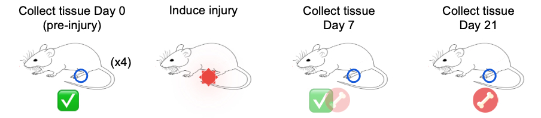

<style type="text/css">
body, td {
   font-size: 18px;
}
code.r{
  font-size: 12px;
}
pre {
  font-size: 12px
}

table{
   width:100%;
}
</style>

```{r klippy, echo=FALSE, include=TRUE}
klippy::klippy(lang = c("r", "markdown", "bash"), position = c("top", "right"))
```

```{r, include = FALSE}
source("../bin/chunk-options.R")
knitr_fig_path("01-GettingStarted/01-")
```

# Workflow Overview {.unlisted .unnumbered}

<br/>

<br/>
<br/>

# Introduction

The field of single-cell expression measurements is still relatively new <!-- add links to early publications & information regarding 10x commercialization --> and therefore  best practices for analysis and standards for publication are continuing to evolve. 

One of the goals of this workshop is to not only provide an example of a start to end single-cell workflow but also explore some of the relatively arbitrary decision points and the rationale for the choices we included in our analysis.

## Sample information

In this workshop, we will be working with single-cell RNA-seq data from mice where the goal is to understand misregulation in wound healing that can lead to bone formation in soft tissue. Of interest are the cell types and genes that are involved in that misregulation. Essentially, "Why might bone form at the injury sight when it shouldn't?"

To investigate this, cells from day 0 (prior to injury), and days 3, 7, and 21 post-injury were subjected to scRNA-seq in quadruplicate for each day. In the interest of computational constraints in this workshop, we have omitted day 3.



## Objectives

- Orient on RStudio.
- Create RStudio project for analysis.
- Create directory structure for analysis.
- Learn how to read 10X data into Seurat.
- Introduce the Seurat object, and how to access parts of it.

---

# Orienting on RStudio

To orient ourselves on the interface of RStudio, look in the lower right pane, that has a list of files and folders. Click on the `welcome.R` script.

There should now be four panes in your RStudio window, with the `welcome.R` script in the upper left pane, this is the "Source" or "Scripts" pane. It displays the code that we will write to perform our analysis.

<!-- Insert screenshot with welcome.R in script pane. -->

In the Scripts pane, there is a line of icons, towards the right side of the pane there is a "Run" button. First highlight all the code in the Source pane, and then click "Run".

<!-- Insert screenshot of the result of running welcome.R -->

**Checkpoint**

A number of things just happened in all the panes:

1. There is a record of the code that was run along with the results in the lower left pane. This is the "Console" panel, and here is where the output of executing code is displayed. You can also type directly in the prompt and execute code, but it is not saved in the script.
2. There is a `phenotypes_by_species` object listed in the upper right pane. This is the "Environment" panel, and it shows all the existing variables in the session, as well as a brief description.
3. There is a plot in the lower right pane where the file structure was previously listed. This is the "Files / Plots / Help" pane, and it can show the file browser that we saw at the start, display plots that are executed in the Console, or display help pages as we'll see later.

# Project setup

To start, we will access our shared RStudio server by opening a web browser to the following URL:

[https://bfx-workshop02.med.umich.edu/](https://bfx-workshop02.med.umich.edu/)

You should now be looking at a page that will allow you to login to the RStudio server:


Enter your user credentials and click <kbd>Sign In</kbd>. Your username and password were provided via email, but if you need help, a helper can retrieve it for you if you ask in Slack. Once logged in, you should now see the RStudio interface:


<!-- consider adding welcome script or example of final goal?-->

## Creating a project

We will create an RStudio Project that will help us keep our files organized. See the [Projects](https://r4ds.hadley.nz/workflow-scripts.html#projects) section of [R for Data Science](https://r4ds.hadley.nz/) for a more in-depth description of what a project is and how it's helpful.

To create a Project for this workshop, click <kbd>File</kbd> then <kbd>New Project...</kbd>. In the New Project Wizard window that opens, select <kbd>Existing Directory</kbd>, then <kbd>Browse...</kbd>. In the Choose Directory window, select the `ISC_R` folder by clicking it once, and then click the <kbd>Choose</kbd> button. Finally, click <kbd>Create Project</kbd>.

Once we do this, RStudio will restart and the Files pane (lower right) should put us in the `~/ISC_R` folder where there is an `inputs/` folder and an `ISC_R.Rproj` file.

## Directory structure

We have included the data to be used in the workshop in the `inputs/` folder. However, the project will need to include folders for our analysis and our analysis scripts. Let's create that directory structure with the `dir.create()` function.

```{r, dir_create}
##### Day 1 - Getting Started with Seurat

# Create project directories ----------------------------------------------
dir.create('scripts', showWarnings = FALSE, recursive = TRUE)
dir.create('results/figures', showWarnings = FALSE, recursive = TRUE)
dir.create('results/tables', showWarnings = FALSE, recursive = TRUE)
dir.create('results/rdata', showWarnings = FALSE, recursive = TRUE)
```

In the Files pane we should see the new `results/` and `scripts/` folders. 

## Analysis script

The two most important artifacts of our analysis are the data from Cell Ranger, and the script to analyze the data. There will be outputs in `results/`, and these will be important, but if the contents of `results/` are ever lost, the script will be able to re-generate them if we've captured all our steps as code, which we aim to do.

To create the analysis script, click <kbd>File</kbd>, hover over <kbd>New File</kbd>, and click on <kbd>R Script</kbd>. A new pane in the upper left slides into view and is the Untitled script file. Save this file, and name it, by clicking <kbd>File</kbd> then <kbd>Save</kbd>. Double click the `scripts/` folder, and in the File name: text box type "analysis.R". Then click <kbd>Save</kbd>.

As we proceed through the workshop, we should save this file (by clicking the Floppy disk, clicking <kbd>File</kbd> then <kbd>Save</kbd>, or by typing <kbd>Control + S</kbd>).

> **Good scripting practices**
> 
> In any analysis script, we recommend using comments (lines preceded by a "#") to provide additional information about code that may not be self-evident. This is to the benefit of others that may look at the code, but also to your future-self.
<br>

# Analysis initialization

We begin our analysis script by loading the libraries we expect to use. It's generally good practice to include all `library()` calls at the top of a script for visibility.

```{r, load_libraries, warning = FALSE, message = FALSE}
# Load libraries  ----------------------------------------------
library(Seurat)
library(BPCells)
library(tidyverse)

options(future.globals.maxSize = 1e9)
```

The libraries that we are loading are:

- The `Seurat` library, developed by the [Satija lab](https://satijalab.org/), which will provide the essential functions used in our single-cell analysis. The [Seurat documentation](https://satijalab.org/seurat/) is extensive and indispensible.
- The `BPCells` library, developed by [Benjamin Parks](https://bnprks.github.io/BPCells/authors.html#citation), is a recent package with the primary goal of efficiently storing single-cell data to reduce its memory footprint. The [BPCells documentation](https://bnprks.github.io/BPCells/index.html) includes many useful tutorials.
- The `tidyverse` library, developed by Posit, is an essential package for data manipulation and plotting. The [tidyverse documentation](https://www.tidyverse.org/) is essential for getting a handle on the array of functions in the many packages contained therein.

# Input data

The `inputs/` folder has the data for the workshop stored in two forms. The first, `inputs/10x_filtered/` is closer to what AGC would generate with Cell Ranger, where each sample has a folder, and within that folder there are three files:

- `barcodes.tsv.gz`
- `features.tsv.gz`
- `matrix.mtx.gz`

Note, we will be using the filtered matrices.

<!-- Were these files explained earlier? If not, briefly explain them here -->

The second, `inputs/10x_mat_filtered/` is the result of the `BPCells` package, and is more machine-readable than human-readable. It is an efficient way of storing the same data contained in the three files above. We will use this form of the input data because it is more memory efficient.

While the full dataset we selected has time-series information from Day 0, Day 3, Day 7, and Day 21, we have removed Day 3 to reduce the memory requirements further.

<!-- Add context for expected 10x outputs and how we would usually start with the "filtered" outputs (and add dropdown or link out to 10x resources to contrast between filtered and raw outputs and use cases for each) -->

# Create a Seurat object

The most recent release of `Seurat`, version 5, includes changes which take advantage of the memory-efficient storage implemented in `BPCells`. To read the efficiently stored data with `BPCells` we will use the `open_matrix_dir()` function.

<!-- Introduce BPCell package and how most recent version of Seurat (Seurat 5) supports more efficient data storage to improve performance and accomodate larger datasets -->

```{r, read_matrix_dir}
# Puts the data "on disk" rather than "in memory"  -------------
geo_mat = open_matrix_dir(dir = 'inputs/10x_mat_filtered')
```

This reads in the expression matrix which has genes as rows and cells as columns. The expression matrix is the precursor to creating the `Seurat` object upon which all our analysis will be done. To create the `Seurat` object:

```{r, create_seurat}
# Create seurat object  ----------------------------------------------
geo_so = CreateSeuratObject(counts = geo_mat, min.cells = 1, min.features = 50)
geo_so
```

We have specified some parameters to remove genes and cells which do not contain very much information. Specifically a gene is removed if it is expressed in 1 or fewer cells, and a cell is removed if it contains reads for 50 or fewer genes. In the context of this workshop, this helps us minimize memory usage.

### Reading in data from scratch
<details>
<summary>*How to read in data and create BPCell matrix*</summary>

Above, we've demonstrated how to read data that was already arranged in the `BPCells` manner. We have done this for the workshop to reduce our memory footprint from the start, but when you get data back from AGC, you will have to follow the steps below.

```{verbatim, eval = FALSE}
# ==========================================================================
### DO NOT RUN ###
# To load data from raw files without BPCells
### DO NOT RUN ###

# Collect the input directories ---------------------------------------
# Each sample dir contains barcodes.tsv.gz, features.tsv.gz, matrix.mtx.gz.
# Naming the sample_dirs vector makes Seurat name the
# samples in the corresponding manner, which is nice for us.

sample_dirs = list(
    HODay0replicate1 = "inputs/10x_analysis/GSM3589975_HODay0replicate1", 
    HODay0replicate2 = "inputs/10x_analysis/GSM3589976_HODay0replicate2",
    HODay0replicate3 = "inputs/10x_analysis/GSM3589977_HODay0replicate3",
    HODay0replicate4 = "inputs/10x_analysis/GSM4141558_HODay0replicate4", 
    HODay7replicate1 = "inputs/10x_analysis/GSM3589981_HODay7replicate1", 
    HODay7replicate2 = "inputs/10x_analysis/GSM3589982_HODay7replicate2", 
    HODay7replicate3 = "inputs/10x_analysis/GSM3589983_HODay7replicate3", 
    HODay7replicate4 = "inputs/10x_analysis/GSM4141559_HODay7replicate4", 
    HODay21replicate1 = "inputs/10x_analysis/GSM3589984_HODay21replicate1", 
    HODay21replicate2 = "inputs/10x_analysis/GSM3589985_HODay21replicate2", 
    HODay21replicate3 = "inputs/10x_analysis/GSM3589986_HODay21replicate3", 
    HODay21replicate4 = "inputs/10x_analysis/GSM4141560_HODay21replicate4")

# Create the expression matrix from sample dirs ----------------------- 
geo_mat = Read10X(data.dir = sample_dirs)

# Create a Seurat object from expression matrix -----------------------
geo_so = CreateSeuratObject(counts = geo_mat, min.cells = 1, min.features = 50)
geo_so

# Save the Seurat object ----------------------------------------------
saveRDS(geo_so, file = 'results/rdata/geo_so_unfiltered.rds')


# Optional: Build BPCells input dir -----------------------------------
# If you *wanted* to use BPCells (to save some memory), you can transform 
# the expression matrix data structure above into BPCells files.
# BPCells uses these files for processing, but you typically never look at 
# their contents directly
write_matrix_dir(mat = geo_mat, dir = 'inputs/10x_mat_filtered')

# What files did that command above create?
as.matrix(list.files('inputs/10x_mat_filtered'))
      [,1]               
 [1,] "col_names"        
 [2,] "idxptr"           
 [3,] "index_data"       
 [4,] "index_idx"        
 [5,] "index_idx_offsets"
 [6,] "index_starts"     
 [7,] "row_names"        
 [8,] "shape"            
 [9,] "storage_order"    
[10,] "val"              
[11,] "version" 


# Create expression matrix and Seurat object from BPCells files ---------
geo_mat = open_matrix_dir(dir = 'inputs/10x_mat_filtered')
geo_so = CreateSeuratObject(counts = geo_mat, min.cells = 1, min.features = 50)
geo_so


# Cleanup ---------------------------------------------------------------
# Since we have a Seurat object, we no longer need the geo_mat matrix.
# We will remove from the environment and then prompt RStudio to run a 
# "garbage collection" to free up unused memory
rm(geo_mat)
gc()

# ========================================================================
```
<hr/>
</details>
<br/>

### molecule_info.h5 as an alternative input to Seurat
<details>
<summary>*H5 (aka HDF5) is an alternative file format*</summary>


Some programs (like Seurat) need only the **barcodes, features, and matrix 
(counts)** and those data are conveniently provided as three separate files for each
sample. Other programs (like Cell Ranger) need to store more information (e.g. 
probe info about certain library preps or the chip or channel that cell ran on).
Instead of adding more files to complement the three base files above, 
10x provides a single binary file, **molecule_info.h5**, which contains *all
information* for all molecules. (Strictly only the molecules with valid 
barcode/UMI assigned to a gene.) 

- molecule_info.h5 is a single file, but with really acts like basket of 
related structures (think tables) for a single sample.
- The ".h5" extension stands for [HDF5](https://www.hdfgroup.org/solutions/hdf5/){target="_blank"},
a broadly adopted, platform agnostic, scalable, high-performance file format for 
storing complex data.
- You can view the data within the .h5 file with special tools 
like [HDF5View](https://www.hdfgroup.org/downloads/hdfview){target="_blank"} 
or [h5dump](https://support.hdfgroup.org/documentation/hdf5/latest/_h5_t_o_o_l__d_p__u_g.html){target="_blank"}.
Here is an excerpt of the structures inside that file:
```
molecule_info.h5
    ├─ barcodes [HDF5 group]
    ├─ count
    ├─ features	[HDF5 group]
    ├─ gem_group
    ├─ library_info
    ├─ metrics_json
    ├─ probes [HDF5 group]
    ├─ ...
    └─ umi
```

You can see the first structures above are barcodes, features, and counts. So 
*if you have the [hdf5 libraries installed](https://github.com/hhoeflin/hdf5r){target="_blank"}*, you can use the .h5 as input to Seurat like so:

```{verbatim, eval=FALSE}
# ==========================================================================
### DO NOT RUN ###
# To load data from raw .h5 file
### DO NOT RUN ###

HODay0replicate1 = "~/ISC_Shell/cellranger_outputs/count_run_HODay0replicate1/outs/molecule_info.h5"
get_mat = Read10X_h5(filename = HODay0replicate1)
geo_so = CreateSeuratObject(counts = geo_mat, min.cells = 1, min.features = 50)

```

If you want to load multiple samples from .h5 files, see the function
[Read10X_h5_Multi_Directory](https://samuel-marsh.github.io/scCustomize/reference/Read10X_h5_Multi_Directory.html){target="_blank"} in the [scCustomize](https://samuel-marsh.github.io/scCustomize/index.html){target="_blank"} R library.

FYI

- Be aware, using HDF5 file=s from R support requires the hdf5 library which entails a 
few more steps to install than a typical library. Brew a nice cup of (decaf) tea
and review how to [install hdf5](https://github.com/hhoeflin/hdf5r){target="_blank"}.
- See the Seurat function [Read10X](https://satijalab.org/seurat/reference/read10x){target="_blank"}.
- See [BPCells](https://satijalab.org/seurat/articles/seurat5_bpcells_interaction_vignette#load-data-from-one-h5-file){target="_blank"} docs for details on loading from h5 to a BPCells directory.
- [10x Genomics](https://www.10xgenomics.com/support/software/cell-ranger/latest/analysis/outputs/cr-outputs-molecule-info){target="_blank"} details the full contents of molecule_info.h5. 
- Checkout the [HDF5 reference docs](https://support.hdfgroup.org/documentation/hdf5/latest/_getting_started.html){target="_blank"} for more information about the HDF5 format.

<hr/>
</details>
<br/>

## Structure of a Seurat object

The `Seurat` object is a complex data type, so let's get a birds eye view with an image from [this tutorial](https://swbioinf.github.io/scRNAseqInR_Doco/seuratobject.html#discussion-the-seurat-object-in-r) on single-cell analysis.


The three main "slots" in the object are:

1. The `assays` slot stores the expression data as `Assay` objects.
2. The `meta.data` slot which stores cell-level information, including technical and phenotypic data.
3. The `reductions` slot stores the results of dimension reduction applied to the `assays`.

There are other slots which store information that becomes relevant as we progress through the analysis. We will highlight the other slots as they come up.

After reading the data in and creating the Seurat object above, we can imagine the following schematic representing our object:


Note the RNA assay contains a `count` layer consisting of a raw count matrix where the rows are genes (features, more generically), and the columns are all cells across all samples. Note also the presence of a `meta.data` table giving information about each cell. We'll pay close attention to this as we proceed. The other slots include information about the `active.assay` and `active.ident` which tell Seurat which expression data to use and how the cells are to be identified.

## Accessing parts of the object

The only slot of the `Seurat` object that we'll typically access or modify by hand--that is, without a function from the `Seurat` package--is the `meta.data` object. In R, slots are accessed with the `@` symbol, as in:

```{r, preview_metadata}
# Examine Seurat object ----------------------------------------------
head(geo_so@meta.data)
```

Here, each row is a cell, and each column is information about that cell. The rows of the table are named according to the uniquely identifiable name for the cell. In this case, the day and replicate, as well as the barcode for that cell. As we continue the workshop, we will check in on the `meta.data` slot and observe changes we want to make, and that other functions will make. We'll also observe the other assays and layers and note their changes.

# Save our progress

Let's Save our progress as an RDS file with `saveRDS()`; this allows us to have a copy of the object that we can read back into our session with the `readRDS()` commmand. Periodically we will be saving our Seurat object so that we can have a version of it at different steps of the analysis. These will also help us get untangled if we get into an odd state.

```{r, save_rds_hidden, echo = FALSE}
if(!file.exists('results/rdata/geo_so_unfiltered.rds')) {
  saveRDS(geo_so, file = 'results/rdata/geo_so_unfiltered.rds')
}
```

```{r, save_rds, eval = FALSE}
# Save the Seurat object ----------------------------------------------
saveRDS(geo_so, file = 'results/rdata/geo_so_unfiltered.rds')
```

# Summary

In this section we:

- Created an RStudio project for analysis.
- Created the directory structure for analysis.
- Learned how to read 10X data into Seurat.
- Introduced the Seurat object, and how to access parts of it.

----

These materials have been adapted and extended from materials listed above. These are open access materials distributed under the terms of the [Creative Commons Attribution license (CC BY 4.0)](http://creativecommons.org/licenses/by/4.0/), which permits unrestricted use, distribution, and reproduction in any medium, provided the original author and source are credited.

<br/>
<br/>

---------------

| [Previous lesson](00A-OrientingOnScRNASeq.html) | [Top of this lesson](#top) | [Next lesson](00B-CellRangerInAction.html) |
| :--- | :----: | ---: |

