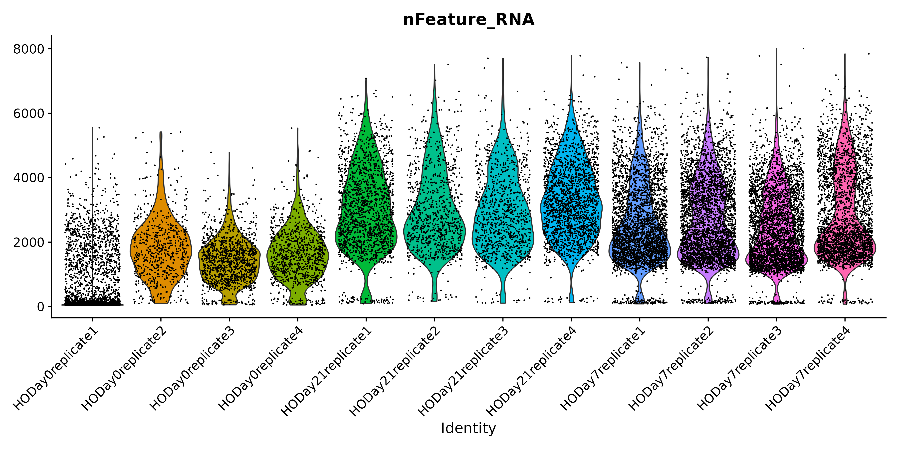
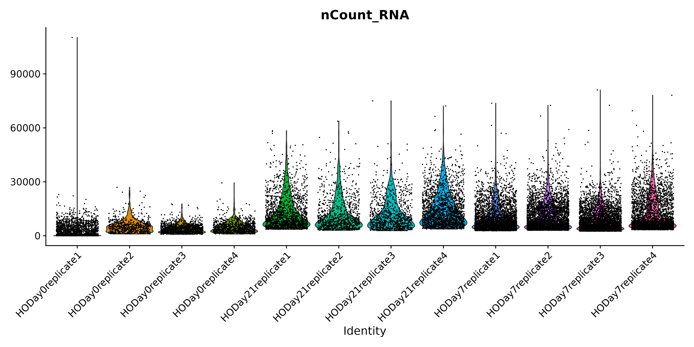
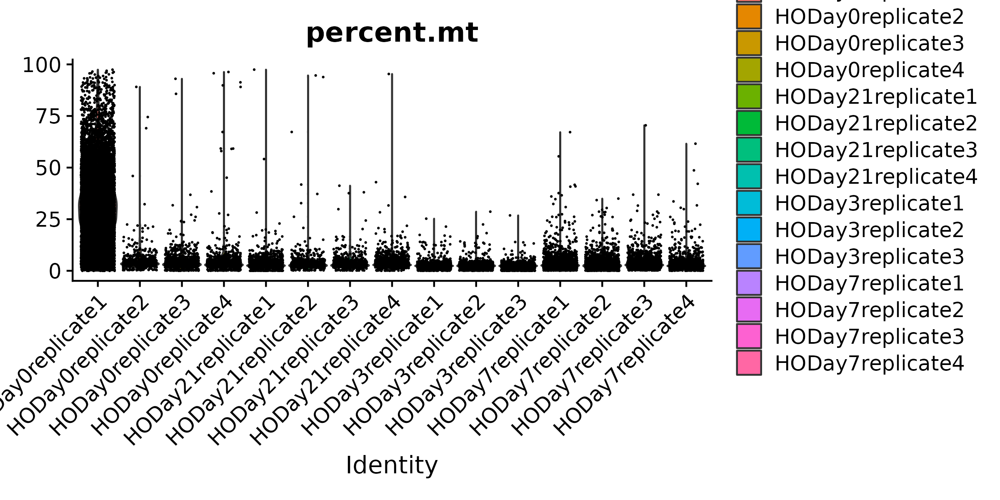

<style type="text/css">
body, td {
   font-size: 18px;
}
code.r{
  font-size: 12px;
}
pre {
  font-size: 12px
}
</style>

```{r, include = FALSE}
source("../bin/chunk-options.R")
knitr_fig_path("02-")
```

# Workflow Overview {.unlisted .unnumbered}

<br/>

<br/>
<br/>

# Introduction

As discussed at the start of the workshop, single-cell experiments using 10x Chromium instrument aim to have droplets with one cell plus one bead. However this is an inherently imperfect process and there are other important considerations like how healthy or intact the cell was at the time of measurement.

In this section, our goal is to use filtering thresholds to remove "cells" that were poorly measured, not cells at all, or included more than one cell.

Similar to many other areas of research, there are often gaps between how single-cell data is presented versus the reality of running an analysis. For example, only the final filtering thresholds might be reported in a paper but our process for choosing those is likely to be more iterative and include some trial and error.

## Objectives

- Discuss QC measures and learn how to calculate and plot them.
- Discuss cell-filtering approaches and apply them to our dataset.

<!-- Challenge for instructors: Every vignette uses different filters, how to harmonize/give guidance? Related, how much to discuss arbitrary cutoffs and continued maturation of field?--> 
<!-- Add links to relevant resources throughout --> 

<!-- General guidance - likely to be moved to earlier section:
- Note with each function call what gets added to the Seurat object.
- Adding checks to ensure object is updated by learners since want to avoid generating copied objects
- Note what layers should be used for what, for example, counts used for FeaturePlots. RNA vs SCT assay. -->

---

# Adding metadata

We're going to alter and add some columns to `meta.data` to ease some downstream analysis and plotting steps. This will often be necessary, as sample names contain combined information about phenotypes. Let's take a look at the first few rows again, to reacquaint ourselves.

```{r, eval = FALSE}
head(geo_so@meta.data)
```
~~~
                                          orig.ident nCount_RNA nFeature_RNA
HODay0replicate1_AAACCTGAGAGAACAG-1 HODay0replicate1      10234         3226
HODay0replicate1_AAACCTGGTCATGCAT-1 HODay0replicate1       3158         1499
HODay0replicate1_AAACCTGTCAGAGCTT-1 HODay0replicate1      13464         4102
HODay0replicate1_AAACGGGAGAGACTTA-1 HODay0replicate1        577          346
HODay0replicate1_AAACGGGAGGCCCGTT-1 HODay0replicate1       1189          629
HODay0replicate1_AAACGGGCAACTGGCC-1 HODay0replicate1       7726         2602
~~~

We can add arbitrary per-cell information to this table such as:

- Summary statistics, such as percent mitochondrial reads for each cell.
- Batch, condition, etc. for each cell.
- Cluster membership for each cell.
- Cell cycle phase for each cell.
- Other custom annotations for each cell.

The first things we'll do is make `orig.ident` a factor in the correct order of the days so that our plots display in chronological order:

```{r, eval = FALSE}
# Make metadata more granular, this is a quality of life thing
orig.ident_levels = apply(
    expand.grid(c('HO'), c('replicate1', 'replicate2', 'replicate3', 'replicate4'), c('Day0','Day7','Day21')), 
    MARGIN = 1, FUN = function(row){paste(row[1], row[3], row[2], sep = '.')})
```

Next, we'll split up the values of `orig.ident` by `.`s so that we can easily extract the day and replicate information. First, we'll make a copy of the `meta.data` data frame so we are free to make mistakes:

```{r, eval = FALSE}
tmp_meta = geo_so@meta.data

tmp_meta$orig.ident = gsub('HO', 'HO.', tmp_meta$orig.ident)
tmp_meta$orig.ident = gsub('rep', '.rep', tmp_meta$orig.ident)

tmp_meta$orig.ident = factor(tmp_meta$orig.ident, levels = orig.ident_levels)
```

Finally, we'll grab the day information and the replicate information. We'll also make the day column adhere to the correct ordering:

```{r, eval = FALSE}
# Add day information
tmp_meta$day = factor(str_split(tmp_meta$orig.ident, pattern = '[.]', simplify = TRUE)[,2], levels = c('Day0', 'Day7', 'Day21'))

# Add replicate column
tmp_meta$replicate = str_split(tmp_meta$orig.ident, pattern = '[.]', simplify = TRUE)[,3]
```

Taking a look at our handiwork:

```{r, eval = FALSE}
head(tmp_meta)
```
~~~
                                            orig.ident nCount_RNA nFeature_RNA  day  replicate
HODay0replicate1_AAACCTGAGAGAACAG-1 HO.Day0.replicate1      10234         3226 Day0 replicate1
HODay0replicate1_AAACCTGGTCATGCAT-1 HO.Day0.replicate1       3158         1499 Day0 replicate1
HODay0replicate1_AAACCTGTCAGAGCTT-1 HO.Day0.replicate1      13464         4102 Day0 replicate1
HODay0replicate1_AAACGGGAGAGACTTA-1 HO.Day0.replicate1        577          346 Day0 replicate1
HODay0replicate1_AAACGGGAGGCCCGTT-1 HO.Day0.replicate1       1189          629 Day0 replicate1
HODay0replicate1_AAACGGGCAACTGGCC-1 HO.Day0.replicate1       7726         2602 Day0 replicate1
~~~

Now that we're satisfied that we have what we want, let's slide this table into `geo_so@meta.data`:

```{r, eval = FALSE}
geo_so@meta.data = tmp_meta
head(geo_so@meta.data)

# Set the Idents(geo_so) to the new orig.ident
Idents(geo_so) = 'orig.ident'
```
~~~
                                            orig.ident nCount_RNA nFeature_RNA  day  replicate
HODay0replicate1_AAACCTGAGAGAACAG-1 HO.Day0.replicate1      10234         3226 Day0 replicate1
HODay0replicate1_AAACCTGGTCATGCAT-1 HO.Day0.replicate1       3158         1499 Day0 replicate1
HODay0replicate1_AAACCTGTCAGAGCTT-1 HO.Day0.replicate1      13464         4102 Day0 replicate1
HODay0replicate1_AAACGGGAGAGACTTA-1 HO.Day0.replicate1        577          346 Day0 replicate1
HODay0replicate1_AAACGGGAGGCCCGTT-1 HO.Day0.replicate1       1189          629 Day0 replicate1
HODay0replicate1_AAACGGGCAACTGGCC-1 HO.Day0.replicate1       7726         2602 Day0 replicate1
~~~

# Quality Metrics

Cell Ranger is a first-pass filter to determine what is a "cell" and what is not. It only considers one sample at a time, and does not consider the cells relative to one another. 

Let's dig deeper to determine when a droplet might contain two cells, a very stressed cell, or some technical issue in the library preparation. We will use three metrics to determine low-quality cells based on their expression profiles ([reference](https://bioconductor.org/books/3.12/OSCA/quality-control.html#choice-of-qc-metrics)).

1. The total number of UMIs detected. Cells with a small number of UMIs detected may indicate loss of RNA during library preparation via cell lysis or inefficient cDNA capture / amplification. Cells with relatively high number of UMIs detected may indicate a doublet.
2. The number of expressed features, defined as number of genes with non-zero counts. Cells with very few measured genes are likely to be of low-quality, and may distort downstream variance estimation or dimension reduction steps.
3. The proportion of reads mapped to the mitochondrial genome. High proportions of mitochondrial transcripts may indicate a damaged cell, the measure of which may also distort downstream analysis steps.

The number of UMIs detected (`nCount`) and number of expressed features (`nFeature`) are already given in the meta data table.

> **Why total UMIs instead of total reads?**
> 
> Since a single-cell inherently contains a limited amount of RNA molecules, a higher amount of PCR amplification is required to generate the final sequencing library.
> 
> Since PCR can skew proportions of initial input materials, specific sequences are included in the initial capture probes called unique molecule identifiers (UMIs). As each initial probe has a different UMI sequence, each RNA captured will be tagged with a different UMI, which allows those initial RNAs and subsequent PCR duplicates to be identified and duplicates collapsed as part of the initial processing by CellRanger.  
>

> **Other meanings of `nFeatures`**
> 
> For other single-cell data types, `nFeatures` would represent what's being measured in that experiment. For single-cell ATAC-seq, `nFeatures` would represents the total number of peaks (e.g. accessible areas of DNA) per cell.
>

## Percent mitochondrial reads

The `PercentageFeatureSet()` function enables us to quickly determine the counts belonging to a subset of the possible features for each cell. Since mitochondrial transcripts in mouse begin with "mt", we will use that pattern to count the percentage of reads coming from mitochondrial transcripts.

```{r, eval = FALSE}
# We use "mt" because this is mouse, depending on the organism, this might need to be changed
geo_so@meta.data$percent.mt = PercentageFeatureSet(geo_so, pattern = '^mt-')

# Alternate way to add this column
geo_so$percent.mt = PercentageFeatureSet(geo_so, pattern = '^mt-')

# Alternate way to add this column
geo_so[['percent.mt']] = PercentageFeatureSet(geo_so, pattern = '^mt-')

# Use summary() to quickly check the range of values
summary(geo_so$percent.mt)
```
~~~
   Min. 1st Qu.  Median    Mean 3rd Qu.    Max. 
  0.000   1.817   2.582   5.281   3.865  98.244
~~~

Just looking at the summary, we can see that there are some cells with a high percentage of mitochondrial reads.

<!-- Matt may have discussed UMIs as part of CellRanger processing and Liv/Tricia may touch on as part of library generation at end of Day 2 -->

# Identifying low-quality cells

To identify low-quality cells, it's helpful to visualize the QC metrics across all cells and samples to understand the the distributions. Let's plot `nFeature_RNA`, `nCount_RNA`, and `percent.mt`. 

## Visualizing QC metrics

A violin plot can help show the distributions of a quantity across multiple samples. Seurat has a built-in function, `VlnPlot()` to quickly generate the plots we seek. As we make our plots, we'll save them to a file so we have them handy outside of R, perhaps to include in a report or to share with collaborators. 

Let's begin with a violin plot of `nFeature_RNA` for only one sample, `HO.Day21.replicate1`:

```{r, eval = FALSE}
VlnPlot(subset(geo_so, orig.ident == 'HO.Day21.replicate1'), features = 'nFeature_RNA', assay = 'RNA', layer = 'counts') + NoLegend()
```


A violin plot is similar to a box plot, but it shows the density of the data at different values. Here the individual points are the cells from `HO.Day21.replicate1` and the y-axis is the value of `nFeature_RNA` for that cell. The violin part of the function is essentially showing the density of the cells at different values of `nFeature_RNA`.

Now let's look at the `nFeature_RNA` violin plot across all the samples.

```{r, eval = FALSE}
VlnPlot(geo_so, features = 'nFeature_RNA', assay = 'RNA', layer = 'counts') + NoLegend()
ggsave(filename = 'results/figures/qc_nFeature_violin.png', width = 12, height = 6, units = 'in')
```



We observe what look like systematic differences between the days. Day 7 appears to have many cells with a low number of genes measured, but also many cells with a higher number of genes measured. Let's continue with the `nCount_RNA` plot.

```{r, eval = FALSE}
VlnPlot(geo_so, features = 'nCount_RNA', assay = 'RNA', layer = 'counts') + NoLegend()
ggsave(filename = 'results/figures/qc_nCount_violin.png', width = 12, height = 6, units = 'in')
```



We observe a similar systematic difference between the days in the total UMI counts per cell, with Day 0 having fewer depth overall. There is an outlier cell in HODay0replicate1, with over 100K unique UMIs detected. This cell is very likely a doublet. Finally, lets plot the `percent.mt`.

```{r, eval = FALSE}
VlnPlot(geo_so, features = 'percent.mt', assay = 'RNA', layer = 'counts') + NoLegend()
ggsave(filename = 'results/figures/qc_mito_violin.png', width = 12, height = 6, units = 'in')
```



We see that most samples have cells with a majority of mitochondrial reads <25%, but many samples have cells with >25%. We'll want to make sure to filter out these cells.

Generally, many tutorials use a cutoff of 5-10% mitochondrial. However, for some experiments high mitochondrial reads would be expected (such as in cases where the condition/treatment or genotype increases cell death), then a relaxed threshold would be necessary to preserve biologically relevant cells. In our case, the cells were collected as part of an injury model, perhaps justifying a more lenient percent mitochondrial read filter.

## Cell counts

It's a good idea to record how many cells we started with in our experiment, and how many cells we have after filtering. So before we discuss filtering further, let's record the number of cells per sample.

```{r, eval = FALSE}
cell_counts_pre_tbl = geo_so@meta.data %>% count(orig.ident, name = 'prefilter_cells')
cell_counts_pre_tbl
```

~~~
            orig.ident prefilter_cells
1   HO.Day0.replicate1            1183
2   HO.Day0.replicate2             689
3   HO.Day0.replicate3            1310
4   HO.Day0.replicate4            1053
5   HO.Day7.replicate1            5765
6   HO.Day7.replicate2            6020
7   HO.Day7.replicate3            6285
8   HO.Day7.replicate4            5166
9  HO.Day21.replicate1            2321
10 HO.Day21.replicate2            1322
11 HO.Day21.replicate3            1275
12 HO.Day21.replicate4            2827
~~~

It appears that Cell Ranger called many more cells in HODay0replicate1 than the other samples. Based on the QC visualization, probably erroneously so.

<!-- Otherwise comment on cell numbers? -->

## Using fixed thresholds

After looking at the plots of `nFeature_RNA`, `nCount_RNA`, and `percent.mt`, we could decide to consider cells with <500 genes per cell, and >25% mitochondrial reads as low-quality, and filter the cells using the `subset()` function. [Sorkin et al.](https://www.ncbi.nlm.nih.gov/pmc/articles/PMC7002453/) chose these thresholds:

> We filtered out cells with less than 500 genes per cell and with more than 25% mitochondrial read content.

We could preview what the resulting cell counts would be with these thresholds:

```{r, eval = FALSE}
subset(geo_so, subset = nFeature_RNA > 500 & percent.mt < 25)@meta.data %>% 
    count(orig.ident, name = 'postfilter_cells')
```

~~~
            orig.ident postfilter_cells
1   HO.Day0.replicate1             1049
2   HO.Day0.replicate2              615
3   HO.Day0.replicate3             1191
4   HO.Day0.replicate4              943
5   HO.Day7.replicate1             4928
6   HO.Day7.replicate2             4932
7   HO.Day7.replicate3             4897
8   HO.Day7.replicate4             4242
9  HO.Day21.replicate1             2000
10 HO.Day21.replicate2             1182
11 HO.Day21.replicate3             1166
12 HO.Day21.replicate4             2470
~~~

## Using adaptive thresholds

For this workshop we will use the above fixed thresholds to match the publication, but another option is to remove low-quality cells adaptively. This approach assumes that most of the cells are of acceptable quality. For more information see the relevant section in Bioconductor's online book: Orchestrating Single-Cell Analysis ([link](https://bioconductor.org/books/3.12/OSCA/quality-control.html#quality-control-outlier)).

# Removing low-quality cells

Let's remove the cells with `nFeature_RNA <= 500` and `percent.mt >= 25`.

```{r, eval = FALSE}
geo_so = subset(geo_so, subset = nFeature_RNA > 500 & percent.mt < 25)
geo_so
```
~~~
An object of class Seurat 
26489 features across 29615 samples within 1 assay 
Active assay: RNA (26489 features, 0 variable features)
 1 layer present: counts
~~~

Note that the `subset()` command uses an expression in terms of the cells we **want to keep**. Now we'll take a look at the cells per sample post-filtering:

```{r, eval = FALSE}
cell_counts_post_tbl = geo_so@meta.data %>% count(orig.ident, name = 'postfilter_cells')
cell_counts_post_tbl
```

~~~
            orig.ident postfilter_cells
1   HO.Day0.replicate1             1049
2   HO.Day0.replicate2              615
3   HO.Day0.replicate3             1191
4   HO.Day0.replicate4              943
5   HO.Day7.replicate1             4928
6   HO.Day7.replicate2             4932
7   HO.Day7.replicate3             4897
8   HO.Day7.replicate4             4242
9  HO.Day21.replicate1             2000
10 HO.Day21.replicate2             1182
11 HO.Day21.replicate3             1166
12 HO.Day21.replicate4             2470
~~~

Looking at the total number of cells per sample is helpful to understand both how the called "cells" compare to what was expected for the experiment. It also allows us to determine the impact of our filtering thresholds. Let's combine the pre and post tables:

```{r, eval = FALSE}
cell_counts_tbl = cell_counts_pre_tbl %>% left_join(cell_counts_post_tbl, by = 'orig.ident')
cell_counts_tbl
```

~~~
            orig.ident prefilter_cells postfilter_cells
1   HO.Day0.replicate1            1183             1049
2   HO.Day0.replicate2             689              615
3   HO.Day0.replicate3            1310             1191
4   HO.Day0.replicate4            1053              943
5   HO.Day7.replicate1            5765             4928
6   HO.Day7.replicate2            6020             4932
7   HO.Day7.replicate3            6285             4897
8   HO.Day7.replicate4            5166             4242
9  HO.Day21.replicate1            2321             2000
10 HO.Day21.replicate2            1322             1182
11 HO.Day21.replicate3            1275             1166
12 HO.Day21.replicate4            2827             2470
~~~

Let's also write this table to a file.

```{r, eval = FALSE}
write_csv(cell_counts_tbl, file = 'results/tables/cell_filtering_counts.csv')
```

<!--What thresholds would we start with based on the plots alone? How does that compare to the thresholds reported in paper?-->

<!--Other “advanced” methods: out of scope for this workshop but there are packages  specifically developed to detect "doublets", e.g. droplets that contained more than one cell, such as DoubleFinder-->

<!--Additional aside - For single-nuclei experiments removing background/ambient RNA with CellBlender OR DecontX is an important additional step since nuclei are both sticky and porous-->

# Save the Seurat object

Let's save this filtered form of our Seurat object. It will also include our changes to the `meta.data`:

```{r, eval = FALSE}
saveRDS(object = geo_so, file = 'results/rdata/geo_so_filtered.rds')
```

# Summary

In this section we:

- Discussed the big three quality metrics: `nFeature`s, `nCount`s, and `percent.mt`.
- Visualized these metrics across cells / samples to help identify low-quality cells.
- Filtered low-quality cells using fixed thresholds.

Next steps: Normalization

----

These materials have been adapted and extended from materials listed above. These are open access materials distributed under the terms of the [Creative Commons Attribution license (CC BY 4.0)](http://creativecommons.org/licenses/by/4.0/), which permits unrestricted use, distribution, and reproduction in any medium, provided the original author and source are credited.

<br/>
<br/>
<hr/>
| [Previous lesson](01-GettingStarted.html) | [Top of this lesson](#top) | [Next lesson](03-Normalization.html) |
| :--- | :----: | ---: |


