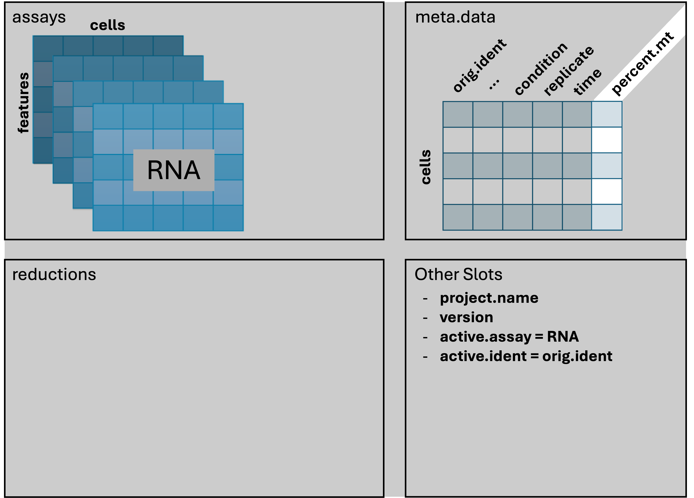

<style type="text/css">
body, td {
   font-size: 18px;
}
code.r{
  font-size: 12px;
}
pre {
  font-size: 12px
}

table.fig, th.fig, td.fig {
  border: 1px solid lightgray;
  border-collapse: collapse;
  padding: 12px;
}

table{
   width:100%;
}

.prepared_content {
  border-radius: 10px;
  padding: 5px 5px 5px 95px;
  background: #FFF8DC left 10px top 10px / 65px no-repeat;
}

.cooking_show {
  background-image: url("images/curriculum/cooking_show-1.png");
}

</style>

```{r klippy, echo=FALSE, include=TRUE}
klippy::klippy(lang = c("r", "markdown", "bash"), position = c("top", "right"))
```

```{r, include = FALSE}
source("../bin/chunk-options.R")
knitr_fig_path("02-QCandFiltering/02-")
library(kableExtra)
```

<br/>

<br/>
<br/>

# Introduction

<br/>
<table class='fig'><tr><td class='fig'>

</td></tr><tr><td class='fig'>
The filtered Cell Ranger barcode feature matrix consists of cells that range in quality. We can use different metrics to visualize and filter to a subset of putative healthy cells to improve downstream analysis.
</td></tr></table>
<br/>

Single-cell experiments using the 10x Chromium instrument are expected to have one cell and one bead in one droplet. However this is an imperfect process and there are other important considerations like how healthy or intact the cell was at the time of measurement. In this section, we will use filtering thresholds to remove "cells" that were poorly measured, aren't actually cells, or had more than one cell.
<br/>
<br/>

## Objectives

- Discuss QC measures and learn how to calculate and plot them.
- Discuss cell-filtering approaches and apply them to our dataset.

Similar to many other areas of research, there are often gaps between how single-cell data is presented versus the reality of running an analysis. For example, only the final filtering thresholds might be reported in a paper but our process for choosing those is likely to be more iterative and include some trial and error.
<br/>
<br/>

<!-- Challenge for instructors: Every vignette uses different filters, how to harmonize/give guidance? Related, how much to discuss arbitrary cutoffs and continued maturation of field?--> 
<!-- Add links to relevant resources throughout --> 

<!-- General guidance - likely to be moved to earlier section:
- Note with each function call what gets added to the Seurat object.
- Adding checks to ensure object is updated by learners since want to avoid generating copied objects
- Note what layers should be used for what, for example, counts used for FeaturePlots. RNA vs SCT assay. -->

---

```{r, read_rds_hidden, echo = FALSE, warning = FALSE, message = FALSE}
if(!exists('geo_so')) {
  library(Seurat)
  library(BPCells)
  library(tidyverse)

  options(future.globals.maxSize = 1e9)

  geo_so = readRDS('results/rdata/geo_so_unfiltered.rds')
}
```

# Adding metadata

We're going to alter and add some columns to `meta.data` to ease some downstream analysis and plotting steps. This will often be necessary, as sample names contain combined information about phenotypes. Let's take a look at the first few rows again, to reacquaint ourselves.

```{r, preview_metadata1A, eval = FALSE}
# =========================================================================
# Secondary QC and filtering
# =========================================================================

# -------------------------------------------------------------------------
# Examine Seurat metdata

# We could do this to show metadata in the console pane:
head(geo_so@meta.data)

# For readability, we'll use View() to open the result in a scrollable tab
View(head(geo_so@meta.data))
```

```{r, preview_metadata1B, warning = FALSE, message = FALSE, echo=FALSE}
head(geo_so@meta.data) %>%
  kable("html") %>%
  kable_styling(font_size = 12,
                bootstrap_options='condensed',
                html_font = '"Arial Narrow", arial, helvetica, sans-serif') %>%
  scroll_box(height='100%', width='1000px')
```
<br/>

We can add arbitrary per-cell information to this table such as:

- Summary statistics, such as percent mitochondrial reads for each cell.
- Batch, condition, etc. for each cell.
- Cluster membership for each cell.
- Cell cycle phase for each cell.
- Other custom annotations for each cell.

<!--- cooking show moment - phenotype table --->
Each sample has a few interesting attributes like "condition", "day", and 
"replicate". The sample attributes are actually part of the directory name for 
each sample:

- Sample directory = count_run_<span style="color:red">HO</span><span style="color:blue">Day0</span><span style="color:green">replicate1</span>
  - <span style="color:red">Condition = HO</span>
  - <span style="color:blue">Day = Day0</span>
  - <span style="color:green">Replicate = 1</span>

We could make a fancy script to pull the file names apart into attributes, but 
instead we'll keep things simple and read the sample attributes from a table in 
the file `phenos.csv`:

::: {.prepared_content .cooking_show data-latex="{cooking_show}"}
**Load a pre-prepared file:**

```{r, read_phenotypes}
# -------------------------------------------------------------------------
# Read sample attributes
# Load the expanded phenotype columns (condition, day, and replicate)
phenos = read.csv('inputs/prepared_data/phenos.csv')
head(phenos, 3)
```

:::

The following code chunk will annotated a copy of the metadata with columns for `day` and `replicate` and ensure that certain categorical data appears in correct order, e.g. Day0, Day7, and Day21 instead of Day0, Day21, and Day7. <!--- updated pheos table to use "time" as column name instead of day to resolve mutate reference error -->

```{r, alter_metadataA, eval = FALSE}
# -------------------------------------------------------------------------
# Make a temp table that joins Seurat loaded metadata with expanded phenotype columns
# Preserve the rownames and order samples based on order in phenos.csv.
tmp_meta = geo_so@meta.data %>% 
  rownames_to_column('tmp_rowname') %>%
  left_join(phenos, by = 'orig.ident') %>%
  mutate(orig.ident = factor(orig.ident, phenos$orig.ident)) %>%
  mutate(time = factor(time, unique(phenos$time))) %>%
  column_to_rownames('tmp_rowname')

View(head(tmp_meta))

```

```{r, alter_metadataB, warning = FALSE, message = FALSE, echo=FALSE}
# Make a temp table that joins Seurat loaded metadata with expanded phenotype columns
# (Also, preserve the rownames and order samples based on order in phenos.csv)
tmp_meta = geo_so@meta.data %>% 
  rownames_to_column('tmp_rowname') %>%
  left_join(phenos, by = 'orig.ident') %>%
  mutate(orig.ident = factor(orig.ident, phenos$orig.ident)) %>%
  mutate(time = factor(time, unique(phenos$time))) %>%
  column_to_rownames('tmp_rowname')

head(tmp_meta) %>%
  kable("html") %>%
  kable_styling(font_size = 12,
                bootstrap_options='condensed',
                html_font = '"Arial Narrow", arial, helvetica, sans-serif') %>%
  scroll_box(height='100%', width='1000px')
```
<br/>


```{r, assign_extended_metadata}
# -------------------------------------------------------------------------
# Assign tmp_meta back to geo_so@meta.data and 
# reset the default identity cell name
geo_so@meta.data = tmp_meta
Idents(geo_so) = 'orig.ident'
```


The `orig.ident` column looks the same, but is now a factor with ordering we prefer. We also have `condition`, `time`, and `replicate` columns that will be useful downstream.

```{r, preview_metadata3A, eval = FALSE}
# -------------------------------------------------------------------------
# Re-examine Seurat metdata
View(head(geo_so@meta.data))
```

```{r, preview_metadata3B, warning = FALSE, message = FALSE, echo=FALSE}
# Re-examine Seurat metdata  -------------------------------------------
head(geo_so@meta.data) %>%
  kable("html") %>%
  kable_styling(font_size = 12,
                bootstrap_options='condensed',
                html_font = '"Arial Narrow", arial, helvetica, sans-serif') %>%
  scroll_box(height='100%', width='1000px')
```
<br/>


# Quality Metrics

Cell Ranger is a first-pass filter to determine what is a "cell" and what is not. It only considers one sample at a time, and does not consider the cells relative to one another. 

Let's dig deeper to determine when a droplet might contain two cells, a very stressed cell, or some technical issue in the library preparation. We will use three metrics to determine low-quality cells based on their expression profiles ([OSCA reference](https://bioconductor.org/books/3.12/OSCA/quality-control.html#choice-of-qc-metrics){target="_blank"}).

1. The total number of UMIs detected. Cells with a small number of UMIs detected may indicate loss of RNA during library preparation via cell lysis or inefficient cDNA capture / amplification. Cells with relatively high number of UMIs detected may indicate a doublet.
2. The number of expressed features, defined as number of genes with non-zero counts. Cells with very few measured genes are likely to be of low-quality, and may distort downstream variance estimation or dimension reduction steps.
3. The proportion of reads mapped to the mitochondrial genome. High proportions of mitochondrial transcripts may indicate a damaged cell, the measure of which may also distort downstream analysis steps.

The number of UMIs detected (`nCount`) and number of expressed features (`nFeature`) are already given in the meta data table. We will demonstrate how to add the mitochondrial fraction shortly.

> **Why total UMIs instead of total reads?**
> 
> Since a single-cell inherently contains a limited amount of RNA molecules, a higher amount of PCR amplification is required to generate the final sequencing library.
> 
> Since PCR can skew proportions of initial input materials, specific sequences are included in the initial capture probes called unique molecule identifiers (UMIs). As each initial probe has a different UMI sequence, each RNA captured will be tagged with a different UMI, which allows those initial RNAs and subsequent PCR duplicates to be identified and duplicates collapsed as part of the initial processing by CellRanger.  
>

> **Other meanings of `nFeatures`**
> 
> For other single-cell data types, `nFeatures` would represent what's being measured in that experiment. For single-cell ATAC-seq, `nFeatures` would represents the total number of peaks (e.g. accessible areas of DNA) per cell.
>

<!-- Matt may have discussed UMIs as part of CellRanger processing and Liv/Tricia may touch on as part of library generation at end of Day 2 -->

## Cell counts

Cell counts per sample (based on the number of unique cellular barcodes detected by Cell Ranger) can indicate if an entire sample was of poor quality. The table below is the number of cells called by Cell Ranger, with the added filter from `CreateSeurateObject()` in the previous lesson: `min.cells = 1, min.features = 50`. Recall, this means a gene is removed if it is expressed in 1 or fewer cells, and a cell is removed if it contains reads for 50 or fewer genes.

```{r, prefilter_cell_counts}
# -------------------------------------------------------------------------
cell_counts_pre_tbl = geo_so@meta.data %>% count(orig.ident, name = 'prefilter_cells')
cell_counts_pre_tbl
```

It appears that the Day 7 samples have systematically more cells than the other days. If you had an idea of how many cells you expected to see per sample, this table can help you check that expectation and determine if a sample failed and should be dropped.

## Visualizing quality metrics

A violin plot shows the distribution of a quantity among the cells in a single sample, or across many samples. Seurat has a built-in function, `VlnPlot()` for this purpose. Let's orient with a violin plot of `nFeature_RNA` for only one sample, `HODay21replicate1`:

```{r, single_violin_plot, echo = FALSE, warning=FALSE, message=FALSE}
VlnPlot(subset(geo_so, orig.ident == 'HODay21replicate1'), features = 'nFeature_RNA', assay = 'RNA', layer = 'counts') + NoLegend()
```

A violin plot is similar to a box plot, but it shows the density of the data at different values. Here the individual points are the cells from `HODay21replicate1` and the y-axis is the value of `nFeature_RNA` for that cell. The violin part of the function is essentially showing the density of the cells at different values of `nFeature_RNA`.

### Genes per cell

Let's look at the `nFeature_RNA` violin plot across all the samples. Again, this is the number of genes detected per cell.

```{r, feature_plot, fig.show = 'hold'}
# -------------------------------------------------------------------------
# Review feature violin plots
VlnPlot(geo_so, features = 'nFeature_RNA', assay = 'RNA', layer = 'counts') + 
  NoLegend() + 
  geom_hline(yintercept = c(500, 400, 300, 200))
ggsave(filename = 'results/figures/qc_nFeature_violin.png',
       width = 12, height = 6, units = 'in')
```

We observe that samples behave similarly within a day, but have different distributions across days. We also note that many cells appear to have a low number of genes detected (< 500).

### UMI counts per cell

Now let's look at `nCount_RNA` plot, the total number of UMIs detected.

```{r, count_plot, fig.show = 'hold'}
# -------------------------------------------------------------------------
# Review count violin plots
# Note: To make it easier to see the distributions, we set the alpha to 0.4;
# this makes opacity of the dots 40% (i.e. 60% transparent).
VlnPlot(geo_so, features = 'nCount_RNA', assay = 'RNA', layer = 'counts', alpha=0.4) + 
  NoLegend()
ggsave(filename = 'results/figures/qc_nCount_violin.png',
       width = 12, height = 6, units = 'in')
```

We observe a similar within-and-across day behavior among the samples. Overall it appears that the Day 0 samples have fewer UMIs detected per cell than Day 7 and Day 21. Also of note is the outlier cell in HO.Day0.replicate1, with around 100K UMIs detected. This cell might be a doublet.

### Percent mitochondrial reads

The `PercentageFeatureSet()` function enables us to quickly determine the counts belonging to a subset of the possible features for each cell. Since mitochondrial transcripts in mouse begin with "mt", we will use that pattern to count the percentage of reads coming from mitochondrial transcripts.

```{r, assign_percent_mt}
# -------------------------------------------------------------------------
# Consider mitochondrial transcripts
# We use "mt" because this is mouse, depending on the organism, this might need to be changed
geo_so$percent.mt = PercentageFeatureSet(geo_so, pattern = '^mt-')

# Use summary() to quickly check the range of values
summary(geo_so$percent.mt)
```

Just looking at the summary, we can see that there are some cells with a high percentage of mitochondrial reads.



Our Seurat object has changed by adding the `percent.mt` column to the meta data.

Finally, we will plot the percent mitochondrial reads, `percent.mt`.

```{r, mito_plot, warning=FALSE, fig.show = 'hold'}
# -------------------------------------------------------------------------
# Review mitochondrial violin plots
VlnPlot(geo_so, features = 'percent.mt', assay = 'RNA', layer = 'counts', alpha=0.3) + 
  NoLegend() + 
  geom_hline(yintercept = c(20, 15, 10))
ggsave(filename = 'results/figures/qc_mito_violin.png',
       width = 12, height = 6, units = 'in')
```

We observe the majority of cells seem to have < 25% mitochondrial reads, but there are many cells with > 25% that we may want to remove.

Generally, many tutorials use a cutoff of 5 - 10% mitochondrial reads. However, for some experiments, high mitochondrial reads would be expected (such as in cases where the condition/treatment or genotype increases cell death). In this case, a relaxed threshold would help preserve biologically relevant cells. In our case, the cells were collected as part of an injury model, perhaps justifying a more lenient percent mitochondrial read filter.

# Filtering approaches

## Fixed thresholds

Fixed thresholds for any combination of `nFeature_RNA`, `nCount_RNA`, and `percent.mt` can be selected to remove low quality cells. In general, selecting very stringent thresholds for each of the metrics may lead to removing informative cells. As per the [HBC training materials](https://hbctraining.github.io/Intro-to-scRNAseq/lessons/04_SC_quality_control.html){target="_blank"}, we recommend setting individual thresholds to err on the permissive side.

[Sorkin et al.](https://www.ncbi.nlm.nih.gov/pmc/articles/PMC7002453/){target="_blank"} chose these thresholds:

> We filtered out cells with less than 500 genes per cell and with more than 25% mitochondrial read content.

In other words, cells with > 500 `nFeature_RNA` and < 25% `percent.mt` were retained by the authors. We could preview what the resulting cell counts would be with these thresholds:

```{r, preview_postfilter_cell_counts}
# -------------------------------------------------------------------------
# Consider excluding suspect cells
subset(geo_so, subset = nFeature_RNA > 500 & percent.mt < 25)@meta.data %>% 
    count(orig.ident, name = 'postfilter_cells')
```

## Adaptive thresholds

For this workshop we will use fixed thresholds, but another option is to remove low-quality cells adaptively. This approach assumes that most of the cells are of acceptable quality. For more information see the relevant section in Bioconductor's online book: [Orchestrating Single-Cell Analysis](https://bioconductor.org/books/3.12/OSCA/quality-control.html#quality-control-outlier){target="_blank"}.

# Removing low-quality cells

We will deviate from the publication slightly and retain the cells with `nFeature_RNA > 300` and `percent.mt < 15`. Noting that the `nFeature_RNA` plot had a gap around 300, and that we want to be more lenient than the usual 5-10% cutoff for mitochondrial reads.

```{r, filter_seurat}
# -------------------------------------------------------------------------
# Filter to exclude suspect cells and assign to new Seurat object
geo_so = subset(geo_so, subset = nFeature_RNA > 300 & percent.mt < 15)
geo_so
```

And let's record the number of cells remaining after filtering:

```{r, postfilter_cell_counts}
# -------------------------------------------------------------------------
# Examine remaining cell counts
cell_counts_post_tbl = geo_so@meta.data %>% count(orig.ident, name = 'postfilter_cells')
cell_counts_post_tbl
```

Let's combine the pre and post tables:

```{r, cell_counts}
# -------------------------------------------------------------------------
# Show cell counts before and after filtering
cell_counts_tbl = cell_counts_pre_tbl %>% left_join(cell_counts_post_tbl, by = 'orig.ident')
cell_counts_tbl
```

We can now easily see how many cells we started with, and how many we retained for downstream analysis. Let's write this table to a file.

```{r, write_cell_counts}
# -------------------------------------------------------------------------
write_csv(cell_counts_tbl, file = 'results/tables/cell_filtering_counts.csv')
```

<!--What thresholds would we start with based on the plots alone? How does that compare to the thresholds reported in paper?-->

<!--Other “advanced” methods: out of scope for this workshop but there are packages  specifically developed to detect "doublets", e.g. droplets that contained more than one cell, such as DoubleFinder-->

<!--Additional aside - For single-nuclei experiments removing background/ambient RNA with CellBlender OR DecontX is an important additional step since nuclei are both sticky and porous-->

# Revising thresholds

It is important to recognize that thresholds for retaining cells are not set in stone. It may happen that the downstream analysis suggests that thresholds should be more or less stringent. In which case, you may experiment with the thresholds and observe the downstream effects.

# Save our progress

Let's save this filtered form of our Seurat object. It will also include our changes to the `meta.data`:

```{r, save_rds_hidden, echo = FALSE}
if(!file.exists('results/rdata/geo_so_filtered.rds')) {
  saveRDS(geo_so, file = 'results/rdata/geo_so_filtered.rds')
}
```

```{r, save_rds, eval = FALSE}
# -------------------------------------------------------------------------
# Save the current Seurat object
saveRDS(geo_so, file = 'results/rdata/geo_so_filtered.rds')
```
<br/>
<br/>

# Summary

<table class='fig'><tr><td class='fig'>

</td></tr><tr><td class='fig'>
The filtered Cell Ranger barcode feature matrix consists of cells that range in quality. We can use different metrics to visualize and filter to a subset of putative healthy cells to improve downstream analysis.
</td></tr></table>
<br/>

In this section we:

- Discussed the big three quality metrics: `nFeature`s, `nCount`s, and `percent.mt`.
- Visualized these metrics across cells / samples to help identify low-quality cells.
- Filtered low-quality cells using fixed thresholds.

Next steps: Normalization

----

These materials have been adapted and extended from materials listed above. These are open access materials distributed under the terms of the [Creative Commons Attribution license (CC BY 4.0)](http://creativecommons.org/licenses/by/4.0/), which permits unrestricted use, distribution, and reproduction in any medium, provided the original author and source are credited.

<br/>
<br/>

-------

| [Previous lesson](00B-CellRangerInAction.html) | [Top of this lesson](#top) | [Next lesson](03-Normalization.html) |
| :--- | :----: | ---: |
