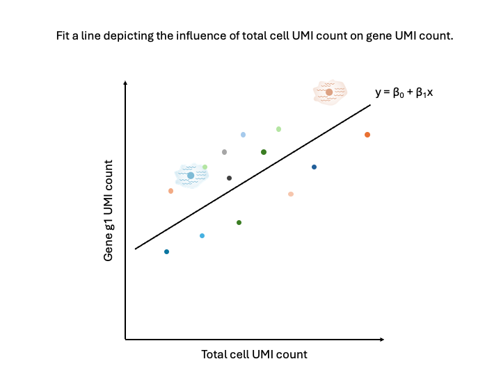

<style type="text/css">
body, td {
   font-size: 18px;
}
code.r{
  font-size: 12px;
}
pre {
  font-size: 12px
}

table.fig, th.fig, td.fig {
  border: 1px solid lightgray;
  border-collapse: collapse;
  padding: 12px;
}
</style>

```{r klippy, include=TRUE, echo=FALSE, message=FALSE, warning=FALSE}
klippy::klippy(lang = c("r", "markdown", "bash"), position = c("top", "right"))
```

```{r, include = FALSE}
source("../bin/chunk-options.R")
knitr_fig_path("03-Normalization/03-")
```

<br/>

<br/>
<br/>

# Introduction 

After removing low-quality cells from the data, the next task is the normalization and variance stabilization of the counts for downstream analysis. 

<br/>
<table class='fig'><tr><td class='fig'>

</td></tr>
<tr class='fig'><td class='fig'>The counts in the feature barcode matrix are a blend of technical and biological effects. Technical effects can distort or mask the biological effects of interest, confounding downstream analyses. Seurat can model the technical effects based on overall patterns in expression across all cells. Once these technical effects are minimized, the remaining signal is primarily due to biological variance.</td></tr>
</table>
<br/>

Variation in scRNA-seq data comes from biological sources:

- Differences in cell type or state
- Differences in response to treatment

And from technical sources:

- Fluctuations in cellular RNA content
- Efficiency in lysis and reverse transcription
- Stochastic sampling during sequencing

A key driver of technical variation is cellular sequencing depth (that is, the number of UMIs sequenced per cell). In the figure below, Sample A (left, red reads) is more deeply sequenced than Sample B (right, green reads). In a test for differential expression, we want to account for the difference in sequencing depth to avoid erroneously calling a gene differentially expressed.

.](images/curriculum/03-Normalization/normalization_depth.png)

## Objectives

- Understand why normalization is needed.
- Describe the essence of the `SCTransform()` method.
- Understand normalization options.
- Normalize the counts with `SCTransform()`.

---

```{r, read_rds_hidden, echo = FALSE, warning = FALSE, message = FALSE}
if(!exists('geo_so')) {
  library(Seurat)
  library(BPCells)
  library(tidyverse)

  options(future.globals.maxSize = 1e9)

  geo_so = readRDS('results/rdata/geo_so_filtered.rds')
}
```

# Normalization

We will use the `SCTransform()` function, which uses a generalized linear model (GLM) framework to account for cell-level sequencing depth while also stabilizing the variance of the counts. Let's get the normalization started, as it takes a little time, and then we can explain what it's doing and why it is an improvement on alternate methods.

## Layers of a Seurat object

The `assays` in a Seurat v5 object store data in "layers". When we first read the data in, we saw there was only one layer in the RNA assay. In order to run `SCTransform()` in Seurat v5, we have to separate the sample-wise data into layers with the following command:

```{r, convert_to_layers}
##### Day 1 - Normalization 

# Separate sample data into layers  ---------------------------------------
geo_so[['RNA']] = split(geo_so[['RNA']], f = geo_so$orig.ident)
geo_so
```

We see the 12 layers containing the count data for each of the samples. Our running schematic has now changed:


Next, run `SCTransform()`:

```{r, normalize, cache = TRUE, cache.lazy = FALSE, warning = FALSE, message = FALSE}
# Normalize the data with SCTransform  ------------------------------------
geo_so = SCTransform(geo_so)
```

## Normalization explained

To get the idea of what `SCTransform()` is doing, we'll consider a simplified example.


Consider two cells that are identical in terms of their type, expression, etc. Imagine that we put them through the microfluidic device and then sequenced the RNA content.


If we were to plot the total cell UMI count against a particular gene UMI count, in an ideal world, the points should be directly on top of each other because the cells had identical expression and everything done to measure that expression went perfectly.


However, we don't live in a perfect world. We will likely observe the cells have different total cell UMI counts as well as different gene UMI counts. This difference, given that the cells were identical, can be attributed to technical factors. For example, efficiency in lysis or in reverse transcription, or the stoachastic sampling that occurs during sequencing.

**It is these technical factors that normalization seeks to correct for, getting us back to the “true” expression state.**


Imagine doing this for thousands of cells. We would get a point cloud like the above. Importantly, that point cloud **has structure**. There is a relationship between the total cell UMI count and the gene UMI count for each gene.



We could fit a line through the point cloud, where we estimate the intercept, the slope, and the error.


The residuals, or the distance from the point to the line, represents the expression of the gene less the total cell UMI count influence.


In other words, the residuals represent the biological variance, and the regression removes the technical variance. Note now that the residuals are the about the same for the two cells.

## Additional details

The full description and justification of the `SCTransform()` function are provided in two excellent papers:

- Hafemeister & Satija, *Normalization and variance stabilization of single-cell RNA-seq data using regularized negative binomial regression*, 2019, Genome Biology ([link](https://genomebiology.biomedcentral.com/articles/10.1186/s13059-019-1874-1#availability-of-data-and-materials))

- Choudhary & Satija, *Comparison and evaluation of statistical error models for scRNA-seq*, 2022, Genome Biology ([link](https://genomebiology.biomedcentral.com/articles/10.1186/s13059-021-02584-9))

A benefit of the this framework for normalization is that the model can include other terms which can account for unwanted technical variation. One example of this is the percent mitochondrial reads (`percent.mt`). The `vars.to.regress` parameter of `SCTransform()` is used for this purpose. See the [documentation](https://satijalab.org/seurat/reference/sctransform) for details.

## Other normalizations

From the Seurat documentation, the `SCTransform()` function "replaces `NormalizeData()`, `ScaleData()`, and `FindVariableFeatures()`". This chain of functions is referred to as the "log-normalization procedure". You may see these three commands in other vignettes, and even in other Seurat vignettes ([source](https://satijalab.org/seurat/articles/sctransform_vignette)). In the two papers referenced above, the authors show how the log-normalization procedure does not always fully account for cell sequencing depth and overdispersion. Therefore, we urge you to use this alternative pipeline with caution.

# Normalization, continued

By now, `SCTransform()` should have finished running, so let's take a look at the result:

```{r, preview_seurat}
# Examine Seurat Object  --------------------------------------------------
geo_so
```

We now observe changes to our running schematic:


Note that we have a new assay, `SCT` which has three layers: `counts`, `data`, and `scale.data`. Also note additional columns in `meta.data` and the change of the `active.assay` to `SCT`. `SCTransform()` has also determined the common variable features across the cells to be used in our downstream analysis. Viewed in our running schematic:

# Save our progress

Let's save this normalized form of our Seurat object.

```{r, save_rds_hidden, echo = FALSE}
if(!file.exists('results/rdata/geo_so_sct_normalized.rds')) {
  saveRDS(geo_so, file = 'results/rdata/geo_so_sct_normalized.rds')
}
```

```{r, save_rds, eval = FALSE}
# Save Seurat object  -----------------------------------------------------
saveRDS(geo_so, file = 'results/rdata/geo_so_sct_normalized.rds')
```

# Summary

In this section we have run the `SCTransform()` function to account for variation in cell sequencing depth and to stabilize the variance of the counts. 

Next steps: PCA and integration

----

These materials have been adapted and extended from materials listed above. These are open access materials distributed under the terms of the [Creative Commons Attribution license (CC BY 4.0)](http://creativecommons.org/licenses/by/4.0/), which permits unrestricted use, distribution, and reproduction in any medium, provided the original author and source are credited.

<br/>
<br/>
<hr/>
| [Previous lesson](02-QCandFiltering.html) | [Top of this lesson](#top) | [Next lesson](04-PCAandIntegration.html) |
| :--- | :----: | ---: |
