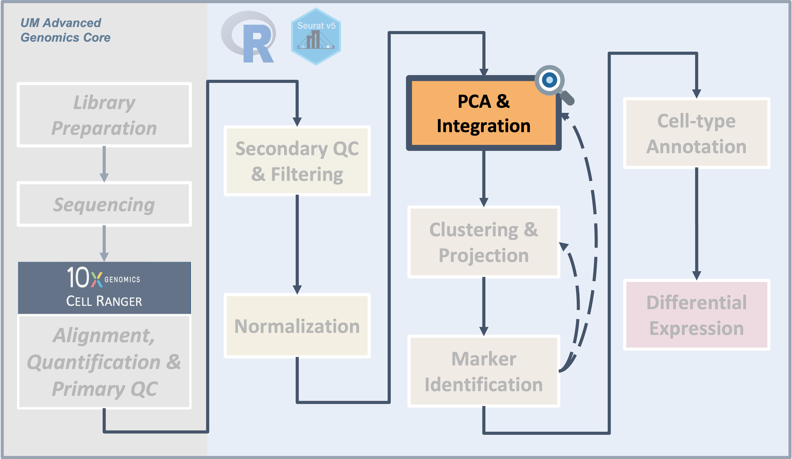
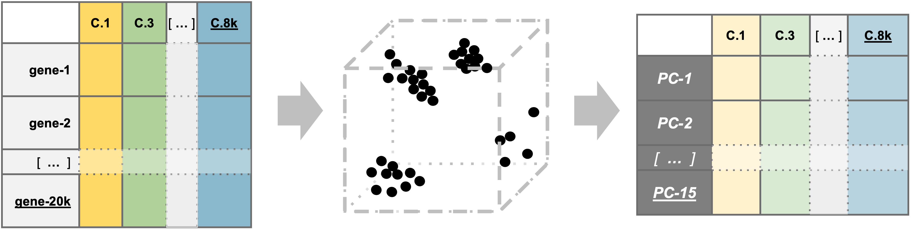
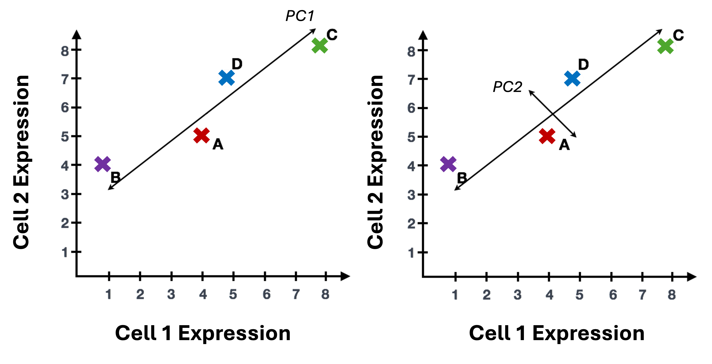

<style type="text/css">
body, td {
   font-size: 18px;
}
code.r{
  font-size: 12px;
}
pre {
  font-size: 12px
}

table.fig, th.fig, td.fig {
  border: 1px solid lightgray;
  border-collapse: collapse;
  padding: 12px;
}

.prepared_content {
  border-radius: 10px;
  padding: 5px 5px 5px 95px;
  background: #FFF8DC left 10px top 10px / 65px no-repeat;
}

.cooking_show {
  background-image: url("images/curriculum/cooking_show-1.png");
}
</style>

```{r klippy, echo=FALSE, include=TRUE}
klippy::klippy(lang = c("r", "markdown", "bash"), position = c("top", "right"))
```


```{css, echo=FALSE}
.doNotRun {
background-color: CornSilk;
}
```

```{r, include = FALSE}
source("../bin/chunk-options.R")
knitr_fig_path("04-PCAandIntegration/04-")
```

<br/>

<br/>
<br/>

# Introduction 

<br/>
<table class='fig'><tr><td class='fig'>

</td></tr><tr><td class='fig'>Starting with filtered, normalized data [gene x cell] for all samples - principal component analysis (PCA) can be used to reduce the dimensionality while still representing the overall gene expression patterns for each cell
</td></tr></table>
<br/>

After filtering and normalization, our next goal is to cluster the cells according to their expression profiles. However, even after filtering, we expect to still have several thousand cells assayed with approximately 21,000 genes measured per cell. This means that we are working very "high-dimensional" data that presents some challenges. 
<br/>

## Objectives

- Understand why PCA is used prior to integration and clustering for single-cell data   
- Use the `RunPCA()` function to generate principal components for our data    
- Choose an appropriate number of principal components to represent our data   
- Use `IntegrateLayers()` to integrate our sample data prior to clustering   

<br/>

Similar to the previous sections, while you may see only a single approach in a paper and we will be showing one example of executing these steps here, testing multiple methods or parameters might be necessary. 

<br/>

---

```{r, read_rds_hidden, echo = FALSE, warning = FALSE, message = FALSE}
primed = FALSE
if(exists('geo_so')) {
  primed = 'scale.data' %in% Layers(geo_so)
}
if (!primed) { 
  library(Seurat)
  library(BPCells)
  library(tidyverse)

  options(future.globals.maxSize = 1e9)

  geo_so = readRDS('results/rdata/geo_so_sct_normalized.rds')
}
```


<!--Before this section - Day 1: Starting w/ Seurat, Initial QC, & Batch correction (SCtransform)-->

<!--Instruction Note: Using integrated data here and will compare to unintegrated results in next section, similar to  [here](https://bmcbioinformatics.biomedcentral.com/articles/10.1186/s12859-021-03957-4)?-->


# What is PCA?

<!--- Give some context and background on PCA
- What is PCA
- Why do we use it 
--->

<!--- add PCA illustration here? --->
The high dimensionality of single-cell data present two major challenges for analysis:

- The scale makes analysis steps costly and slow     
- The sparseness means there is likely uninteresting variation that should be excluded    


In practical terms, Principal component analysis (PCA) creates a simpler, more concise version of data while preserving the same "story". For example, we can think of watching football - attending a game in person is exciting but can take hours, especially considering the time that will be spent traveling and waiting. Conversely, watching a highlight reel of those same game might not give you the full experience, but by seeing the key plays you can get a good understand what happened in the game in a fraction of the time. 

Similarly to a highlight reel, running PCA allows us to select PCs that represent correlated gene expression to reduce the size and complexity of the data while still capturing the overall expression patterns and also reducing computation time.


### PCA example

To understand how PCA works for single-cell data, we can consider a smaller dataset measuring the expression of four genes measured in just two cells and plot the expression of those four genes, with data from one cell plotted on the x-axis and the second cell plotted on the y-axis.


If we wanted to represent the most variation across the data, we would draw a diagonal line between gene B and gene C - this would represent the first principal component (PC). However, this line doesn't capture all the variance in this data as the genes also vary above and below the line, so we could draw another line (at a right angle to the first) representing the second most variation in the data - which would represent the second PC. 



<!--- <Consider moving to dropdown and adding figure to show loadings> However, as we can see in the example below, genes near the end of each line are those with the greatest influence on the direction and length of the PC.-->


We won't illustrate the process of generating all possible PCs, but running PCA on our data will result in a score for each cell for each PC and each gene will have a weight or loading for a given PC. By definition, the PCs capture the greatest factors of heterogeneity in decreasing order in the data set [(source)](https://bioconductor.org/books/3.13/OSCA.basic/dimensionality-reduction.html#principal-components-analysis).

## Why PCA is useful for single-cell data

In contrast to bulk RNA-seq, where the majority of the variance is usually explained by the first and second PC, for single-cell data we expect that many more PCs are contributing to the overall variance. 


### Sparsity in single-cell data

In addition to being "high-dimensional", we expect the data to be both "sparse" and "noisy". Sparse in the sense that many genes will either not be expressed or not measured in many of the cells and have zero values. Noisy due to biological variability and technical variability due to the practical limitations of both capture and sequencing depth [(source)](https://ouyanglab.com/singlecell/basic.html#a-gentle-introduction-to-dr).

> *Note on zero "inflation" of single-cell data*
>
> Single-cell data is sometimes described as "zero inflated", however work by [Svensson](https://www.biorxiv.org/content/10.1101/582064v1.full) has challenged that characterization and argued that the higher number of zeros observed in scRNA-seq compared to bulk RNA-seq is more likely due to biological variance and lower sequencing saturation than technical artifacts. Work by [Choi et al. (2020)](https://genomebiology.biomedcentral.com/articles/10.1186/s13059-020-02103-2) support that zeros in single-cell data are due to biology but [Jiang et al. (2022)](https://www.ncbi.nlm.nih.gov/pmc/articles/PMC8783472/) delves more into the "controversy" zero inflation, including common approaches for handling zeros and the downstream impacts.

For sparse, high-dimensional, _biological_ data, we expect many genes to have correlated expression as they would be impacted by the same biological process while other genes to have either low (more noisy) or have similar expression and therefore are not as important for identifying cell-type/subtypes. So we can use the top several PCs to approximate the full data set for the purpose of ([source](https://bioconductor.org/books/3.12/OSCA/dimensionality-reduction.html#principal-components-analysis)).


<details>
    <summary>*More detail on dimensionality reduction *</summary>
    The [Ouyang Lab has a "gentle introduction" section of their materials](https://ouyanglab.com/singlecell/basic.html#a-gentle-introduction-to-dr) that goes into greater details on dimensionality reduction including how similar strategies are used in deep learning models. Additionaly, the OSCA book has a [chapter on Dimensionality reduction](https://bioconductor.org/books/3.15/OSCA.basic/dimensionality-reduction.html) that has useful context. 
</details>
<br>
<br>

> #### More context using PCA for single-cell data {.unlisted .unnumbered}
>
> To read more on PCA, please refer to the [HBC - Theory of PCA content](https://hbctraining.github.io/Intro-to-scRNAseq/lessons/05_theory_of_PCA.html), from which this section is adapted and the original source material for that content, specifically [Josh Starmer's StatQuest video](https://www.youtube.com/watch?v=_UVHneBUBW0).
>
> For additional detail on , the OSCA chapter on [Principal components analysis](https://bioconductor.org/books/3.15/OSCA.basic/dimensionality-reduction.html) includes a more descriptive overview.


<br>

# Run PCA on our dataset    

<!--- Add introduction to function, including link to documentation --->

Since PCA is sensitive to scale, we will use the SCT normalized assay ([reference](https://ouyanglab.com/singlecell/basic.html#pca-principal-component-analysis)). We will name the reduction in an informative way to keep them clear for us in the future. In this case, our data has not yet been integrated, but it has been SCT normalized. So we will name the reduction `unintegrated.sct.pca`. Note that `SCTTransform()` returned a set of highly variable genes, and the `RunPCA()` function will use this subset to determine the PCs and genes associated with those PCs.


```{r, run_pca, warning = FALSE, message = FALSE}
# =========================================================================
# PCA and Integration
# =========================================================================

# Build a PCA and add it to the Seurat object
geo_so = RunPCA(geo_so, reduction.name = 'unintegrated.sct.pca')
geo_so
```

After running the command in the console, we should see that `geo_so` has a new reduction added to that slot in the Seurat object as shown in the schematic:


We can then visualize the first several PCs using the `DimHeatmp()` function, which orders both cells and features (genes) according to their PCA scores and allows us to see some general patterns in the data. Here we will specify that the first 24 PCs be included in the figure and that 500 cells are randomly subsetted for the plot. _Note - you may need to increase your plot window size to resolve errors regarding figure margins._  <!-- revise to be hidden executed block plus shown non-executed block to ensure displayed code is a single block instead of being split up -->


```{r, pca_heatmap_one, message = FALSE, eval = FALSE}
# -------------------------------------------------------------------------
# look at first PC alone first
heatmap_1 <- DimHeatmap(geo_so, dims=1, cells=500, balanced=TRUE, fast = FALSE, reduction = 'unintegrated.sct.pca') # doesn't include which PC(s) are included in plot
heatmap_1 + 
  labs(title="PC1: top 30 genes x top 500 cells") + 
  theme(plot.title = element_text(hjust = 0.5, face = "bold")) 

# save to file
ggsave(filename = 'results/figures/qc_pca_heatmap-pc1.png',
       width = 6, height = 4.5, units = 'in')
```

```{r, pca_heatmap_one_hidden, message = FALSE, echo = FALSE, out.width='50%', fig.cap='DimHeatmap for PC1 alone'}
# -------------------------------------------------------------------------
# look at first PC alone first
heatmap_1 <- DimHeatmap(geo_so, dims=1, cells=500, balanced=TRUE, fast = FALSE, reduction = 'unintegrated.sct.pca') # works but doesn't include PC numbers
heatmap_1 + 
  labs(title="PC1: top 30 genes x top 500 cells") + 
  theme(plot.title = element_text(hjust = 0.5, face = "bold")) 

# save to file
ggsave(filename = 'results/figures/qc_pca_heatmap-pc1.png',
       width = 6, height = 4.5, units = 'in')
```


In the plot of just the first PC, we see the rows are labeled with gene names and PC scores plotted with positive values in yellow, negative values in purple, and zero in black [by default](https://davetang.org/muse/2017/08/01/getting-started-seurat/), with each column representing a cell. Note that by using `fast=FALSE` our output is a `ggplot` object, which allows for customization like adding a more informative, formatted title. 

What about the other PCs that have been calculated for these data? We can look at additional dimensions using the same `DimHeatmap()` function. However, we'll use the default plotting where `fast=TRUE` so base plotting will be used instead of `ggplot`. <!-- revise to be hidden executed block plus shown non-executed block to ensure displayed code is a single block instead of being split up -->

```{r, pca_heatmap_18, message = FALSE, eval = FALSE}
#  -------------------------------------------------------
# plot cell by gene heatmaps for larger set of dimensions
DimHeatmap(geo_so, dims=1:18, cells=500, balanced=TRUE, combine = FALSE, reduction = 'unintegrated.sct.pca')

# need to use png() to write to file because this isn't a ggplot
png(filename = 'results/figures/qc_pca_heatmap-pc1-18.png', width = 12, height = 30, units = 'in', res = 300)
  DimHeatmap(geo_so, dims=1:18, cells=500, balanced=TRUE, reduction = 'unintegrated.sct.pca')
dev.off()
```

```{r, pca_heatmap_18_hidden, message = FALSE, echo = FALSE, out.width='50%', fig.cap='DimHeatmap for PC1 alone'}
#  -------------------------------------------------------
# plot cell by gene heatmaps for larger set of dimensions
DimHeatmap(geo_so, dims=1:18, cells=500, balanced=TRUE, combine = FALSE, reduction = 'unintegrated.sct.pca')

# need to use png() to write to file because this isn't a ggplot
png(filename = 'results/figures/qc_pca_heatmap-pc1-18.png', width = 12, height = 30, units = 'in', res = 300)
  DimHeatmap(geo_so, dims=1:18, cells=500, balanced=TRUE, reduction = 'unintegrated.sct.pca')
dev.off()
```

As we scroll down in this plot, we see less and less structure in our plots and more zero scores (in black) indicating that less variation is being represented by larger PCs overall. However, these patterns can be hard to see so we can also select a few PCs to take a closer look at, again using the default `fast=TRUE` option to generate a base plot. <!-- revise to be hidden executed block plus shown non-executed block to ensure displayed code is a single block instead of being split up -->

```{r, pca_heatmap_zoom, message = FALSE, eval=FALSE}
# ------------------------------------------------------------
# Plot cell by gene heatmaps for a subset of dimensions 
DimHeatmap(geo_so, dims=c(1,5,10,20,30,50), cells=500, balanced=TRUE, reduction = 'unintegrated.sct.pca', nfeatures=20)

png(filename = 'results/figures/qc_pca_heatmap-select.png', width = 12, height = 10, units = 'in', res = 300)
  DimHeatmap(geo_so, dims=c(1,5,10,20,30,50), cells=500, balanced=TRUE, reduction = 'unintegrated.sct.pca', nfeatures=20)
dev.off()
```

```{r, pca_heatmap_zoom_hidden, message = FALSE, echo = FALSE, out.width='75%', fig.cap='DimHeatmap for select PCs'}
# ------------------------------------------------------------
# Plot cell by gene heatmaps for a subset of dimensions 
DimHeatmap(geo_so, dims=c(1,5,10,20,30,50), cells=500, balanced=TRUE, reduction = 'unintegrated.sct.pca', nfeatures=20)

png(filename = 'results/figures/qc_pca_heatmap-select.png', width = 12, height = 10, units = 'in', res = 300)
  DimHeatmap(geo_so, dims=c(1,5,10,20,30,50), cells=500, balanced=TRUE, reduction = 'unintegrated.sct.pca', nfeatures=20)
dev.off()
```

When we look at the selected PCs, we can see that PC10 has quite a bit of blocky structure that is separating about half the cells for a subset of genes. For the later PCs, we are seeing less 'blocks' suggesting that the variation explained by these later components might not correspond to the larger cell-type differences that we want to capture for the purposes of clustering.


<details>
  <summary>*What genes are contributing the most to each PC?*</summary>
  We can also visualize the loadings for genes contributing to each principal components using Seurat provided functions [source](https://holab-hku.github.io/Fundamental-scRNA/downstream.html#perform-linear-dimensional-reduction).
  
  We can highlight genes loaded for dimenstions of interest using using `VizDimLoadings()`:

```{r, pca_loading_plot, eval = TRUE, fig.show='hold'}
# -------------------------------------------------------------------------
# Visualize gene loadings for PC1 and PC2
VizDimLoadings(geo_so, dims = 1:2, reduction = 'unintegrated.sct.pca')
ggsave(filename = 'results/figures/qc_pca_loadings.png',
       width = 12, height = 6, units = 'in')
```
</details>
<br>
</br>

> #### How does Seurat use PCA scores? {.unlisted .unnumbered}
> 
> Per the [Ho Lab's materials](https://holab-hku.github.io/Fundamental-scRNA/downstream.html#perform-linear-dimensional-reduction) - "To overcome the extensive technical noise in any single feature for scRNA-seq data, Seurat clusters cells based on their PCA scores, with each PC essentially representing a 'metafeature' that combines information across a correlated feature set. The top principal components therefore represent a robust compression of the dataset." 
<!-- Note, may want to edit/remove above section -->


### Visualizing relative contributions of each PC

So how do we determine how many PCs to use before classifying cells into clusters based on their expression? One way to evaluate how many PCs to use for clustering is by looking at an elbow plot, which shows the percent variance explained by successive PCs. We'll use the `ElbowPlot()` function to do this, specifying that the first 50 PCs be plotted. 

```{r, elbow_plot, fig.show='hold', out.width='80%'}
# -------------------------------------------------------------------------
# Visualize how many PCs to include using an elbow plot
ElbowPlot(geo_so, ndims = 50, reduction = 'unintegrated.sct.pca')
ggsave(filename = 'results/figures/qc_sct_elbow_plot.png',
       width = 8, height = 8, units = 'in')
```

In this plot, we could arbitrarily choose a number along the x-axis that looks like a sharp change in the variance from one PC to the next, that is, an elbow. Of course, while that's often the recommendation in tutorials, the choice of where the point of the "elbow" is, is not always obvious, and this plot is no different.

## Choosing the number of significant PCs for dimensionality reduction

<!-- Section may still need to be edited more & consider adding a figure --> 
An important consideration for determining how many PCs to select for your single-cell analysis is to understand the "resolution" of your biological question. Is answering your biological question dependent on identifying rarer cell types or specific subtypes? Or are broader cell-types more relevant and less PCs are needed?

For this dataset, we are expecting a diversity of cell types and cell populations that mediate wound healing, but also an aberrant transition to bone, which might include rarer cells in the population. So for this dataset, we can consider starting with more PCS rather than too few PCs to start. Again, in a full analysis workflow, our selection at this step might be more of a starting point for further iterations than a final decision. 

<!-- Section may need more editing
Related - how important is that decision to the downstream impact (e.g. how much does changing the number of PCs change the clustering)?
--> 


### An algorithmic approach

Instead of choosing based on the elbow plot by sight alone, we can try to 
quantify our choice algorithmically. Here we create a function to return a 
recommended PC based on two possible metrics ( (A) cumulative variation or (B) 
above a minimum step size). We can apply a version of this function that was borrowed from [HBC]( https://hbctraining.github.io/scRNA-seq/lessons/elbow_plot_metric.html) to our data to select a good
starting point for number of PCs to include for clustering later on.
<!--- revised function name per discussion with Raymond --->

```{r, check_pcs}
# -------------------------------------------------------------------------
# Estimate the number of PCs to use for clustering with a function
check_pcs = function(so, reduction) {
    # quantitative check for number of PCs to include
    pct = so@reductions[[reduction]]@stdev / sum(so@reductions[[reduction]]@stdev) * 100
    cum = cumsum(pct)
    co1 = which(cum > 90 & pct < 5)[1]
    co2 = sort(which((pct[1:length(pct)-1] - pct[2:length(pct)]) > .1), decreasing = T)[1] + 1
    pcs = min(co1, co2) 
    
    return(pcs)
}

# Apply function to our data
pcs = check_pcs(geo_so, 'unintegrated.sct.pca')
pcs
```

Again, this number is likely a starting point and may need to be revised depending on the outcome of the downstream steps. 

<summary>Optional: A more advanced function for picking PCs</summary>
<details>

This function is derived from the function above; it's useful for understanding
the overall variance of the PCs as well as visualizing the two kinds of cutoffs. 
It returns the same recommended PCs as the original function, but also:

- prints more details 
- prints a plot of the PC variance with key PCs highlighted 
- returns a named list of detailed results


```{r, estimate_alt_pcs_fn}
# -------------------------------------------------------------------------
# Define a function to estimate optimal PCs for clustering
check_pcs_advanced = function(so, reduction, print_plot=TRUE, verbose=TRUE) {
  # quantitative check for number of PCs to include
  threshold_var_cum_min = 90
  threshold_var_pct_max = 5
  threshold_step_min = 0.1
  pct = so@reductions[[reduction]]@stdev / sum(so@reductions[[reduction]]@stdev) * 100
  cum = cumsum(pct)
  co1 = which(cum > threshold_var_cum_min & pct < threshold_var_pct_max)[1]
  co2 = sort(which((pct[1:length(pct)-1] - pct[2:length(pct)]) > threshold_step_min), decreasing = T)[1] + 1
  pcs = min(co1, co2) 
  
  plot_df <- data.frame(pc = 1:length(pct),
                        pct_var = pct, 
                        cum_var = cum)
  plot_df$labels = ''
  co1_label = paste0('PC ', co1)
  co2_label = paste0('PC ', co2)
  if (co1 == co2) {
    plot_df$labels[plot_df$pc == co1] = paste0(co1_label, '\n', co2_label)
  } else {
    plot_df$labels[plot_df$pc == co1] = co1_label
    plot_df$labels[plot_df$pc == co2] = co2_label
  }
  
  
  p = ggplot(plot_df, aes(x=pc, y=cum_var, label=labels)) +
    geom_point(color="grey", alpha=1) +
    geom_text(hjust = 0, vjust=1, nudge_x=2, nudge_y=-5) +
    geom_step(data=filter(plot_df, pc<=co2), color="blue", alpha=0.6, direction='vh') +
    geom_step(data=filter(plot_df, pc>=co2), color="grey", alpha=0.6, direction='hv') +
    geom_hline(yintercept = 90, color = "red", alpha=0.6, linetype = 'dashed') +
    geom_point(data=filter(plot_df, pc==co1), aes(x=pc,y=cum_var), color='red') + 
    geom_point(data=filter(plot_df, pc==co2), aes(x=pc,y=cum_var), color='blue') +
    scale_y_continuous(breaks = c(0,25,50,75,100, threshold_var_cum_min)) +
    theme_bw() +
    labs(title = 'Optimal num of PCs',
         x = 'Principal Component', 
         y = 'Cumulative percent variance')

  if (print_plot) {
          print(p)
  }
  
  if (verbose) {
     results = paste(
                sprintf('Reduction %s: %s PCs (total var = %s)', 
                     reduction,
                     nrow(plot_df),
                     plot_df[plot_df$pc==nrow(plot_df), 'cum_var']),
                sprintf("\t%s (total var = %s) : Smallest PC that explains at least %s%% total variance", 
                     co1_label,
                     round(plot_df[plot_df$pc==co1, 'cum_var'], 2),
                     threshold_var_cum_min),
                sprintf("\t%s (total var = %s) : Largest PC with incremental variance step at least %s%%", 
                      co2_label,
                      round(plot_df[plot_df$pc==co2, 'cum_var'],2),
                      threshold_step_min),
                sprintf('\tRecommended num of PCs: %s', pcs),
                sep='\n')
      message(results)
  }
  
  return(list(recommended_pcs=pcs, plot=p, co1=co1, co2=co2, df=plot_df))
}

```

```{r, apply_estimate_alt_pcs}
# -------------------------------------------------------------------------
# Apply function to our data
alt_pcs = check_pcs_advanced(geo_so, 'unintegrated.sct.pca')
```

```{r, save_alt_pcs}
# -------------------------------------------------------------------------
# Save plot of PCs
ggsave(filename = 'results/figures/optimal_pcs.png',
       plot=alt_pcs$plot,
       width = 8, height = 8, units = 'in')

rm(alt_pcs)
gc()
```


Again, this number is likely a starting point and may need to be revised depending on the outcome of the downstream steps. 

While outside the scope of this workshop, there are community efforts to develop 
more sophisticated methods to select an appropriate number of PCs; here are a 
few popular approaches:

- [chooseR package](https://github.com/rbpatt2019/chooseR)
- [findPC package](https://academic.oup.com/bioinformatics/article/38/10/2949/6565314)
- [using clustering trees](https://lazappi.id.au/posts/2017-07-19-building-a-clustering-tree/)

<br/>
<hr/>
</details>
<br/>

<!-- move this section to projection and clustering once ready to incorporate examples of alternative PCA choices-->
```{r, revised_select_pcs}
# -------------------------------------------------------------------------
# Based on the heatmaps (and some behind the scenes testing), we'll modify the number of PCs
pcs = 10
```

### Visualizing our PC results

In addition to selecting a reduced number of PCs to represent our data, we can also visualize , similarly to how we often look at samples for bulk RNA-seq using the `DimPlot()` function, with each cell plotted along the selected PCs and colored by a selected meta-data column:

~~~
?DimPlot # default dims = c(1,2)
~~~

```{r, pca_loading_plots, message=FALSE, fig.show='hold'}
# -------------------------------------------------------------------------
# Visualize PCA (PC1 and PC2, unintegrated)
# first label by sample
DimPlot(geo_so, reduction = 'unintegrated.sct.pca', group.by = 'orig.ident') 

# then label by day, which looks more useful
DimPlot(geo_so, reduction = 'unintegrated.sct.pca', group.by = 'time')

# save plot labeled by day
ggsave(filename = 'results/figures/qc_pca_plot_unintegrated_sct_day.png',
       width = 7, height = 6, units = 'in')

```

In the first plot with each cell labeled by the original sample name, it looks like there might be some batches but it's hard to distinguish. From the second by `day`, we can see that even after normalization there seems to be variation that corresponds more to a batch effect related to the day status than interesting biological variation. This suggests that clustering our data using our selected number of PCs, integration should be performed to mitigate these differences and better align our data.


# Integrate Layers

Before proceeding with clustering, we want to integrate our data across all samples. This is a common step for scRNA-seq analyses that include multiple samples and should mitigate the differences between samples we saw in our PCA plot. Currently, each sample is stored as a layer in our `geo_so` object. Since earlier in the workshop, we used `SCTransform()` to normalize our data, select variable genes and then have generated a PCA reduction, we'll use the `IntegrateLayers()` function.


The details of how integration works depends on the method, but for the RPCA approach that we'll be using here - the process is similar to the canonical correlation analysis (CCA) approach illustration above [(source)](https://www.biorxiv.org/content/10.1101/2021.08.04.453579v1.full.pdf). However, RPCA is more efficient (faster) to run and better preserves distinct cell identities between samples [(source)](https://www.nature.com/articles/s41592-021-01336-8). As described in the corresponding [Seurat tutorial](https://satijalab.org/seurat/articles/integration_rpca.html), each dataset is projected into the others' PCA space and constrain the anchors 

New to Seurat v5 are improvements that make selecting different integration methods much easier. The results of each alternative integration method are stored within the same `Seurat` object, which makes comparing downstream effects much easier.  So, if we wanted to run the `RPCAIntegration` method, we would run (**but we won't here**):

```{r, integrate_layers_hidden, cache = TRUE, cache.lazy = FALSE, warning = FALSE, message = FALSE, echo=FALSE, include=FALSE}
### Hidden code block to generate integrated data
geo_so = IntegrateLayers(
  object = geo_so, 
  method = RPCAIntegration, 
  orig.reduction = 'unintegrated.sct.pca',
  normalization.method = 'SCT',
  new.reduction = 'integrated.sct.rpca')
```

```{verbatim, integrate_layers_do_not_run, eval=FALSE, include=TRUE, class.source="doNotRun"}
### DO NOT RUN ###
geo_so = IntegrateLayers(
  object = geo_so, 
  method = RPCAIntegration, 
  orig.reduction = 'unintegrated.sct.pca',
  normalization.method = 'SCT',
  new.reduction = 'integrated.sct.rpca')
### DO NOT RUN ###
```


Note that the integration is run on the layers, which from our prior steps each correspond to a single sample, in our `geo_so` Seurat object. For additional information, refer to the Seurat v5 vignette on integrative analysis ([link](https://satijalab.org/seurat/articles/seurat5_integration#perform-streamlined-one-line-integrative-analysis)) provides examples of each integration method. Note, that the Seurat vignette code uses the `NormalizeData()`, `ScaleData()`, `FindVariableFeatures()` pipeline, so their `IntegrateLayers()` call does not include `normalization.method = 'SCT'`, as ours must.

::: {.prepared_content .cooking_show data-latex="{cooking_show}"}
**Load a pre-prepared integrated data file:**

Because the `IntegrateLayers()` function takes a while to run, we will load the RPCA integrated `geo_so` object from a file we have previously generated.

```{r, eval = FALSE}
# -------------------------------------------------------------------------
# Load integrated data from prepared file
geo_so = readRDS('inputs/prepared_data/rdata/geo_so_sct_integrated.rds')
```

:::

Note we have specified the unintegrated reduction `unintegrated.sct.pca`, which is what `IntegrateLayers()` operates on, along with the `SCT` assay. Let's take a look to see what's different about the `Seurat` object:

```{r, preview_seurat}
# -------------------------------------------------------------------------
# Check our updated object that we've read in from file
# Observe that we now have a new reduction, `integrated.sct.rpca`
geo_so 
```

And in in our running schematic, we can now see `integrated.sct.rpca` added to the dimensional reduction slot:


We can also confirm that our integration method has helped to correct the `Day` effects we saw in the initial PCA plots by generating a similar plot for our integrated data.

```{r, check_integration, fig.show='hold'}
# -------------------------------------------------------------------------
# Visualize PCA (PC1 and PC2, integrated)
DimPlot(geo_so, reduction = 'integrated.sct.rpca', group.by = 'time')
ggsave(filename = 'results/figures/qc_pca_plot_integrated_sct_day.png', 
       width = 7, height = 6, units = 'in')
```

<!--- confirmed in testing that PCA plot is updated if run on catched geo_so object --->

### Remove plot variables once they are saved

Plots are terrific for visualizing data and we use them liberally in our
analysis and the workshop. Interestingly, ggplots save a reference to the source
dataset - in our case a rather large Seurat object. That's ok in most cases, BUT
if you save your RStudio environment (or RStudio temporarily suspends your
session), RStudio will save a **separate copy** of the Seurat object for each
ggplot object; RStudio's simplistic approach avoids a lot of complexity, but can
drastically increase your load time and memory usage.

Since (a) we have the script to recreate the plots and (b) we explicitly saved 
them as graphic objects - we can simply remove them from memory.

```{r, umap_by_clusters_clear}
# -------------------------------------------------------------------------
# Remove plot variables from the environment to avoid excessive memory usage
plots = c("heatmap_1")

# Only remove plots that actually exist in the environment
rm(list=Filter(exists, plots))
gc()
```


# Save our progress

Before we move on, let's save our updated Seurat object to file:

```{r, save_rds_hidden, echo = FALSE}
if(!file.exists('results/rdata/geo_so_sct_integrated.rds')) {
  saveRDS(geo_so, file = 'results/rdata/geo_so_sct_integrated.rds')
}
```

```{r, save_rds, eval = FALSE}
# -------------------------------------------------------------------------
# Save updated seurat object to file
saveRDS(geo_so, file = 'results/rdata/geo_so_sct_integrated.rds')
```

> **Other integration methods**
> 
> After normalizing the data with `SCTransform()` and performed the dimension reduction with `RunPCA()`, alternatively we could also use the `CCA` integration method with:
> 
> ```{verbatim, eval = FALSE, class.source="doNotRun"}
> ### DO NOT RUN ###
> geo_so = IntegrateLayers(
>     object = geo_so, 
>     method = CCAIntegration, 
>     orig.reduction = 'unintegrated.sct.pca',
>     normalization.method = 'SCT',
>     new.reduction = 'integrated.sct.cca')
> ### DO NOT RUN ###
> ```
>

<br/>
<br/>

# Summary

<br/>
<table class='fig'><tr><td class='fig'>

</td></tr><tr><td class='fig'>Starting with filtered, normalized data [gene x cell] for all samples - principal component analysis (PCA) can be used to reduce the dimensionality while still representing the overall gene expression patterns for each cell
</td></tr></table>
<br/>

In this section, we:

- Discussed how PCA is used in scRNA-seq analysis.
- Demonstrated some visualizations after computing PCA.
- Discussed how to decide how many PCs to use in downstream analysis.
- Integrated the data.

Next steps: Clustering and projection

----

These materials have been adapted and extended from materials listed above. These are open access materials distributed under the terms of the [Creative Commons Attribution license (CC BY 4.0)](http://creativecommons.org/licenses/by/4.0/), which permits unrestricted use, distribution, and reproduction in any medium, provided the original author and source are credited.

<br/>
<br/>
<hr/>
| [Previous lesson](03-Normalization.html) | [Top of this lesson](#top) | [Next lesson](05-ProjectionAndClustering.html) |
| :--- | :----: | ---: |

