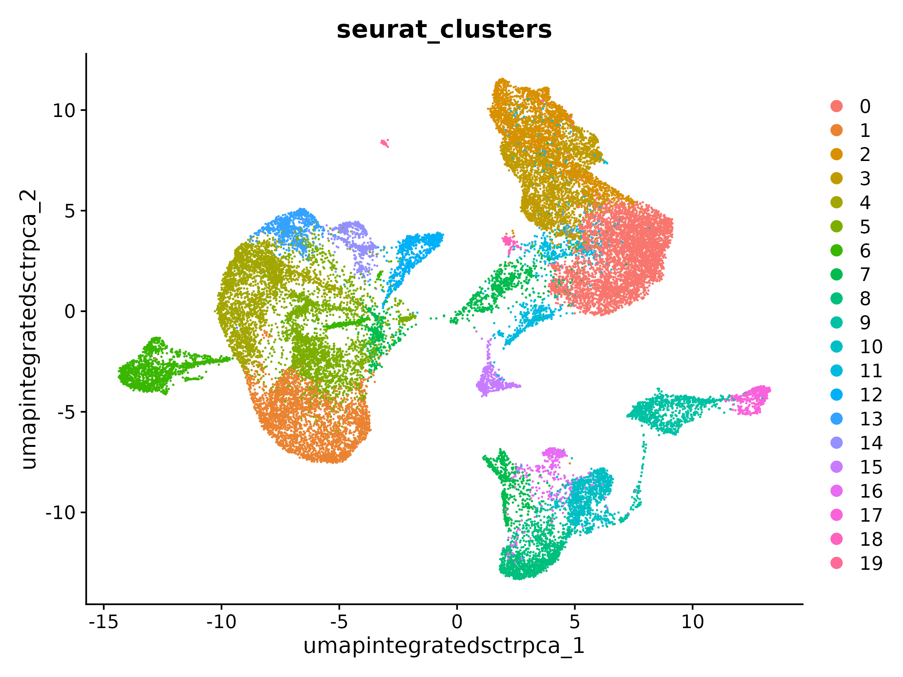
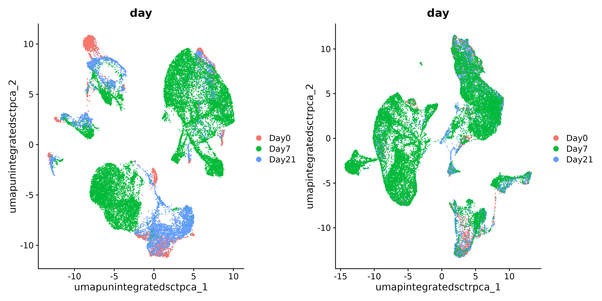

<style type="text/css">
body, td {
   font-size: 18px;
}
code.r{
  font-size: 12px;
}
pre {
  font-size: 12px
}
</style>

```{r, include = FALSE}
source("../bin/chunk-options.R")
knitr_fig_path("05-")
```

# Workflow Overview {.unlisted .unnumbered}

<br/>

<br/>
<br/>

# Introduction

<!--- General goal: to generate clusters that reasonably approximate cell-types or sub-types of interest --->
One of our goals in a single-cell analysis is to generate clusters that reasonably approximate cell-types or sub-types of interest in our samples before determining if there are differences in the proportions of these populations or differences in gene expression within these populations between experimental conditions.


In this section, we will demonstrate how to generate clusters using Seurat's graph based clustering approach and visualize those clustering assignments via a lower-dimensional projection of the full dataset.

Like other steps in our analysis, multiple parameters may need to be tested and evaluated while we would expect that only the final would be reported. Clustering is considered part of data exploration so an iterative approach is reasonable, and often expected ([source](https://bioconductor.org/books/3.15/OSCA.basic/clustering.html)). 


## Objectives

- Understand the clustering process and input parameters
- Generate initial clusters and visualize the results

---


# Clustering and projection


An important aspect of parameter selection for clustering is to understand the "resolution" of the underlying biology and your experimental design. Is answering your biological question dependent on identifying rarer cell types or specific subtypes? Or are broader cell-types more relevant to address your biological question?

The OSCA book has a [helpful analogy comparing clustering to microscopy](https://bioconductor.org/books/3.15/OSCA.basic/clustering.html#overview-1) and points out that "asking for an unqualified 'best' clustering is akin to asking for the best magnification on a microscope without any context". 

We've already selected a number of PCs that we think are likely to represent biological variation in our data while excluding technical variability. Next, we'll need to determine the "community" of cells based on the selected PCs before selecting a resolution to divide those communities into discrete clusters.

<!--- Contrast the previous dimensionality reduction versus nearest neighbors clustering and plotting the cells in lower dimensionality with the cluster labels? --->


## Clustering

Seurat uses a graph-based clustering approach to assign cells to clusters using a distance metric based on the previously generated PCs, with improvements based on work by ([Xu and Su 2015](https://academic.oup.com/bioinformatics/article/31/12/1974/214505)) and CyTOF data ([Levine et al. 2015](https://www.ncbi.nlm.nih.gov/pmc/articles/PMC4508757/)) implemented in Seurat v3 and v5 and building on the initial strategies for droplet-based single-cell technology ([Macosko et al. 2015](https://www.ncbi.nlm.nih.gov/pmc/articles/PMC4481139/))  ([source](https://satijalab.org/seurat/articles/pbmc3k_tutorial.html)). A key aspect of this process is that while the clusters are based on similarity of expression between the cells, the clustering is based on the selected PCs and therefore limited to the genes contributing to those PCs. 


To briefly summarize, cells are embedded in a k-nearest neighbors (kNN) graph (illustrated above) based on "the euclidean distance in PCA space" between the cells and the edge weights between any two cells (e.g. their "closeness") is refined based on Jaccard similarity ([source](https://hbctraining.github.io/scRNA-seq_online/lessons/07_SC_clustering_cells_SCT.html)).

<details>
    <summary>*Additional context and sources for graph-based clustering*</summary>
    [Cambridge Bioinformatics' Analysis of single cell RNA-seq data course materials](https://biocellgen-public.svi.edu.au/mig_2019_scrnaseq-workshop/clustering-and-cell-annotation.html), the source of the image above, delves into kNN and other graph based clustering methods in much greater detail, including outlining possible downsides for these methods. 
     To described kNN, we have also drawn from the [Ho Lab's description of this process for Seurat v3](https://holab-hku.github.io/Fundamental-scRNA/downstream.html#perform-linear-dimensional-reduction) as well as the [HBC materials on clustering](https://hbctraining.github.io/scRNA-seq_online/lessons/07_SC_clustering_cells_SCT.html) and the [OSCA book's more general overview of graph based clustering](https://bioconductor.org/books/3.15/OSCA.basic/clustering.html#clustering-graph), which also describes the drawbacks for these methods.
</details>
<br>


This process is performed with the `FindNeighbors()` [command](https://satijalab.org/seurat/reference/findneighbors), using the number of principal components we selected in the previous section.

```{r, eval = FALSE}
geo_so = FindNeighbors(geo_so, dims = 1:pcs, reduction = 'integrated.sct.rpca')
```

The second step is to iteratively partition the kNN graph into "cliques" or clusters using the Louvain modularity optimization algorithm (for the default parameters), with the "granularity" of the clusters set by a `resolution` parameter ([source](https://satijalab.org/seurat/articles/pbmc3k_tutorial.html)).


We'll use the `FindClusters()` [function](https://satijalab.org/seurat/reference/findclusters), selecting a resolution of `0.4` to start, although we could also add other resolutions at this stage to look at in later steps. See [Waltman and Jan van Eck (2013)](https://link.springer.com/article/10.1140/epjb/e2013-40829-0) for the underlying algorithms.

Again, how a “cell type” or “subtype” should be defined for your data is helpful to consider in selecting a resolution - we'd start with a higher resolution for smaller/more rare clusters and a lower resolution for larger/more general clusters.  

And then iff we look at the meta data we can see that cluster labels have now been added for each cell:

```{r, eval=FALSE}
# generate clusters
geo_so = FindClusters(geo_so, resolution = 0.4, cluster.name = 'integrated.sct.rpca.clusters')

# look at meta.data to see cluster labels
head(geo_so@meta.data)
```

Generally it's preferable to err on the side of too many clusters, as they can be combined manually in later steps. In our experience, this is another parameter that may need to be iteratively revised and reviewed. 

<details>
    <summary>*Resolution parameter recommendations*</summary>
    The [Seurat clustering tutorial](https://holab-hku.github.io/Fundamental-scRNA/downstream.html#perform-linear-dimensional-reduction) recommends selecting a resolution between 0.4 - 1.2 for datasets of approximately 3k cells, while the [HBC course](https://hbctraining.github.io/scRNA-seq_online/lessons/07_SC_clustering_cells_SCT.html) recommends 0.4-1.4 for 3k-5k cells. However, in our experience reasonable starting resolutions can be very dataset dependent.
</details>
<br>


~~~~
                                            orig.ident nCount_RNA nFeature_RNA  day  replicate percent.mt nCount_SCT nFeature_SCT integrated.sct.rpca.clusters seurat_clusters
HODay0replicate1_AAACCTGAGAGAACAG-1 HO.Day0.replicate1      10234         3226 Day0 replicate1   1.240962       6061         2865                            1               1
HODay0replicate1_AAACCTGGTCATGCAT-1 HO.Day0.replicate1       3158         1499 Day0 replicate1   7.536415       4625         1510                            1               1
HODay0replicate1_AAACCTGTCAGAGCTT-1 HO.Day0.replicate1      13464         4102 Day0 replicate1   3.112002       5426         2485                            5               5
HODay0replicate1_AAACGGGAGGCCCGTT-1 HO.Day0.replicate1       1189          629 Day0 replicate1   3.700589       4165          919                            1               1
HODay0replicate1_AAACGGGCAACTGGCC-1 HO.Day0.replicate1       7726         2602 Day0 replicate1   2.938131       5858         2585                            1               1
HODay0replicate1_AAACGGGGTCCGAATT-1 HO.Day0.replicate1       5165         2362 Day0 replicate1   9.196515       5162         2348                            8               8
~~~~


# Cluster plots 

To visualize the cell clusters, we can use dimensionality reduction techniques to visualize and explore our large, high-dimensional dataset. Two popular methods that are supported by Seurat are t-distributed stochastic neighbor embedding (t-SNE) and Uniform Manifold Approximation and Projection (UMAP) techniques. These techniques allow us to visualize our high-dimensional single-cell data in 2D space and see if cells grouped together within graph-based clusters co-localize in these representations ([source](https://satijalab.org/seurat/articles/pbmc3k_tutorial.html#run-non-linear-dimensional-reduction-umaptsne)).

While we unfortunately don't have time to compare and contrast tSNE, and UMAP, we would highly recommend [this blog post contrasting tSNE and UMAP](https://pair-code.github.io/understanding-umap/) for illustrative examples. The Seurat authors additionally caution that while these methods are useful for data exploration, to avoid drawing biological conclusions solely based on these visualizations ([source](https://satijalab.org/seurat/articles/pbmc3k_tutorial.html#run-non-linear-dimensional-reduction-umaptsne)).

To start this process, we'll use the `RunUMAP()` [function](https://satijalab.org/seurat/reference/runumap) to calculate the UMAP reduction for our data. Notice how the previous dimensionality choices carry through the downstream analysis and that the number of PCs selected in the previous steps are included as an argument.

```{r, eval=FALSE}
geo_so = RunUMAP(geo_so, dims = 1:pcs, reduction = 'integrated.sct.rpca', reduction.name = 'umap.integrated.sct.rpca')
geo_so
```
~~~
An object of class Seurat 
47037 features across 29615 samples within 2 assays 
Active assay: SCT (20548 features, 3000 variable features)
 3 layers present: counts, data, scale.data
 1 other assay present: RNA
 3 dimensional reductions calculated: unintegrated.sct.pca, integrated.sct.rpca, umap.integrated.sct.rpca
~~~

Notice that we now have a third reduction: `umap.integrated.sct.rpca`.

# Visualizing and evaluating clustering

<!--- How many clusters should I get and how do I adjust the number? --->

<!--- Add example of changing resolution?--->

After we generate the UMAP reduction, we can then visualize the results using the `DimPlot()` [function](https://satijalab.org/seurat/reference/dimplot), labeling our plot by the auto generated `seurat_clusters` that correspond to the most recent clustering results generated.

At this stage, we want to determine if the clusters look fairly well separated, if they seem to correspond to how cells are grouped in the UMAP, and if the number of clusters are aligned with the resolution of our biological question. 

We can also look at the same UMAP labeled by `day` to visually inspect if the UMAP structure corresponds to the `day`.


```{r, eval = FALSE}
# UMAP with cluster ID labels
post_integration_umap_plot_clusters = DimPlot(geo_so, group.by = 'seurat_clusters', label = TRUE, reduction = 'umap.integrated.sct.rpca') + NoLegend()
post_integration_umap_plot_clusters

ggsave(filename = 'results/figures/umap_integrated_sct_clusters.png', plot = post_integration_umap_plot_clusters, width = 6, height = 6, units = 'in')

# UMAP with day labels (note - we added this column to the meta-data yesterday)
post_integration_umap_plot_day = DimPlot(geo_so, group.by = 'day', label = FALSE, reduction = 'umap.integrated.sct.rpca')
post_integration_umap_plot_day

ggsave(filename = 'results/figures/umap_integrated_sct_day.png', plot = post_integration_umap_plot_day, width = 8, height = 6, units = 'in')
```

 
<br>


<br>


A plot like this can tell us if technical sources of variation might be driving or stratifying the clusters, or if we see good correction after the normalization and integration steps.


Another approach is to evaluate the number of cells per cluster using the `table()` function, split by `day` or split by `orig.ident` to see if the individual samples are driving any of the UMAP structure:

```{r, eval=FALSE}
# table of number of cells per cluster, split by condition
table(geo_so@meta.data$day, geo_so@meta.data$integrated.sct.rpca.clusters)

# table of number of cells per cluster per sample
table(geo_so@meta.data$orig.ident, geo_so@meta.data$integrated.sct.rpca.clusters)
```
~~~
           0    1    2    3    4    5    6    7    8    9   10   11   12   13   14   15   16   17   18
  Day0    88  938  239  167   38  242   36   94  814  132  119  298   55   29  159  133   57  141   19
  Day7  3434 1138 2507 2022 2409 1330 1594  935  119  546  562  325  626  659  309   98  262   88   36
  Day21 1438 1138  368  463  141  482   81  430  402  500  375  201  108   69   42  256  117  195   12
~~~


~~~
                       0    1    2    3    4    5    6    7    8    9   10   11   12   13   14   15   16   17   18
HO.Day0.replicate1    20  278   82   52   17   69   15   18  209   33   32   82   17   11   47   20    5   35    7
HO.Day0.replicate2    13  127   37   33    5   23    6   24  162   27   20   56    8    6   13   25   13   16    1
HO.Day0.replicate3    34  331   72   46    3   91    5   18  238   40   38   84   16    5   58   40   16   54    2
HO.Day0.replicate4    21  202   48   36   13   59   10   34  205   32   29   76   14    7   41   48   23   36    9
HO.Day7.replicate1   472  309  590  501  769  358  755  155   49  113  190   67  167  212   63   41   72   28   17
HO.Day7.replicate2  1219  219  615  574  486  280  218  378   10  157  132  105  180  150   86   19   88   13    3
HO.Day7.replicate3   957  457  727  531  407  465   90  243   50  177  145   90  163  152   93   27   72   37   14
HO.Day7.replicate4   786  153  575  416  747  227  531  159   10   99   95   63  116  145   67   11   30   10    2
HO.Day21.replicate1  369  363   99  145   38  172   30  134  119  145  110   63   35   14   13   66   26   56    3
HO.Day21.replicate2  189  218   74   82   21   57   12   97  123   79   46   36   15   14    6   51   28   29    5
HO.Day21.replicate3  203  187   73   91   25   67    8   61  102   90   68   31   16   20    7   55   20   39    3
HO.Day21.replicate4  677  370  122  145   57  186   31  138   58  186  151   71   42   21   16   84   43   71    1
~~~

<!-- consider adding later 
Add DimPlot for % mitochondria to see if high % are across dataset or limited to one/few clusters (related to what Olivia talked about during Day 1)

# Other approaches for visualizing scRNA-sq data
e.g. code for tSNE visualization 
-->

# Comparing to unintegrated data

If we had proceeded with our filtered data and only normalized our data without doing any integration, including through the dimensionality reduction and clustering steps and then labeled the cells with their sample of origin, then we would see the following for our data:

<!--Add example of UMAP / sample labels for unintegrated data from analysis folder to images-->




If we instead labeled our plot by `day`, then we would see:


In this plot, we see that while there are distinct clusters, those clusters seem to stratified by day. This suggests that without integration, these batch effects could skew the biological variability in our data. We can also directly compare between integrated and unintegrated 

<!-- Edit section to incorporate --->

<details>
<summary>**Rewind: Pre-integration evaluation clustering and visualization (code)**</summary>
Prior to integration, could follow the same steps we've just run for the integrated to see if the resulting clusters tend to be determined by sample or condition (in this case, the day):

```{r, eval=FALSE}
geo_so = FindNeighbors(geo_so, dims = 1:pcs, assay = 'RNA', reduction = 'unintegrated.sct.pca', graph.name = c('RNA_nn', 'RNA_snn'))
geo_so = FindClusters(geo_so, resolution = 0.4, graph.name = 'RNA_snn', cluster.name = 'unintegrated.sct.clusters')
geo_so = RunUMAP(geo_so, dims = 1:pcs, reduction = 'unintegrated.sct.pca', reduction.name = 'umap.unintegrated.sct.pca')
```
	
The plots above were generated with:

```{r, eval=FALSE}
pre_integration_umap_plot_orig.ident = DimPlot(geo_so, group.by = 'orig.ident', label = FALSE, reduction = 'umap.unintegrated.sct.pca')
ggsave(filename = 'results/figures/umap_unintegrated_sct_orig.ident.png', plot = pre_integration_umap_plot_orig.ident, width = 8, height = 6, units = 'in')
```

```{r, eval=FALSE}
pre_integration_umap_plot_day = DimPlot(geo_so, group.by = 'day', label = FALSE, reduction = 'umap.unintegrated.sct.pca')
ggsave(filename = 'results/figures/umap_unintegrated_sct_day.png', plot = pre_integration_umap_plot_day, width = 8, height = 6, units = 'in')
```

</details>
<br>
<br>


<details>
<summary>**Alternative clustering resolutions**</summary>
While we show a single resolution, we can generate and plot multiple resolutions iteratively and compare between them before selecting a clustering result for the next steps:

```{r, eval=FALSE}
resolutions = c(0.4, 0.8)

for(res in resolutions) {
    message(res)

    cluster_column = sprintf('SCT_snn_res.%s', res)
    umap_file = sprintf('results/figures/umap_integrated_sct_%s.png', res)

    geo_so = FindClusters(geo_so, resolution = res)

    DimPlot(geo_so, group.by = cluster_column, label = TRUE, reduction = 'umap.integrated.sct.rpca') + NoLegend()
    ggsave(filename = umap_file, width = 8, height = 7, units = 'in')
}
```

If we look at the results:

```{r, eval=FALSE}
head(geo_so@meta.data)
```

... multiple resolutions should now be added to the metadata slot.
</details>
<br>
<br>


# Save our progress

Before moving on to our next section, we will output our updated Seurat object to file:

```{r, eval=FALSE}
saveRDS(object = geo_so, file = 'results/rdata/geo_so_sct_clustered.rds')
```

# Summary

In this section we:

- Generated cluster assignments for our cells using `FindNeighbors()` and `FindClusters()`
- Evaluated our initial clusters using `RunUMAP` dimensional reduction and visualization


Next steps: Marker genes


----

These materials have been adapted and extended from materials listed above. These are open access materials distributed under the terms of the [Creative Commons Attribution license (CC BY 4.0)](http://creativecommons.org/licenses/by/4.0/), which permits unrestricted use, distribution, and reproduction in any medium, provided the original author and source are credited.

<br/>
<br/>
<hr/>
| [Previous lesson](04-PCAandIntegration.html) | [Top of this lesson](#top) | [Next lesson](06-MarkerVisualization.html) |
| :--- | :----: | ---: |

