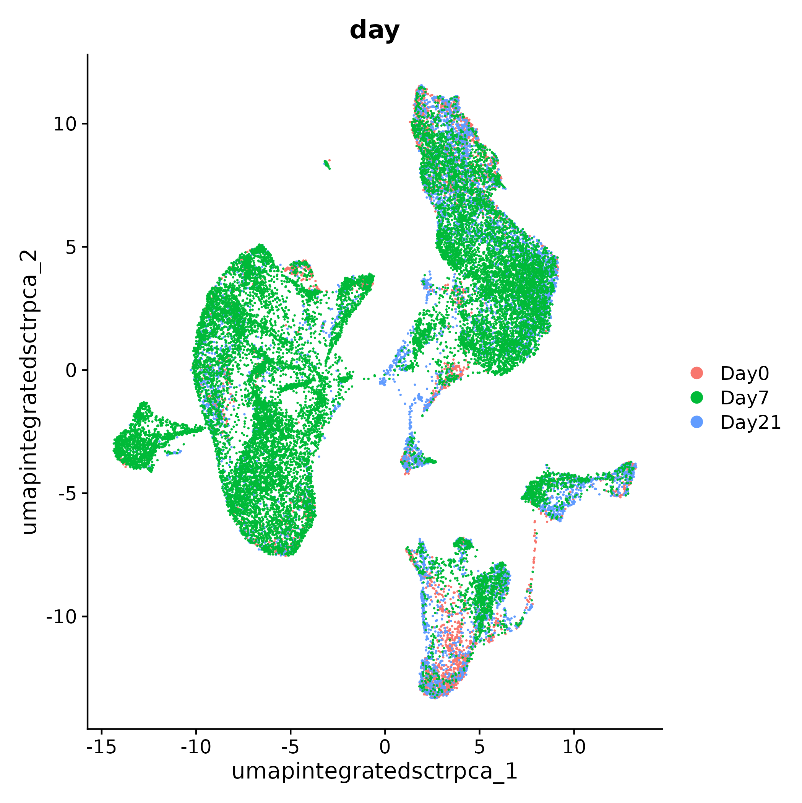
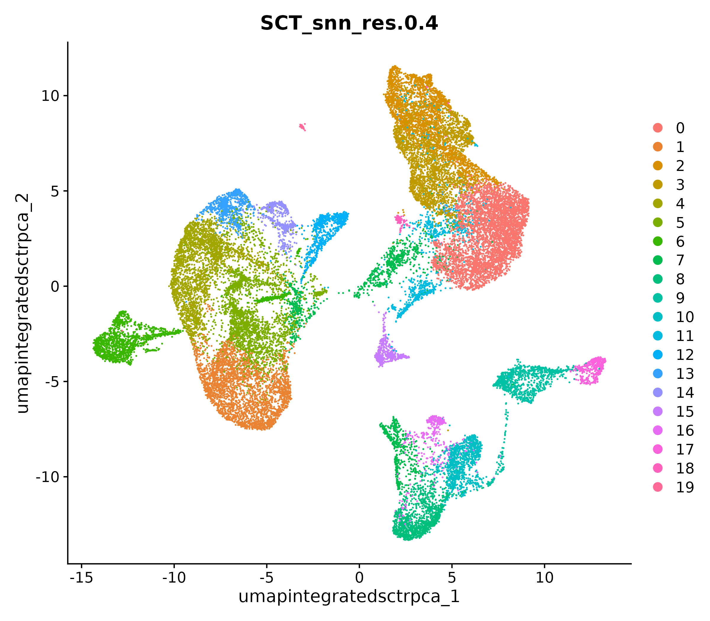
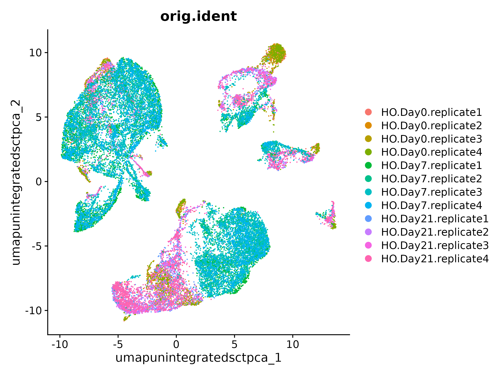
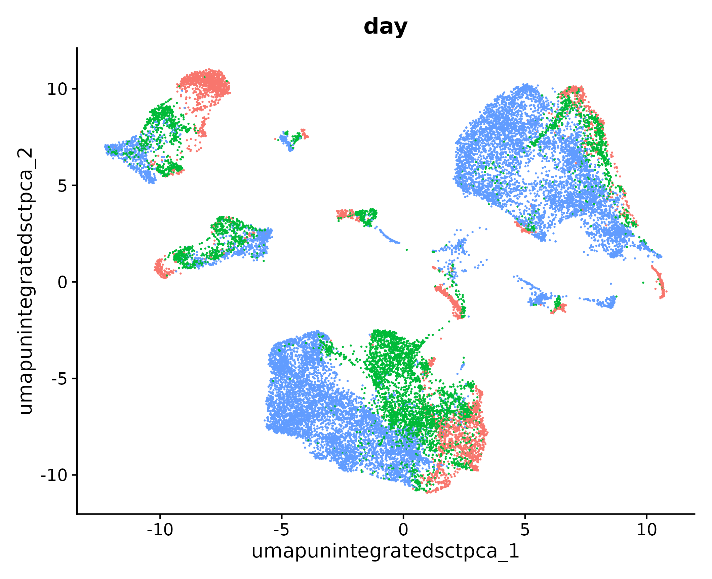

<style type="text/css">
body, td {
   font-size: 18px;
}
code.r{
  font-size: 12px;
}
pre {
  font-size: 12px
}
</style>

```{r, include = FALSE}
source("../bin/chunk-options.R")
knitr_fig_path("XX")
```

# Workflow Overview {.unlisted .unnumbered}

<br/>

<br/>
<br/>

# Introduction

<!--- General goal: to generate clusters that reasonably approximate cell-types or sub-types of interest --->

In this section, we will demonstrate graph based clustering and visualizing those clustering assignments via projection.

<!--- Point out possible gaps between how single-cell data is presented versus the reality of running an analysis
e.g. Papers might report final clustering parameters but multiple parameters may need to be tested/evaluated --->

Considered part of data exploration so iterative approach is reasonable and often expected [source](https://bioconductor.org/books/3.15/OSCA.basic/clustering.html)


## Objectives

- XX
- XX

---


# Clustering and projection


An important aspect of parameter selection for clustering is to understand the "resolution" of the underlying biology and your experimental design. Is answering your biological question dependent on identifying rarer cell types or specific subtypes? Or are broader cell-types more relevant to address your biological question?

The OSCA book has a [helpful analogy comparing clustering to microscopy](https://bioconductor.org/books/3.15/OSCA.basic/clustering.html#overview-1) and points out that "asking for an unqualified “best” clustering is akin to asking for the best magnification on a microscope without any context". 

<!--- Contrast the previous dimensionality reduction versus nearest neighbors clustering and plotting the cells in lower dimensionality with the cluster labels. --->


## Clustering

Nearest neighbors algorithm - based on similarity of expression pattern (just for genes/PCs selected)

Again, how are you defining a “cell type” or “subtype” should help with ambiguity not only with "How do I decide how many PCs to include?" but also "How do I choose a resolution for finding clusters?" (as well as evaluating in the downstream if your initial choices should be revised).


<!-- per [Ho Lab](https://holab-hku.github.io/Fundamental-scRNA/downstream.html#perform-linear-dimensional-reduction) - The previous version of Seurat (v3) applied a graph-based clustering approach, building upon initial strategies in the development of the initial droplet based single cell technology([Macosko et al. 2015](https://www.ncbi.nlm.nih.gov/pmc/articles/PMC4481139/)). "Importantly, the distance metric which drives the clustering analysis (based on previously identified PCs) remains the same."

"However, approach in Seurat to partitioning the cellular distance matrix into clusters has dramatically improved. This approach was heavily inspired by recent publications which applied graph-based clustering approaches to scRNA-seq data ([Xu and Su 2015](https://academic.oup.com/bioinformatics/article/31/12/1974/214505)) and CyTOF data ([Levine et al. 2015](https://www.cell.com/cell/pdfExtended/S0092-8674(15)00637-6)). Briefly, these methods embed cells in a graph structure - for example a K-nearest neighbor (KNN) graph, with edges drawn between cells with similar feature expression patterns, and then attempt to partition this graph into highly interconnected ‘quasi-cliques’ or ‘communities’.

As in PhenoGraph, they first construct a KNN graph based on the euclidean distance in PCA space, and refine the edge weights between any two cells based on the shared overlap in their local neighborhoods (Jaccard similarity). This step is performed using the FindNeighbors() function, and takes as input the previously defined dimensionality of the dataset (first 20 PCs)." -->

Our first step is to generate the k-Nearest Neighbor (KNN) graph using the number of principal components chosen in the previous section.

```{r, eval = FALSE}
geo_so = FindNeighbors(geo_so, dims = 1:pcs, reduction = 'integrated.sct.rpca.clusters')
```

<!--- per [Ho Lab](https://holab-hku.github.io/Fundamental-scRNA/downstream.html#perform-linear-dimensional-reduction) - "To cluster the cells, we next apply modularity optimization techniques such as the Louvain algorithm (default) or SLM (Blondel et al. 2008), to iteratively group cells together, with the goal of optimizing the standard modularity function. The FindClusters() function implements this procedure, and contains a resolution parameter that sets the ‘granularity’ of the downstream clustering, with increased values leading to a greater number of clusters. We find that setting this parameter between 0.4-1.2 typically returns good results for single-cell datasets of around 3K cells. Optimal resolution often increases for larger datasets. The clusters can be found using the Idents() function."" --->

The second step is to partition the kNN graph into "cliques" or clusters using the Louvain modularity optimization algorithm, specifying the cluster resolution. 

```{r, eval=FALSE}
geo_so = FindClusters(geo_so, resolution = 0.4, cluster.name = 'integrated.sct.rpca.clusterss')
```

A larger cluster resolution would generate more clusters; generally it can be preferable to err on the side of too many clusters, as they can be combined manually in later steps. However, this is another parameter that may need to be revised after evaluating this initial clustering in later steps. Recommended resolution ranges are often dependent on cell number but the [Ho Lab recommends](https://holab-hku.github.io/Fundamental-scRNA/downstream.html#perform-linear-dimensional-reduction) resolutions between 0.4-1.2 for datasets of approximately 3k cells.

```{r, eval=FALSE}
geo_so
```

~~~
# An object of class Seurat 
# 47037 features across 29615 samples within 2 assays 
# Active assay: SCT (20548 features, 3000 variable features)
#  3 layers present: counts, data, scale.data
#  1 other assay present: RNA
#  3 dimensional reductions calculated: unintegrated.sct.pca, integrated.sct.rpca, umap.unintegrated.sct.pca
~~~


# Cluster plots 

Note how dimensionality choices are carried through downstream functions.

What's different beteween PCA, tSNE, and UMAP?

Note: tSNE vs UMAP example: https://pair-code.github.io/understanding-umap/ 

<!-- per [Ho Lab](https://holab-hku.github.io/Fundamental-scRNA/downstream.html#run-non-linear-dimensional-reduction-umaptsne) "Seurat offers several non-linear dimensional reduction techniques, such as tSNE and UMAP, to visualize and explore these datasets. The goal of these algorithms is to learn the underlying manifold of the data in order to place similar cells together in low-dimensional space. Cells within the graph-based clusters determined above should co-localize on these dimension reduction plots. As input to the UMAP and tSNE, we suggest using the same PCs as input to the clustering analysis."" --->

```{r, eval=FALSE}
geo_so = RunUMAP(geo_so, dims = 1:25, reduction = 'unintegrated.sct.pca', reduction.name = 'umap.unintegrated.sct.pca')
```

# Visualizing and evaluating clustering

How many clusters should I get and how do I adjust the number?

<!--- Show example of changing resolution?--->


We can check the how well the normalization and integration merged together the data.

```{r, eval = FALSE}
post_integration_umap_plot_day = DimPlot(geo_so, group.by = 'day', label = FALSE, reduction = 'umap.integrated.sct.rpca')

ggsave(filename = 'results/figures/umap_integrated_sct_day.png', plot = post_integration_umap_plot_day)
```




```{r, eval = FALSE}
post_integration_umap_plot_clusters = DimPlot(geo_so, group.by = 'seurat_clusters', label = FALSE, reduction = 'umap.integrated.sct.rpca')

ggsave(filename = 'results/figures/umap_integrated_sct_clusters.png', plot = post_integration_umap_plot_clusters, width = 8, height = 6, units = 'in')
```

 


We can also evaluate the number of cells per cluster using the `table()` function, split by `day`:

```{r, eval=FALSE}
table(geo_so@meta.data$day, geo_so@meta.data$integrated.sct.rpca.clusters)
```

~~~
# 		0    1    2    3    4    5    6    7    8    9   10   11   12   13   14   15   16   17   18   19
Day0    65  240  843  317  167   36   36  125  778  132  125  305   55   29  159  133   56  141   37   19
Day7  3184 2497  972 1689 2037 2374 1596  929  108  548  566  382  627  686  309   97  262   86   14   36
Day21 1329  355  964  663  461  147   81  452  383  499  379  227  108   72   42  252  117  195   80   12

~~~


... or split by `orig.ident` e.g. by individual sample:

```{r, eval=FALSE}
table(geo_so@meta.data$orig.ident, geo_so@meta.data$integrated.sct.rpca.clusters)
```

~~~
# 					0    1    2    3    4    5    6    7    8    9   10   11   12   13   14   15   16   17   18   19
HO.Day0.replicate1    14   82  250   96   52   17   15   24  203   33   32   84   17   11   47   20    5   35    5    7
HO.Day0.replicate2    10   38  110   33   33    4    6   34  152   27   20   57    8    6   13   25   13   16    9    1
HO.Day0.replicate3    25   72  300  117   46    3    5   25  227   40   42   86   16    5   58   40   16   54   12    2
HO.Day0.replicate4    16   48  183   71   36   12   10   42  196   32   31   78   14    7   41   48   22   36   11    9
HO.Day7.replicate1   410  587  285  431  506  766  755  157   45  113  190   79  167  213   63   40   72   28    4   17
HO.Day7.replicate2  1156  616  184  361  580  468  220  372    7  158  135  126  180  160   86   19   88   12    1    3
HO.Day7.replicate3   887  722  377  592  534  395   90  241   48  178  146  110  163  164   93   27   72   36    8   14
HO.Day7.replicate4   731  572  126  305  417  745  531  159    8   99   95   67  117  149   67   11   30   10    1    2
HO.Day21.replicate1  338   96  317  221  144   40   30  139  115  145  110   73   35   14   13   65   26   56   20    3
HO.Day21.replicate2  168   69  189   86   82   25   12  106  113   78   48   40   15   14    6   51   29   29   17    5
HO.Day21.replicate3  184   72  168   93   91   26    8   62  100   90   69   34   16   20    7   55   20   39    9    3
HO.Day21.replicate4  639  118  290  263  144   56   31  145   55  186  152   80   42   24   16   81   42   71   34    1
~~~


# Other approaches for visualizing scRNA-sq data

tSNE, PCA


# Comparing to unintegrated data

If we had proceeded with our filtered data and only normalized our data without doing any integration, including through the dimensionality reduction and clustering steps and then labeled the cells with their sample of origin, then we would see the following for our data:

<!--Add example of UMAP / sample labels for unintegrated data from analysis folder to images-->




If we instead labeled our plot by `day`, then we would see:


In this plot, we see that while there are distinct clusters, those clusters seem to stratifid by day. This suggests that without integration, these batch effects could skew the biological variability in our data. <!--move this section to end of Projection module to contrast with integrated results-->


<!-- Edit section to incorporate --->

# Rewind: Pre-integration evaluation

Prior to integration, we would like to know if there are any batch effects that carry through to the cell clusters. Most importantly, we would like to know if clusters tend to be determined by sample or condition (in this case, the day). In order to figure this out we have already run the following three commands, which we will describe in more detail later.

```{r, eval=FALSE}
# DefaultAssay(geo_so) = 'RNA'

geo_so = RunPCA(geo_so, reduction.name = 'unintegrated.sct.pca')
geo_so = FindNeighbors(geo_so, dims = 1:25, reduction = 'unintegrated.sct.pca')
geo_so = FindClusters(geo_so, resolution = 0.4, cluster.name = 'unintegrated.sct.clusters')
geo_so = RunUMAP(geo_so, dims = 1:25, reduction = 'unintegrated.sct.pca', reduction.name = 'umap.unintegrated.sct.pca')
```

From this image, we can qualitatively see that some clusters seem to be driven by the original identity. We can see this even more clearly if we use `group.by = 'day'`:

```{r, eval=FALSE}
pre_integration_umap_plot = DimPlot(geo_so, group.by = 'day', label = FALSE, reduction = 'umap.unintegrated.sct.pca') + NoLegend()
ggsave(filename = 'ISC_R/results/figures/umap_unintegrated_sct_day.png', plot = pre_integration_umap_plot)
```




```{r, eval=FALSE}
pre_post_integration_plot = pre_integration_umap_plot_day | post_integration_umap_plot_day

ggsave(filename = 'results/figures/umap_comparison_sct.png', plot = pre_post_integration_plot, width = 12, height = 6, units = 'in')
```

<!-- Make sure above section is edited -->

## Alternative clustering resolutions

```{r, eval=FALSE}
resolutions = c(0.4, 0.8)
# seq(from = 0.1, to = 1, by = 0.1)

for(res in resolutions) {
    message(res)
    
    cluster_column = sprintf('SCT_snn_res.%s', res)
    umap_file = sprintf('results/figures/umap_integrated_sct_%s.png', res)
    
    geo_so = FindClusters(geo_so, resolution = res)
    
    DimPlot(geo_so, group.by = cluster_column, label = FALSE, reduction = 'umap.integrated.sct.rpca')
    ggsave(filename = umap_file, width = 8, height = 7, units = 'in')
}
```


Look at our results
```{r, eval=FALSE}
head(geo_so@meta.data)
```

~~~
#									orig.ident nCount_RNA nFeature_RNA  day  replicate percent.mt nCount_SCT nFeature_SCT
 HODay0replicate1_AAACCTGAGAGAACAG-1 HO.Day0.replicate1      10234         3226 Day0 replicate1   1.240962       6061         2865
 HODay0replicate1_AAACCTGGTCATGCAT-1 HO.Day0.replicate1       3158         1499 Day0 replicate1   7.536415       4625         1510
 HODay0replicate1_AAACCTGTCAGAGCTT-1 HO.Day0.replicate1      13464         4102 Day0 replicate1   3.112002       5426         2485
 HODay0replicate1_AAACGGGAGGCCCGTT-1 HO.Day0.replicate1       1189          629 Day0 replicate1   3.700589       4165          919
 HODay0replicate1_AAACGGGCAACTGGCC-1 HO.Day0.replicate1       7726         2602 Day0 replicate1   2.938131       5858         2585
 HODay0replicate1_AAACGGGGTCCGAATT-1 HO.Day0.replicate1       5165         2362 Day0 replicate1   9.196515       5162         2348
#                                     unintegrated.sct.clusters seurat_clusters integrated.sct.rpca.clusters SCT_snn_res.0.4 SCT_snn_res.0.8
 HODay0replicate1_AAACCTGAGAGAACAG-1                         4               8                            2               2               8
 HODay0replicate1_AAACCTGGTCATGCAT-1                         4               8                            2               2               8
 HODay0replicate1_AAACCTGTCAGAGCTT-1                         4               6                            3               3               6
 HODay0replicate1_AAACGGGAGGCCCGTT-1                         4               2                            2               2               2
 HODay0replicate1_AAACGGGCAACTGGCC-1                         4               8                            2               2               8
 HODay0replicate1_AAACGGGGTCCGAATT-1                        11               9                            8               8               9 
~~~


## Save our progress

```{r, eval=FALSE}
saveRDS(object = geo_so, file = 'results/rdata/geo_so_sct_clustered.rda')
```

# Summary

In this section we:

- XX
- XX
- XX

Next steps: Marker genes


----

These materials have been adapted and extended from materials listed above. These are open access materials distributed under the terms of the [Creative Commons Attribution license (CC BY 4.0)](http://creativecommons.org/licenses/by/4.0/), which permits unrestricted use, distribution, and reproduction in any medium, provided the original author and source are credited.

<br/>
<br/>
<hr/>
| [Previous lesson](04-PCAandDimReduction.html) | [Top of this lesson](#top) | [Next lesson](06-MarkerVisualization.html) |
| :--- | :----: | ---: |

