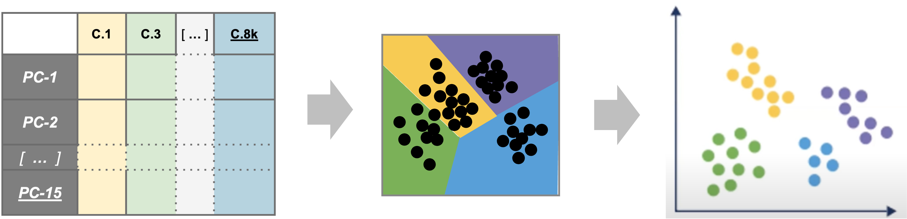

<style type="text/css">

body {
   font-size: 18px;
}

code.r{
  font-size: 12px;
}
pre {
  font-size: 12px
}

table.fig, th.fig, td.fig {
  border: 1px solid lightgray;
  border-collapse: collapse;
  padding: 12px;
}

</style>

```{r klippy, include=TRUE, echo=FALSE, message=FALSE, warning=FALSE}
klippy::klippy(lang = c("r", "markdown", "bash"), position = c("top", "right"))
library(kableExtra)
```

```{r, include = FALSE}
source("../bin/chunk-options.R")
knitr_fig_path("05-ProjectionAndClustering/05-")
```

# Workflow Overview {.unlisted .unnumbered}

<br/>

<br/>

# Introduction

<br/>
<table class='fig'><tr><td class='fig'>

</td></tr><tr><td class='fig'>Starting with reduced dimensionality data [PCs x cells] for all samples - cells are organized into networks and then split up to into clusters with similar expression programs, regardless of experimental condition.</td></tr>
</table>
<br/>

<!--- General goal: to generate clusters that reasonably approximate cell-types or sub-types of interest --->
Before making any comparisons between experimental conditions, its important to identify cell-types or sub-types present across all samples and unsupervised clustering is a reasonable starting point to accomplish this.
<br/>

## Objectives

- Choose an appropriate number of principal components to represent our data   
- Understand the clustering process and input parameters
- Generate initial clusters using `FindNeighbors()` and `FindClusters()`
- Visualize our clustering results with `DimPlot()`

<br/>
Like other steps in our analysis, multiple parameters may need to be tested and evaluated while we would expect that only the final would be reported. Clustering is considered part of data exploration so an iterative approach is common ([source](https://bioconductor.org/books/3.15/OSCA.basic/clustering.html)). 
<br/>

---

```{r, read_rds_hidden, echo = FALSE, warning = FALSE, message = FALSE}
if(!exists('geo_so')) {
  library(Seurat)
  library(BPCells)
  library(tidyverse)

  options(future.globals.maxSize = 1e9)

  geo_so = readRDS('results/rdata/geo_so_sct_integrated.rds')
  
  pcs=10
}
```

# Clustering and projection

Now that we generated a PCA reduction of our data and integrated across samples/batches, our next task is clustering. An important aspect of parameter selection for clustering is to understand the "resolution" of the underlying biology and your experimental design:   

- Is answering your biological question dependent on identifying rarer cell types or specific subtypes?   
- Or are broader cell-types more relevant to address your biological question?   

The OSCA book has a [helpful analogy comparing clustering to microscopy](https://bioconductor.org/books/3.15/OSCA.basic/clustering.html#overview-1) and points out that "asking for an unqualified 'best' clustering is akin to asking for the best magnification on a microscope without any context". 

To generate clusters, we will select a subset of the PCs and then generate "communities" of cells from that reduction before choosing a resolution parameter to divide those communities into discrete clusters. So how do we determine how many PCs represent the "resolution" of biological variation we are interested in?

<!--- Contrast the previous dimensionality reduction versus nearest neighbors clustering and plotting the cells in lower dimensionality with the cluster labels? --->


## Choosing the number of PCs to represent our data

The short answer is while we might not know if that number of PCs is appropriate for the "resolution" of our biological question until we begin to identify marker genes and/or begin to annotate cell-types, we can start by visually or empirically determine how many PCs represent the *majority* of the variation in a dataset and use that number as a starting point.

<!-- Section may need more editing  & consider adding a figure
Related - how important is that decision to the downstream impact (e.g. how much does changing the number of PCs change the clustering)?
--> 

### Visualizing variance across PCs

So in addition to the heatmaps we generated in the last module, one way to evaluate how many PCs explain the majority of the variation is by generating an elbow plot, which shows the percent variance explained by successive PCs. We'll use the `ElbowPlot()` function to do this, specifying that the first 50 PCs be plotted. 

```{r, elbow_plot, fig.show='hold', out.width='80%'}
# -------------------------------------------------------------------------
# Visualize how many PCs to include using an elbow plot
ElbowPlot(geo_so, ndims = 50, reduction = 'unintegrated.sct.pca')
ggsave(filename = 'results/figures/qc_sct_elbow_plot.png',
       width = 8, height = 8, units = 'in')
```

In this plot, we could arbitrarily choose a number along the x-axis that looks like a sharp change in the variance from one PC to the next, that is, an "elbow", which indicates diminishing explained variance. While this approach is a common recommendation in in tutorials, the choice of where the point of the "elbow" is not always obvious, and this plot is no different.


### An algorithmic approach

Instead of choosing based on the elbow plot by sight alone, we can try to  quantify our choice algorithmically. Here we create a function to return a recommended PC based on two possible metrics ( (A) cumulative variation or (B) above a minimum step size). We can apply a version of this function that was borrowed from [HBC](https://hbctraining.github.io/scRNA-seq/lessons/elbow_plot_metric.html) to our data to help select a good starting point for the number of PCs to include for clustering.
<!--- revised function name per discussion with Raymond --->

```{r, check_pcs}
# -------------------------------------------------------------------------
# Estimate the number of PCs to use for clustering with a function
check_pcs = function(so, reduction) {
    # quantitative check for number of PCs to include
    pct = so@reductions[[reduction]]@stdev / sum(so@reductions[[reduction]]@stdev) * 100
    cum = cumsum(pct)
    co1 = which(cum > 90 & pct < 5)[1]
    co2 = sort(which((pct[1:length(pct)-1] - pct[2:length(pct)]) > .1), decreasing = T)[1] + 1
    pcs = min(co1, co2) 
    
    return(pcs)
}

# Apply function to our data
pcs = check_pcs(geo_so, 'unintegrated.sct.pca')
pcs
```

Again, this number is likely a starting point and may need to be revised depending on the outcome of the downstream steps. 

<summary>Optional: A more advanced function for picking PCs</summary>
<details>

This function is derived from the function above; it's useful for understanding
the overall variance of the PCs as well as visualizing the two kinds of cutoffs. 
It returns the same recommended PCs as the original function, but also:

- prints more details 
- prints a plot of the PC variance with key PCs highlighted 
- returns a named list of detailed results


```{r, estimate_alt_pcs_fn}
# -------------------------------------------------------------------------
# Define a function to estimate optimal PCs for clustering
check_pcs_advanced = function(so, reduction, print_plot=TRUE, verbose=TRUE) {
  # quantitative check for number of PCs to include
  threshold_var_cum_min = 90
  threshold_var_pct_max = 5
  threshold_step_min = 0.1
  pct = so@reductions[[reduction]]@stdev / sum(so@reductions[[reduction]]@stdev) * 100
  cum = cumsum(pct)
  co1 = which(cum > threshold_var_cum_min & pct < threshold_var_pct_max)[1]
  co2 = sort(which((pct[1:length(pct)-1] - pct[2:length(pct)]) > threshold_step_min), decreasing = T)[1] + 1
  pcs = min(co1, co2) 
  
  plot_df <- data.frame(pc = 1:length(pct),
                        pct_var = pct, 
                        cum_var = cum)
  plot_df$labels = ''
  co1_label = paste0('PC ', co1)
  co2_label = paste0('PC ', co2)
  if (co1 == co2) {
    plot_df$labels[plot_df$pc == co1] = paste0(co1_label, '\n', co2_label)
  } else {
    plot_df$labels[plot_df$pc == co1] = co1_label
    plot_df$labels[plot_df$pc == co2] = co2_label
  }
  
  
  p = ggplot(plot_df, aes(x=pc, y=cum_var, label=labels)) +
    geom_point(color="grey", alpha=1) +
    geom_text(hjust = 0, vjust=1, nudge_x=2, nudge_y=-5) +
    geom_step(data=filter(plot_df, pc<=co2), color="blue", alpha=0.6, direction='vh') +
    geom_step(data=filter(plot_df, pc>=co2), color="grey", alpha=0.6, direction='hv') +
    geom_hline(yintercept = 90, color = "red", alpha=0.6, linetype = 'dashed') +
    geom_point(data=filter(plot_df, pc==co1), aes(x=pc,y=cum_var), color='red') + 
    geom_point(data=filter(plot_df, pc==co2), aes(x=pc,y=cum_var), color='blue') +
    scale_y_continuous(breaks = c(0,25,50,75,100, threshold_var_cum_min)) +
    theme_bw() +
    labs(title = 'Optimal num of PCs',
         x = 'Principal Component', 
         y = 'Cumulative percent variance')

  if (print_plot) {
          print(p)
  }
  
  if (verbose) {
     results = paste(
                sprintf('Reduction %s: %s PCs (total var = %s)', 
                     reduction,
                     nrow(plot_df),
                     plot_df[plot_df$pc==nrow(plot_df), 'cum_var']),
                sprintf("\t%s (total var = %s) : Smallest PC that explains at least %s%% total variance", 
                     co1_label,
                     round(plot_df[plot_df$pc==co1, 'cum_var'], 2),
                     threshold_var_cum_min),
                sprintf("\t%s (total var = %s) : Largest PC with incremental variance step at least %s%%", 
                      co2_label,
                      round(plot_df[plot_df$pc==co2, 'cum_var'],2),
                      threshold_step_min),
                sprintf('\tRecommended num of PCs: %s', pcs),
                sep='\n')
      message(results)
  }
  
  return(list(recommended_pcs=pcs, plot=p, co1=co1, co2=co2, df=plot_df))
}

```

```{r, apply_estimate_alt_pcs}
# -------------------------------------------------------------------------
# Apply function to our data
alt_pcs = check_pcs_advanced(geo_so, 'unintegrated.sct.pca')
```

```{r, save_alt_pcs}
# -------------------------------------------------------------------------
# Save plot of PCs
ggsave(filename = 'results/figures/optimal_pcs.png',
       plot=alt_pcs$plot,
       width = 8, height = 8, units = 'in')

rm(alt_pcs)
gc()
```


Again, this number is likely a starting point and may need to be revised depending on the outcome of the downstream steps. 

While outside the scope of this workshop, there are community efforts to develop 
more sophisticated methods to select an appropriate number of PCs; here are a 
few popular approaches:

- [chooseR package](https://github.com/rbpatt2019/chooseR)
- [findPC package](https://academic.oup.com/bioinformatics/article/38/10/2949/6565314)
- [using clustering trees](https://lazappi.id.au/posts/2017-07-19-building-a-clustering-tree/)

<br/>
<hr/>
</details>
<br/>

## Selecting the number of PCs to be used for clustering

For this dataset, we are expecting a diversity of cell types and cell populations that mediate wound healing, but also an aberrant transition to bone. For the purposes of the workshop and after 

<!-- move this section to projection and clustering once ready to incorporate examples of alternative PCA choices-->
```{r, revised_select_pcs}
# -------------------------------------------------------------------------
# Based on the heatmaps (and some behind the scenes testing), we'll modify the number of PCs
pcs = 10
```

Again, in a full analysis workflow, our selection at this step can be more of a starting point for further iterations than a final decision. In the exercises, you'll have the opportunity to test how alternative parameters impact the clustering results, including selecting fewer or more PCs. <!--- also add link to PC/clustering exploration here/ -->

## Clustering

Seurat uses a graph-based clustering approach to assign cells to clusters using a distance metric based on the previously generated PCs, with improvements based on work by ([Xu and Su 2015](https://academic.oup.com/bioinformatics/article/31/12/1974/214505)) and CyTOF data ([Levine et al. 2015](https://www.ncbi.nlm.nih.gov/pmc/articles/PMC4508757/)) implemented in Seurat v3 and v5 and building on the initial strategies for droplet-based single-cell technology ([Macosko et al. 2015](https://www.ncbi.nlm.nih.gov/pmc/articles/PMC4481139/))  ([source](https://satijalab.org/seurat/articles/pbmc3k_tutorial.html)). A key aspect of this process is that while the clusters are based on similarity of expression between the cells, the clustering is based on the selected PCs and not the full data set. 

<center>

</center>

To briefly summarize, cells are embedded in a k-nearest neighbors (kNN) graph (illustrated above) based on "the euclidean distance in PCA space" between the cells and the edge weights between any two cells (e.g. their "closeness") is refined based on Jaccard similarity ([source](https://hbctraining.github.io/scRNA-seq_online/lessons/07_SC_clustering_cells_SCT.html)).

<details>
    <summary>*Additional context and sources for graph-based clustering*</summary>
    [Cambridge Bioinformatics' Analysis of single cell RNA-seq data course materials](https://biocellgen-public.svi.edu.au/mig_2019_scrnaseq-workshop/clustering-and-cell-annotation.html), the source of the image above, delves into kNN and other graph based clustering methods in much greater detail, including outlining possible downsides for these methods. 
     To described kNN, we have also drawn from the [Ho Lab's description of this process for Seurat v3](https://holab-hku.github.io/Fundamental-scRNA/downstream.html#perform-linear-dimensional-reduction) as well as the [HBC materials on clustering](https://hbctraining.github.io/scRNA-seq_online/lessons/07_SC_clustering_cells_SCT.html) and the [OSCA book's more general overview of graph based clustering](https://bioconductor.org/books/3.15/OSCA.basic/clustering.html#clustering-graph), which also describes the drawbacks for these methods.
</details>
<br>

This process is performed with the `FindNeighbors()` [command](https://satijalab.org/seurat/reference/findneighbors), using the number of principal components we selected in the previous section.

The second step is to iteratively partition the kNN graph into "cliques" or clusters using the Louvain modularity optimization algorithm (for the default parameters), with the "granularity" of the clusters set by a `resolution` parameter ([source](https://satijalab.org/seurat/articles/pbmc3k_tutorial.html)).


We'll use the `FindClusters()` [function](https://satijalab.org/seurat/reference/findclusters), selecting a resolution of `0.4` to start, although we could also add other resolutions at this stage to look at in later steps. See [Waltman and Jan van Eck (2013)](https://link.springer.com/article/10.1140/epjb/e2013-40829-0) for the underlying algorithms.

Again, how a “cell type” or “subtype” should be defined for your data is important to consider in selecting a resolution - we'd start with a higher resolution for smaller/more rare clusters and a lower resolution for larger/more general clusters.  

Then, when we look at the meta data we should see that cluster labels have been added for each cell:

```{r, find_neighbors, eval = FALSE}
# =========================================================================
# Clustering and Projection
# =========================================================================

# Create KNN graph for PCs with `FindNeighbors()`
geo_so = FindNeighbors(geo_so, dims = 1:pcs, reduction = 'integrated.sct.rpca')

# Then generate clusters
geo_so = FindClusters(geo_so,
                      resolution = 0.4,
                      cluster.name = 'integrated.sct.rpca.clusters')

# look at meta.data to see cluster labels
head(geo_so@meta.data)
```

```{r, find_neighbors_hidden, cache = TRUE, cache.lazy = FALSE, warning = FALSE, message = FALSE, echo=FALSE}
# Cluster PCAs ------------------------------------------------------------
# Create KNN graph with `FindNeighbors()`
geo_so = FindNeighbors(geo_so, dims = 1:pcs, reduction = 'integrated.sct.rpca')

# generate clusters
geo_so = FindClusters(geo_so, resolution = 0.4, cluster.name = 'integrated.sct.rpca.clusters')
```

```{r, find_neighbors_head_geo_hidden, cache = TRUE, cache.lazy = FALSE, warning = FALSE, message = FALSE, echo=FALSE}
# -------------------------------------------------------------------------
# look at meta.data to see cluster labels
head(geo_so@meta.data) %>%
  kable("html") %>%
  kable_styling(font_size = 12,
                bootstrap_options='condensed',
                html_font = '"Arial Narrow", arial, helvetica, sans-serif') %>%
  scroll_box(height='100%', width='1000px')
```


```{r, cluster_leiden_hidden, eval = FALSE, warning = FALSE, message = FALSE, echo=FALSE}
# Instructor notes on how Leiden clustering would work (hidden) --------------------
# Setup python dependencies (leidenalg is implemented in python)
library(reticulate)
options(reticulate.conda_binary = "/efs/workshop/conda/base/condabin/conda")
use_condaenv('/efs/workshop/conda/isc1.1')
py_config()


# Cluster PCAs ------------------------------------------------------------
# Create KNN graph with `FindNeighbors()`
geo_so = FindNeighbors(geo_so, dims = 1:pcs, reduction = 'integrated.sct.rpca')

# generate clusters
# algorithm 4 = Leiden; using method igraph to reduces memory footprint and speed things up 
geo_so = FindClusters(geo_so,
                      resolution = 0.4,
                      cluster.name = 'integrated.sct.rpca.clusters',
                      algorithm = 4,
                      method="igraph")

# look at meta.data to see cluster labels
head(geo_so@meta.data)
```

The result of `FindNeighbors()` adds graph information to the `graphs` slot:


<br>

The result of `FindClusters()` adds two columns to the `meta.data` table and changes the `active.ident` to the "seurat_clusters" column. In other words, the cells now belong to clusters rather than to their `orig.ident`.


<br>

Generally it's preferable to err on the side of too many clusters, as they can be combined manually in later steps.

### Resolution parameters recommendations
<details>
    <summary>*More details on choosing a clustering resolution*</summary>
    The [Seurat clustering tutorial](https://holab-hku.github.io/Fundamental-scRNA/downstream.html#perform-linear-dimensional-reduction) recommends selecting a resolution between 0.4 - 1.2 for datasets of approximately 3k cells, while the [HBC course](https://hbctraining.github.io/scRNA-seq_online/lessons/07_SC_clustering_cells_SCT.html) recommends 0.4-1.4 for 3k-5k cells. However, in our experience reasonable starting resolutions can be very dataset dependent.
</details>
<br>

# Cluster plots 

To visualize the cell clusters, we can use dimensionality reduction techniques to visualize and explore our large, high-dimensional dataset. Two popular methods that are supported by Seurat are t-distributed stochastic neighbor embedding (t-SNE) and Uniform Manifold Approximation and Projection (UMAP) techniques. These techniques allow us to visualize our high-dimensional single-cell data in 2D space and see if cells grouped together within graph-based clusters co-localize in these representations ([source](https://satijalab.org/seurat/articles/pbmc3k_tutorial.html#run-non-linear-dimensional-reduction-umaptsne)).

While we unfortunately don't have time to compare and contrast tSNE, and UMAP, we would highly recommend [this blog post contrasting tSNE and UMAP](https://pair-code.github.io/understanding-umap/) for illustrative examples. The Seurat authors additionally caution that while these methods are useful for data exploration, to avoid drawing biological conclusions solely based on these visualizations ([source](https://satijalab.org/seurat/articles/pbmc3k_tutorial.html#run-non-linear-dimensional-reduction-umaptsne)).

To start this process, we'll use the `RunUMAP()` [function](https://satijalab.org/seurat/reference/runumap) to calculate the UMAP reduction for our data. Notice how the previous dimensionality choices carry through the downstream analysis and that the number of PCs selected in the previous steps are included as an argument.

```{r, run_umap, cache = TRUE, cache.lazy = FALSE, warning = FALSE, message = FALSE}
# -------------------------------------------------------------------------
# Create UMAP reduction
geo_so = RunUMAP(geo_so,
                 dims = 1:pcs,
                 reduction = 'integrated.sct.rpca',
                 reduction.name = 'umap.integrated.sct.rpca')

# Note a third reduction has been added: `umap.integrated.sct.rpca`
geo_so 

```

Refering back to the schematic, the resulting Seurat object now has an additional `umap.integrated.sct.rpca` in the `reduction` slot:


<br/>
<br/>

# Visualizing and evaluating clustering

<!--- How many clusters should I get and how do I adjust the number? --->

<!--- Add example of changing resolution?--->

After we generate the UMAP reduction, we can then visualize the results using the `DimPlot()` [function](https://satijalab.org/seurat/reference/dimplot), labeling our plot by the auto generated `seurat_clusters` that correspond to the most recent clustering results generated.

At this stage, we want to determine if the clusters look fairly well separated, if they seem to correspond to how cells are grouped in the UMAP, and if the number of clusters is generally aligned with the resolution of our biological question. Again, if there are "too many" clusters that's not necessarily a problem.

We can also look at the same UMAP labeled by `time` to visually inspect if the UMAP structure corresponds to the day of collection.

```{r, umap_by_clusters, fig.show='hold', fig.height = 6, fig.width=6}
# -------------------------------------------------------------------------
# Visualize UMAP clusters: ID labels
post_integration_umap_plot_clusters = 
  DimPlot(geo_so, 
          group.by = 'seurat_clusters',
          label = TRUE,
          reduction = 'umap.integrated.sct.rpca') + 
  NoLegend()
post_integration_umap_plot_clusters

ggsave(filename = 'results/figures/umap_integrated_sct_clusters.png',
       plot = post_integration_umap_plot_clusters,
       width = 6, height = 6, units = 'in')
```

```{r, umap_by_splitclusters, fig.show='hold', fig.height = 4}
# -------------------------------------------------------------------------
# Visualize UMAP clusters: clusters with labels, split by condition
post_integration_umap_plot_split_clusters = 
  DimPlot(geo_so,
          group.by = 'seurat_clusters',
          split.by = 'time',
          label = TRUE,
          reduction = 'umap.integrated.sct.rpca') + 
  NoLegend()
post_integration_umap_plot_split_clusters

ggsave(filename = 'results/figures/umap_integrated_sct_split_clusters.png',
       plot = post_integration_umap_plot_clusters, 
       width = 14, height = 6, units = 'in')
```

```{r, umap_by_dayclusters, fig.show='hold', fig.height = 6, fig.width=7}
# -------------------------------------------------------------------------
# Visualize UMAP clusters: day labels
post_integration_umap_plot_day = 
  DimPlot(geo_so,
          group.by = 'time',
          label = FALSE,
          reduction = 'umap.integrated.sct.rpca')
post_integration_umap_plot_day

ggsave(filename = 'results/figures/umap_integrated_sct_day.png',
       plot = post_integration_umap_plot_day,
       width = 8, height = 6, units = 'in')

```

Similar to the PCA plots, the `time` labeled UMAP can tell us if technical sources of variation might be driving or stratifying the clusters, which would suggest that the normalization and integration steps should be revisted before proceeding.

Another approach is to evaluate the number of cells per cluster using the `table()` function, split by `time` or split by `orig.ident` to see if the individual samples are driving any of the UMAP structure:
<!-- add step to write out tables to file? or only do that once clusters are labeled?-->
```{r, table_by_day, eval = FALSE, message=FALSE}
# -------------------------------------------------------------------------
# Make tables of cell counts
clusters_counts_condition <- geo_so@meta.data %>% 
  select(time, integrated.sct.rpca.clusters) %>%
  summarise(counts = n(), .by = c(time, integrated.sct.rpca.clusters)) %>% 
  pivot_wider(names_from = integrated.sct.rpca.clusters, values_from = counts, names_sort=TRUE) %>%
  bind_rows(summarise_all(., ~if(is.numeric(.)) sum(.) else "TOTAL"))
clusters_counts_condition 

# cells per cluster per sample
clusters_counts_sample <- geo_so@meta.data %>% 
  select(orig.ident, integrated.sct.rpca.clusters) %>%
  summarise(counts = n(), .by = c(orig.ident, integrated.sct.rpca.clusters)) %>% 
  pivot_wider(names_from = integrated.sct.rpca.clusters, values_from = counts, names_sort=TRUE) %>%
  bind_rows(summarise_all(., ~if(is.numeric(.)) sum(., na.rm = TRUE) else "TOTAL"))
clusters_counts_sample
  
```

```{r, table_by_day_hidden, echo = FALSE}
# Make tables of cell counts (hidden) ----------------
# cells per cluster, split by condition
clusters_counts_condition <- geo_so@meta.data %>% 
  select(time, integrated.sct.rpca.clusters) %>%
  summarise(counts = n(), .by = c(time, integrated.sct.rpca.clusters)) %>% 
  pivot_wider(names_from = integrated.sct.rpca.clusters, values_from = counts, names_sort=TRUE) %>%
  bind_rows(summarise_all(., ~if(is.numeric(.)) sum(.) else "TOTAL"))

clusters_counts_condition  %>%
  kable("html") %>%
  kable_styling(font_size = 12,
                bootstrap_options='condensed',
                html_font = '"Arial Narrow", arial, helvetica, sans-serif') %>%
  scroll_box(width = "825px", height = "100%")
```

<br/>

```{r, table_by_ident_hidden, echo = FALSE}
# cells per cluster per sample
clusters_counts_sample <- geo_so@meta.data %>% 
  select(orig.ident, integrated.sct.rpca.clusters) %>%
  summarise(counts = n(), .by = c(orig.ident, integrated.sct.rpca.clusters)) %>% 
  pivot_wider(names_from = integrated.sct.rpca.clusters, values_from = counts, names_sort=TRUE) %>%
  bind_rows(summarise_all(., ~if(is.numeric(.)) sum(., na.rm = TRUE) else "TOTAL"))

clusters_counts_sample %>%
  kable("html") %>%
  kable_styling(font_size = 12,
                bootstrap_options='condensed',
                html_font = '"Arial Narrow", arial, helvetica, sans-serif') %>%
  scroll_box(width = "825px", height = "100%")
```

<br/>
<br/>

<!-- consider adding later 
# Other approaches for visualizing scRNA-sq data
e.g. code for tSNE visualization 
-->

# Comparing to unintegrated data

If we had proceeded with our filtered data and only normalized our data without doing any integration, including through the dimensionality reduction and clustering steps and then labeled the cells with their sample of origin, then we would see the following for our data:

<!--Add updated example of UMAP / sample labels for unintegrated data -check with Raymond regarding how best to do this in place --> 

```{r, run_umap_unintegrated, echo = FALSE, cache = TRUE, cache.lazy = FALSE, warning = FALSE, message = FALSE, fig.height = 4}
# -------------------------------------------------------------------------
# Create KNN graph with `FindNeighbors()` for unintegrated data
geo_so = FindNeighbors(geo_so, dims = 1:pcs, reduction = 'unintegrated.sct.pca', verbose=FALSE)

# generate clusters for unintegrated data
geo_so = FindClusters(geo_so, resolution = 0.4, cluster.name = 'unintegrated.sct.pca.clusters')

geo_so = RunUMAP(geo_so, dims = 1:pcs, reduction = 'unintegrated.sct.pca', reduction.name = 'umap.unintegrated.sct.pca')

pre_integration_umap_plot_day = DimPlot(geo_so, group.by = 'time', label = FALSE, reduction = 'umap.unintegrated.sct.pca')

print(pre_integration_umap_plot_day + post_integration_umap_plot_day)
```

In the plot at left, we see that while there are distinct clusters, those clusters seem to stratified by day. This suggests that without integration, these batch effects could skew the biological variability in our data. While on the right, we see little stratification within our clusters which means the integration seems to have removed those batch effects.

<details>
<summary>**Rewind: Pre-integration evaluation clustering and visualization (code)**</summary>
Prior to integration, we could follow the same steps we've just run for the integrated to see if the resulting clusters tend to be determined by sample or condition (in this case, the day):

```{r, eval=FALSE}
# -------------------------------------------------------------------------
geo_so = FindNeighbors(geo_so, dims = 1:pcs, assay = 'RNA', reduction = 'unintegrated.sct.pca', graph.name = c('RNA_nn', 'RNA_snn'))
geo_so = FindClusters(geo_so, resolution = 0.4, graph.name = 'RNA_snn', cluster.name = 'unintegrated.sct.clusters')
geo_so = RunUMAP(geo_so, dims = 1:pcs, reduction = 'unintegrated.sct.pca', reduction.name = 'umap.unintegrated.sct.pca')
```
	
The plots above were generated with:

```{r, eval=FALSE}
# -------------------------------------------------------------------------
# Show PCA of unintegrated data
pre_integration_umap_plot_orig.ident = DimPlot(geo_so, group.by = 'orig.ident', label = FALSE, reduction = 'umap.unintegrated.sct.pca')
ggsave(filename = 'results/figures/umap_unintegrated_sct_orig.ident.png',
       plot = pre_integration_umap_plot_orig.ident,
       width = 8, height = 6, units = 'in')

pre_integration_umap_plot_day = DimPlot(geo_so, group.by = 'time', label = FALSE, reduction = 'umap.unintegrated.sct.pca')
ggsave(filename = 'results/figures/umap_unintegrated_sct_day.png',
       plot = pre_integration_umap_plot_day,
       width = 8, height = 6, units = 'in')

```

```{r, eval=FALSE}
# -------------------------------------------------------------------------
# Remove the plot variables from the environment to manage memory
rm(pre_integration_umap_plot_orig.ident) 
rm(pre_integration_umap_plot_day)
gc()
```
</details>
<br>
<br>

<details>
<summary>**Alternative clustering resolutions**</summary>
While we show a single resolution, we can generate and plot multiple resolutions iteratively and compare between them before selecting a clustering result for the next steps:

```{r, eval=FALSE}
# -------------------------------------------------------------------------
resolutions = c(0.4, 0.8)

for(res in resolutions) {
    message(res)

    cluster_column = sprintf('SCT_snn_res.%s', res)
    umap_file = sprintf('results/figures/umap_integrated_sct_%s.png', res)

    geo_so = FindClusters(geo_so, resolution = res)

    DimPlot(geo_so,
            group.by = cluster_column,
            label = TRUE,
            reduction = 'umap.integrated.sct.rpca') 
      + NoLegend()
    ggsave(filename = umap_file,
           width = 8, height = 7, units = 'in')
}
```

In the results, we'll see multiple resolutions should now be added to the metadata slot.

```{r, eval=FALSE}
# -------------------------------------------------------------------------
head(geo_so@meta.data)
```
</details>
<br>
<br>


### Remove plot variables once they are saved

Before proceeding, we'll remove the ggplot objects from our environment to avoid using execessive memory.

```{r, umap_by_clusters_clear}
# -------------------------------------------------------------------------
# Remove plot variables from the environment to manage memory usage
plots = c("pre_integration_umap_plot_day", 
          "post_integration_umap_plot_clusters", 
          "post_integration_umap_plot_split_clusters", 
          "post_integration_umap_plot_day")

# Only remove plots that actually exist in the environment
rm(list=Filter(exists, plots))
gc()
```

# Save our progress

Before moving on to our next section, we will output our updated Seurat object to file:

```{r, save_rds_hidden, echo = FALSE}
if(!file.exists('results/rdata/geo_so_sct_clustered.rds')) {
  saveRDS(geo_so, file = 'results/rdata/geo_so_sct_clustered.rds')
}
```

```{r, eval=FALSE}
# -------------------------------------------------------------------------
# Save Seurat object
saveRDS(geo_so, file = 'results/rdata/geo_so_sct_clustered.rds')
```
<br/>
<br/>

# Summary

<br/>
<table class='fig'><tr><td class='fig'>

</td></tr><tr><td class='fig'>Starting with reduced dimensionality data [PCs x cells] for all samples - cells were organized into networks and then split up to into clusters with similar expression programs, regardless of experimental condition.</td></tr>
</table>
<br/>

In this section we:

- Generated cluster assignments for our cells using `FindNeighbors()` and `FindClusters()`
- Evaluated our initial clusters using `RunUMAP` dimensional reduction and visualization

Next steps: Marker genes

----

### Additional links and references:
- https://pair-code.github.io/understanding-umap/
- https://duhaime.s3.amazonaws.com/apps/umap-zoo/index.html


These materials have been adapted and extended from materials listed above. These are open access materials distributed under the terms of the [Creative Commons Attribution license (CC BY 4.0)](http://creativecommons.org/licenses/by/4.0/), which permits unrestricted use, distribution, and reproduction in any medium, provided the original author and source are credited.

<br/>
<br/>

-------

| [Previous lesson](04-PCAandIntegration.html) | [Top of this lesson](#top) | [Next lesson](clusters_faq.html) |
| :--- | :----: | ---: |
