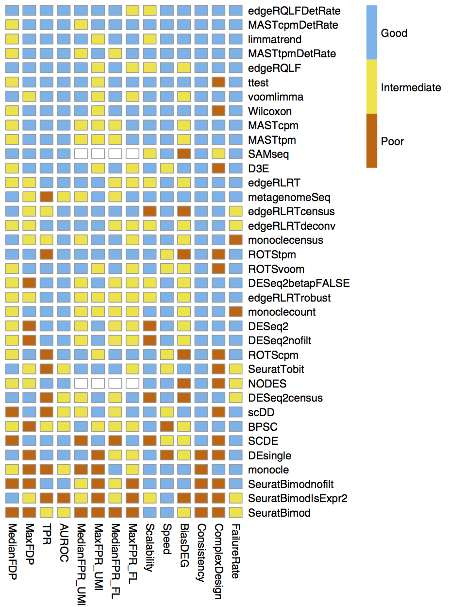
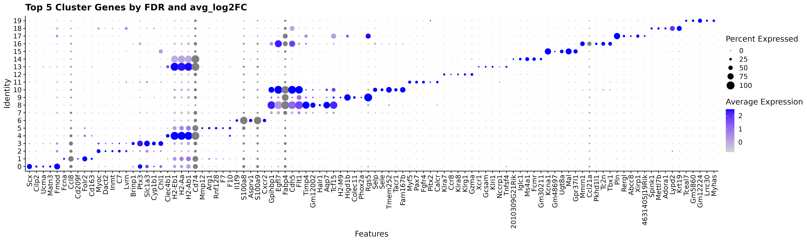
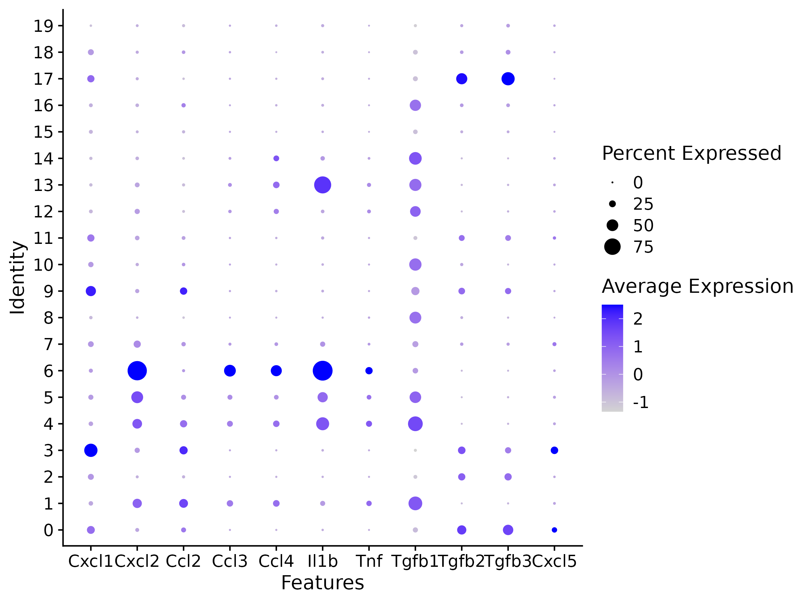

<style type="text/css">
body, td {
   font-size: 18px;
}
code.r{
  font-size: 12px;
}
pre {
  font-size: 12px
}
</style>

```{r, include = FALSE}
source("../bin/chunk-options.R")
knitr_fig_path("XX")
```

# Workflow Overview {.unlisted .unnumbered}

<br/>

<br/>
<br/>

# Introduction

To interpret our initial clustering results for all cells in our experiment, we'll need to characterized the gene expression driving separation between the clusters. 

In this section, we will demonstrate how to generate analytical marker genes for each cluster and how to visualize the expression of genes of interest to aid in cluster identification and labeling in subsequent steps. 

This process can be a highly variable process, from seeing well-characterized marker genes as top markers to needing to dig through the literature and plot the expression for multiple sets of genes of interest. Like the previous sections (and like other areas of research), when this process is more involved or iterative the final results then often only the final results are reported.

## Objectives
<!--Add specific goals for section-->
- Determine gene markers for each of the clusters using `FindAllMarkers`
- Visualize expression across clusters for genes of interest using `DotPlot`

---

# Cluster markers and characterization

After generating clusters, we need to perform differential expression analysis to identify the genes that distinguish those clusters [source](https://ouyanglab.com/singlecell/clust.html#identifying-marker-genes).  This should allow us to get visibility on some key questions for our clusters, as [highlighted by the HBC materials](https://hbctraining.github.io/scRNA-seq_online/lessons/09_merged_SC_marker_identification.html), namely if there are biologically meaningful gene expression differences between the clusters, if the gene expression of the generated clusters corresponds to expected cell-types or sub-types, if there are clusters with similar expression that should be combined and/or clusters that might need to be sub-clustered into smaller populations.

Many of the differential expression (DE) tools designed for bulk RNA-seq samples have been benchmarked for performance on scRNA-seq in [Soneson and Robinson (2018)](https://pubmed.ncbi.nlm.nih.gov/29481549/) and there are also dedicated DE tools for scRNA-seq like [MAST](https://genomebiology.biomedcentral.com/articles/10.1186/s13059-015-0844-5) that use models that account for the expected sparse structure of scRNA-seq data. However in our and others' experience, the default Wilcoxon test is often sufficient for simple pairwise DE comparisons, while edgeR ([Robinson, McCarthy, and Smyth 2010](https://pubmed.ncbi.nlm.nih.gov/19910308/)) is recommended by the [Ouyang Lab]([Ouyang](https://ouyanglab.com/singlecell/clust.html#identifying-marker-genes)) for more complex comparison designs, such as those that include covariates.

<!-- Additional context from [Ouyang](https://ouyanglab.com/singlecell/clust.html#identifying-marker-genes) regarding tool options and [HBC materials](https://hbctraining.github.io/scRNA-seq_online/lessons/09_merged_SC_marker_identification.html) regarding FindMarkers vs FindConservedMarkers, etc. -->




<details>
    <summary>*Additional considerations for differential expression*</summary>
    The Ouyang Lab has a [section of their tutorial](https://ouyanglab.com/singlecell/clust.html#sec:diffexpr) that discusses the methods available for differential expression including some highlighted in the figure below, as well as a more extensive section on [threshold considerations](https://ouyanglab.com/singlecell/clust.html#sec:diffexpr), while the [HBC section on marker genes identification](https://hbctraining.github.io/scRNA-seq_online/lessons/09_merged_SC_marker_identification.html) highlights the different types of marker identification options available via Seurat.
</details>
<br>

## Marker identification

First, we'll ensure that the correct resolution is selected from our Seurat object and then we'll use `PrepSCTFindMarkers` in preparation for DE comaprisons to "reverse the individual SCT regression model using minimum of median UMI as the sequencing depth covariate" according to the [Seurat documentation](https://satijalab.org/seurat/reference/prepsctfindmarkers) <!-- if we want to use the normalized RNA data (not the integrated data) `DefaultAssay(geo_so) <- "RNA"`, although need to check if that still makes sense for Seurat v5 --> 
```{r, eval = FALSE}
geo_so = SetIdent(geo_so, value = 'SCT_snn_res.0.4')
geo_so = PrepSCTFindMarkers(geo_so)
```

Next we'll run the`FindAllMarkers` [function](https://satijalab.org/seurat/reference/findallmarkers) to generate comparisons between each cluster and all other cells, regardless of the experimental group. The statistical test to perform can be specified in this function, but defaults to a Wilcoxon test:
```{r, eval=FALSE}
geo_markers = FindAllMarkers(geo_so, only.pos = TRUE)
```

<!--- Consider adding figure showing example of what's being compared (circle cluster 1 and then circle all other cells for example) -->

<details>
    <summary>*Seurat v5 improvements*</summary>
    For marker generation, Seurat v5 uses the [presto package](https://www.biorxiv.org/content/10.1101/653253v1) to reduce the time required to run DE comparisons, particularly for large datasets. For users who are not using presto, Seurat recommends increasing the min.pct and logfc.threshold parameterscto increase the speed of DE testing. [source](https://satijalab.org/seurat/articles/pbmc3k_tutorial.html#finding-differentially-expressed-features-cluster-biomarkers)
</details>
<br>

Then we can write out the full results to file: 
```{r, eval=FALSE}
write_csv(geo_markers, file = 'ISC_R/results/tables/marker_genes_0.4.csv')
```
Note that over-interpretation of these results should be avoided, since each cell is used as a replicate in these comparisons which can lead to inflated (e.g. very low) p-values, the top markers are more likely to be trustworthy [source](https://hbctraining.github.io/scRNA-seq_online/lessons/09_merged_SC_marker_identification.html). 

Therefore, it's useful to filter the results to highlight the top positive markers (since a positive fold-change would mean that gene is more highly expressed in the cluster compared to all other cells):
```{r, eval=FALSE}
# add code to create table of top 5 markers per cluster
top_5_by_log2FC = geo_markers %>% group_by(cluster) %>% arrange(p_val_adj, desc(avg_log2FC)) %>% slice_head(n = 5)
```

We can look at the marker table to see our results:
```{r, eval=FALSE}
head(top_5_by_log2FC)
```
<!--- ~~~~
# add expected output?
~~~~ --->

We expect to see several columns:
- `gene`: gene symbol
- `p_val`: p-value not adjusted for multiple test correction
- `avg_logFC`: average log fold change. Positive values indicate that the gene is more highly expressed in the cluster.
- `pct.1`: percentage of cells where the gene is detected in the cluster 
- `pct.2`: percentage of cells where the gene is detected on average across all other clusters 
- `p_val_adj`: adjusted p-value based on bonferroni correction using all genes in the dataset, used to determine significance
- `cluster`: cluster represented by `pct.1` and for which the statistics in the row are reported


When looking at the output, it is important to prioritize marker genes with both larger fold-change differences and larger difference between pct.1 and pct.2, particularly if pct.1 is high (e.g. if 80% of cells in the cluster evaluated express the gene that more reliable than if only 20% of cells express that gene) [source](https://hbctraining.github.io/scRNA-seq_online/lessons/09_merged_SC_marker_identification.html).

## Marker visualization

Now that we have generated a set of marker genes for our clusters, it is useful to visualize the expression of those markers to aid in evaluating our clusters. While the expression of individual genes per cell can be overlaid on our UMAPs as a "[FeaturePlot](https://satijalab.org/seurat/reference/featureplot)", it's often more useful to visualize the expression of multiple genes simultaneously. While there are [multiple methods supported by Seurat](https://satijalab.org/seurat/articles/visualization_vignette) for  visualizing marker gene expression, a heatmap or a related plot called a dotplot are commonly used. 

We'll use the `DotPlot` function with the SCT values to visualize the top 5 marker genes per cluster:
```{r, eval=FALSE}
top_5_sct_dot_plot = DotPlot(geo_so, features = unique(top_5_by_log2FC$gene)) + 
    theme(axis.text.x = element_text(angle = 90, hjust = 1, vjust = 0.5)) +
    labs(title = 'Top 5 Cluster Genes by FDR and avg_log2FC')
top_5_sct_dot_plot
```

In the dotplot we can see that the color indicates the expression of the gene while the size of the dot indicates the proportion of cells expressing that gene in each cluster [source](https://ouyanglab.com/singlecell/clust.html#visualising-marker-genes). 

 <!-- file: markers_top_5_sct_dot_plot.png -->

And then we can save the figure to file
```{r, eval=FALSE}
ggsave(filename = 'ISC_R/results/figures/markers_top_5_sct_dot_plot.png', plot = top_5_sct_dot_plot, width = 12, height = 6, units = 'in') 
```

<details>
    <summary>*Using raw RNA values in Dotplots*</summary>
    In addition to plotting the SCT values, the raw or normalized RNA values can be plotted as well:

```{r, eval=FALSE}
top_5_rna_dot_plot = DotPlot(geo_so, features = unique(top_5_by_log2FC$gene), assay = 'RNA') + 
    theme(axis.text.x = element_text(angle = 90, hjust = 1, vjust = 0.5)) +
    labs(title = 'Top 5 Cluster Genes by FDR and avg_log2FC')

ggsave(filename = 'ISC_R/results/figures/markers_top_5_sct_dot_plot.png', plot = top_5_rna_dot_plot, width = 12, height = 6, units = 'in') 
```
    
</details>
<br>

<br>


# Utilizing genes of interest

Often we have prior information about what cell types are expected in our samples and key marker genes for those populations. This can be an important part of evaluating our clusters, since if genes that are known markers for a specific cell type are found in too many or too few clusters as that can suggest that re-clustering is needed or that some of the clusters should be manually combined before annotating.

We can create lists of markers used in figures from the [original paper](https://www.ncbi.nlm.nih.gov/pmc/articles/PMC7002453/): 

```{r, eval=FALSE}

fig1g_markers = c('Cxcl1', 'Cxcl2', 'Ccl2', 'Ccl3', 'Ccl4', 'Il1b', 'Il6b', 'Tnf', 'Tgfb1', 'Tgfb2', 'Tgfb3', 'Cxcl5')
fig1h_markers = c('Cxcr2', 'Csf1r', 'Csf3r', 'Tgfbr1', 'Tgfbr3', 'Il1r1', 'Il6ra', 'Lifr', 'Tgfbr2')
```

Then we can use the same `DotPlot` function to visualize the expression level and frequency of these genes in our current clusters:
```{r, eval=FALSE}
fig1g_sct_dot_plot = DotPlot(geo_so, features = fig1g_markers, assay = 'SCT')
fig1h_sct_dot_plot = DotPlot(geo_so, features = fig1h_markers, assay = 'SCT')

View(fig1g_sct_dot_plot)
```




And save the figures to file:
```{r, eval=FALSE}
ggsave(filename = 'results/figures/markers_fig1g_sct_dot_plot.png', plot = fig1g_sct_dot_plot, width = 8, height = 6, units = 'in')
ggsave(filename = 'results/figures/markers_fig1h_sct_dot_plot.png', plot = fig1h_sct_dot_plot, width = 8, height = 6, units = 'in')
```

<details>
    <summary>*Using raw RNA values for genes of interest*</summary>
    We can also generate the same plots, but using the unintegrated data by specifying the `RNA` assay:
```{r, eval=FALSE}
rna_dot_plot = DotPlot(geo_so, features = fig1g_markers, assay = 'RNA')
fig1h_rna_dot_plot = DotPlot(geo_so, features = fig1h_markers, assay = 'RNA')

ggsave(filename = 'results/figures/markers_fig1g_rna_dot_plot.png', plot = fig1g_rna_dot_plot, width = 8, height = 6, units = 'in')
ggsave(filename = 'results/figures/markers_fig1h_rna_dot_plot.png', plot = fig1h_rna_dot_plot, width = 8, height = 6, units = 'in')
```
</details>
<br>


For known marker genes, it's important to note that since scRNA-seq is only measuring transcriptional signals that markers at the protein level (e.g used for approaches like FACS) may be less effective. The book ["Best practices for single-cell analysis across modalities" by Heumos, Schaar, Lance, et al. ](https://www.sc-best-practices.org/cellular_structure/annotation.html) points out that ideally marker genes are validated across multiple datasets but "it is often useful to work together with experts ... [like a] biologist who has more extensive knowledge of the tissue, the biology, the expected cell types and markers etc.". In our experience, we find that experience and knowledge of the the researchers we work with is invaluable. 

# Save our progress

Finally, we can create an output file for our updated Seurat object
```{r, eval=FALSE}
saveRDS(object = geo_so, file = 'ISC_R/results/rdata/geo_so_sct_integrated_with_markers.rda')
```


# Summary

Now that we have characterized the expression of both analytical marker genes and literature or knowledge based marker genes, we may have a better sense of what cell-types or subtypes our clusters might correspond to.   

However, marker genes alone might not be sufficient to determine cell-type or sub-type labels for our clusters so we will discuss other more automated approaches to complement these results.

<!-- While there are some automated cluster annotation tools, one of which we'll discuss in the next section, often manual cluster annotation is part of characterizing clusters in single cell data.  -->

Next steps: Cell type prediction tools


----

These materials have been adapted and extended from materials listed above. These are open access materials distributed under the terms of the [Creative Commons Attribution license (CC BY 4.0)](http://creativecommons.org/licenses/by/4.0/), which permits unrestricted use, distribution, and reproduction in any medium, provided the original author and source are credited.

<br/>
<br/>
<hr/>
| [Previous lesson](05-ProjectionAndClustering.html) | [Top of this lesson](#top) | [Next lesson](07-CellTypeAnnos.html) |
| :--- | :----: | ---: |

