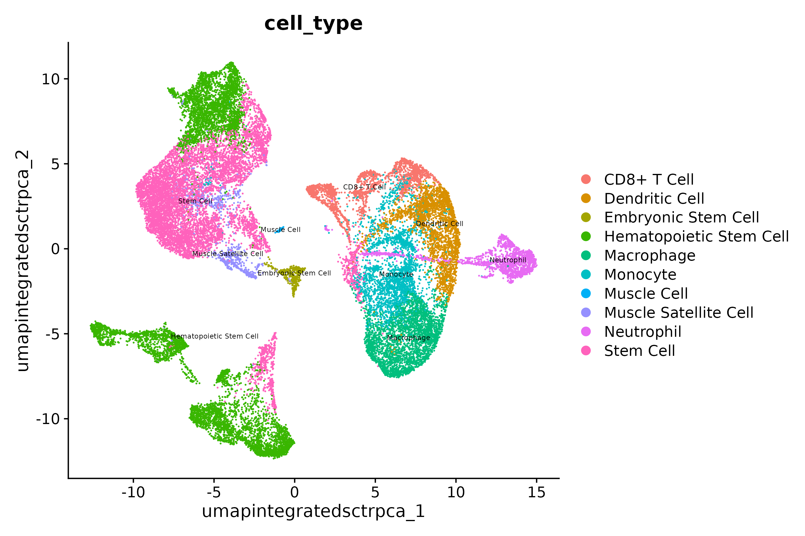

<style type="text/css">
body, td {
   font-size: 18px;
}
code.r{
  font-size: 12px;
}
pre {
  font-size: 12px
}
</style>

```{r, include = FALSE}
source("../bin/chunk-options.R")
knitr_fig_path("XX")
```

# Workflow Overview {.unlisted .unnumbered}

<br/>

<br/>
<br/>

# Introduction

A frequent bottleneck in the single-cell RNA-seq analysis workflow is annotating our clustering results, as it requires bridging the gap between the data and prior knowledge ([source](https://bioconductor.org/books/3.15/OSCA.basic/cell-type-annotation.html)). While generating markers for each cluster and evaluating the expression of known marker genes is important, it may or may not be sufficient to assign cell-type or sub-type labels. 

In this section, our goal is to use an automated annotation tool to generate cell type predictions for our clusters. 

Like the previous sections, the process to assign cell-types to clusters can be very iterative. In addition, the steps to reach a "Figure 1" level of labeled clusters may not be presented in detail, can be very dataset dependent, and often is more challenging for less characterized tissues. 

## Objectives

-  Understand the complexities of cell-type annotation    
-  Use `scCATCH` cell-type predictions to annotate our clusters    


----


# Cell type predictions


Automated tools have the advantage of being able to compare between the expression patterns in our dataset and large numbers of reference datasets or databases at a scale that is not feasible to do manually.

As described [in more detail by the Ouyang Lab](https://ouyanglab.com/singlecell/clust.html#annotating-clusters) and summarized in the figure below, there are many computational tools that aim to assign cell type labels for single-cell data. These methods generally fall into three categories: 

1. Marker based approaches that use gene sets drawn from the literature, including previous single-cell studies, 
2. Correlation based approaches that estimate the similarity between the cells or clusters in the input data and some reference data and 
3. Machine learning approaches that include training on a single-cell reference atlas. 

   

However, across any of these approaches the quality of the reference data (and reliability of the authors labels) and relevancy to your specific tissue/experiment (and the resolution of your biological question) is crucial. Additionally, it's important to consider that rare or novel cell populations may not be present or well-characterized in available references and that even after filtering some clusters correspond to stressed or dying cells and not a particular cell-type or subtype. Therefore, any prediction should be reviewed and considered in the context both marker gene expression for the dataset and knowledge of the biological system and broader literature. 


Some tools and references are available primarily for human tissues (and not mouse or rat), particular for tissues other than PBMCs and the brain. For human data, if a relevant reference is available for your experiment, we would recommend trying [Azimuth (created by authors of Seurat)](https://azimuth.hubmapconsortium.org/). [10x has a tutorial](https://www.10xgenomics.com/analysis-guides/automated-cell-type-annotation-from-r-to-loupe-using-louper) that includes example of using Azimuth, including a feature of the tool that allows for first pass of cell-type assignment of more common cell-types followed by identifying rarer populations that may not be identified in the first pass. 

<details>
    <summary>*Additional automated annotation resources*</summary>
    Automated cell-type annotation is an active area of research and development and many other tools and resources are available, including [OSCA's demonstration of the SingleR method](https://bioconductor.org/books/3.15/OSCA.basic/cell-type-annotation.html), a [Tutorial by Clarke et al. for cell-type annotations](https://pubmed.ncbi.nlm.nih.gov/34031612/), and an [entire chapter of the SC best practices book](https://www.sc-best-practices.org/cellular_structure/annotation.html#automated-annotation).
</details>
<br>


# Using scCATCH

A tool we often use for both mouse and human data cell-type predictions is called [scCATCH](https://github.com/ZJUFanLab/scCATCH/wiki) which, per the author's description in [Shao et al (2020)](https://www.ncbi.nlm.nih.gov/pmc/articles/PMC7031312/), annotates cell-types using a "tissue-specific cellular taxonomy reference database (CellMatch) and [an] evidence-based scoring (ES) protocol". The CellMatch reference is compiled from CellMarker ([Zhang et al., 2019b](https://www.cell.com/servlet/linkout?suffix=e_1_5_1_2_33_2&dbid=8&doi=10.1016/j.isci.2020.100882&key=30289549&cf=)), MCA ([Han et al., 2018](https://www.cell.com/servlet/linkout?suffix=e_1_5_1_2_10_2&dbid=8&doi=10.1016/j.isci.2020.100882&key=29775597&cf=)), CancerSEA ([Yuan et al., 2019](https://www.cell.com/servlet/linkout?suffix=e_1_5_1_2_29_2&dbid=8&doi=10.1016/j.isci.2020.100882&key=30329142&cf=)), and the [CD Marker Handbook](https://www.abcam.com/primary-antibodies/human-cd-antigen-guide) and PMIDs for relevant literature are reported in the prediction results. 

<!-- consider adding [scType](https://cran.r-project.org/web/packages/scCATCH/vignettes/tutorial.html) as an alternative -->

 

First, we need to load the scCATCH library. Then, we'll double check that we are using the expected resolution cluster results (this is particularly important if we generated multiple resolutions in our clustering steps), before creating a new object from our `counts` data with `createscCATCH()` and adding our marker genes to the scCATCCH object.

To increase the speed and accuracy of our predictions, we'll create query of relevant tissues (which requires some prior knowledge of the experiment and using the [scCATCH wiki](https://github.com/ZJUFanLab/scCATCH/wiki) to select tissues from the species) before we run the tool:

```{r, eval=FALSE}
library(scCATCH)

# check that cell identities are set to expected resolution 
all(Idents(geo_so) == geo_so$integrated.sct.rpca.clusters)

# create scCATCH object, using count data
geo_catch = createscCATCH(data = geo_so@assays$SCT@counts, cluster = as.character(Idents(geo_so)))

# add marker genes to use for predictions
geo_catch@markergene = geo_markers

# specify tissues/cell-types from the scCATCH reference
geo_catch@marker = cellmatch[cellmatch$species == 'Mouse' & cellmatch$tissue %in% c('Blood', 'Peripheral Blood', 'Muscle', 'Skeletal muscle', 'Epidermis', 'Skin'), ]

# run scCATCH to generate predictions
geo_catch = findcelltype(geo_catch)

# look at the predictions
geo_catch@celltype %>% select(cluster, cell_type, celltype_score)
```
~~~
   cluster               cell_type celltype_score
1        0               Stem Cell           0.83
2        1 Hematopoietic Stem Cell           0.87
3        2              Macrophage           0.82
4        3          Dendritic Cell           0.86
5        4                Monocyte           0.82
6        5               Stem Cell           0.88
7        6              Neutrophil           0.81
8        7               Stem Cell           0.85
9        8 Hematopoietic Stem Cell           0.90
10       9 Hematopoietic Stem Cell           0.87
11      10 Hematopoietic Stem Cell           0.91
12      11   Muscle Satellite Cell           0.94
13      12             CD8+ T Cell           0.90
14      13             CD8+ T Cell           0.88
15      14             CD8+ T Cell           0.89
16      15     Embryonic Stem Cell           0.87
17      16 Hematopoietic Stem Cell           0.87
18      17 Hematopoietic Stem Cell           0.88
19      18             Muscle Cell           0.69
~~~

When we look at our results we can see the cell type score, which gives us an idea of the confidence of that prediction. Not shown here but the full `celltype` table also includes marker genes and PMIDs for relevant literature for each prediction.

As these cell-types correspond to the cell-types and subtypes we'd expect to be present in these data and most of the prediction scores are quite high, we can reasonably use these results to annotate our clusters. In our experience, the scCATCH results often help guide cluster annotation but scores can vary and the predictions may need to be revised based on researcher's knowledge of the biological system.


# Annotate clusters

Next, we'll add celltype the predictions to our Seurat object to replace our clusters' numerical identities. Note: we will create a new metadata object where we join cell types. However, this will destroy the row names - which will cause a problem in Seurat - so we have to add them back.

```{r, eval=FALSE}
# Extract the cell types only to merge into the meta.data
catch_celltypes = geo_catch@celltype %>% select(cluster, cell_type)

# Merge cell types in but as a new table to slide into @meta.data
new_metadata = geo_so@meta.data %>% left_join(catch_celltypes, by = c('integrated.sct.rpca.clusters' = 'cluster'))
rownames(new_metadata) = rownames(geo_so@meta.data) #  We are implicitly relying on the same row order!

# Replace the meta.data
geo_so@meta.data = new_metadata 

head(geo_so@meta.data)
```

**Checkpoint** : Has the metadata for your `geo_so` object been updated?

## Visualise annotated clusters

Lastly, we can generate a revised UMAP plot with our descriptive cluster labels by using our updated Seurat object and providing the new `cell_type` label for the `group.by` argument:

```{r, eval=FALSE}
catch_umap_plot = DimPlot(geo_so, group.by = 'cell_type', label = TRUE, reduction = 'umap.integrated.sct.rpca')
catch_umap_plot

ggsave(filename = 'results/figures/umap_integrated_catch.png', plot = catch_umap_plot, width = 8, height = 7, units = 'in')
```



# Save our progress

We'll save the scCATCH object. The Seurat object has not been changed in this module.

```{r, eval = FALSE}
saveRDS(object = geo_catch, file = 'results/rdata/geo_catch.rds')
```

# Summary

Now that we have generated reasonable annotations for our clusters, we can proceed with the step of differential expression which is essential to addressing our biological question for this experiment.

Next steps: Differential Expression

----

These materials have been adapted and extended from materials listed above. These are open access materials distributed under the terms of the [Creative Commons Attribution license (CC BY 4.0)](http://creativecommons.org/licenses/by/4.0/), which permits unrestricted use, distribution, and reproduction in any medium, provided the original author and source are credited.

<br/>
<br/>
<hr/>
| [Previous lesson](06-MarkerVisualization.html) | [Top of this lesson](#top) | [Next lesson](08-DifferentialExpression.html) |
| :--- | :----: | ---: |

