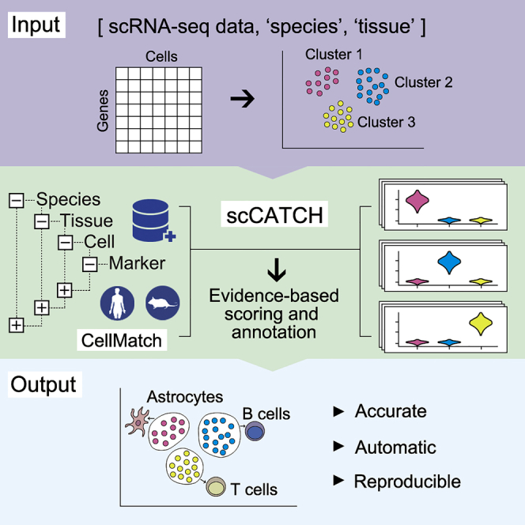

<style type="text/css">
body, td {
   font-size: 18px;
}
code.r{
  font-size: 12px;
}
pre {
  font-size: 12px
}

table.fig, th.fig, td.fig {
  border: 1px solid black;
  border-collapse: collapse;
  padding: 15px;
}
</style>

```{r klippy, echo=FALSE, include=TRUE}
klippy::klippy(lang = c("r", "markdown", "bash"), position = c("top", "right"))
```

```{r, include = FALSE}
source("../bin/chunk-options.R")
knitr_fig_path("07-CellTypeAnnotation/07-")
```

# Workflow Overview {.unlisted .unnumbered}

<br/>

<br/>
<br/>

# Introduction

A frequent bottleneck in the single-cell RNA-seq analysis workflow is annotating our clustering results, as it requires bridging the gap between the data and prior knowledge ([source](https://bioconductor.org/books/3.15/OSCA.basic/cell-type-annotation.html)). While generating markers for each cluster and evaluating the expression of known marker genes is important, it may or may not be sufficient to assign cell-type or sub-type labels. 

<table class='fig'>
<tr class='fig'><td class='fig'></td></tr>
<tr class='fig'><td class='fig'>For each cell-type (A), the marker genes we derived in the prior step (B) are compared with known marker genes for different cell types (C). Concordance between derived marker genes and known cell markers produces a suggested annotation for that cell type.
</td></tr>
</table>

In this section, our goal is to use an automated annotation tool to generate cell type predictions for our clusters. 

Like the previous sections, the process to assign cell-types to clusters can be very iterative. In addition, the steps to reach a "Figure 1" level of labeled clusters may not be presented in detail, can be very dataset dependent, and often is more challenging for less characterized tissues. 

## Objectives

-  Understand the complexities of cell-type annotation    
-  Use `scCATCH` cell-type predictions to annotate our clusters    

----

```{r, read_rds_hidden, echo = FALSE, warning = FALSE, message = FALSE}
if(!exists('geo_so')) {
  library(Seurat)
  library(BPCells)
  library(tidyverse)

  options(future.globals.maxSize = 1e9)

  geo_so = readRDS('results/rdata/geo_so_sct_integrated_with_markers.rds')
}

if(!exists('geo_markers')) {
  library(Seurat)
  library(BPCells)
  library(tidyverse)

  options(future.globals.maxSize = 1e9)

  geo_markers = readRDS('results/rdata/geo_markers.rds')
}
```

# Cell type predictions

Automated tools have the advantage of being able to compare between the expression patterns in our dataset and large numbers of reference datasets or databases at a scale that is not feasible to do manually.

As described [in more detail by the Ouyang Lab](https://ouyanglab.com/singlecell/clust.html#annotating-clusters) and summarized in the figure below, there are many computational tools that aim to assign cell type labels for single-cell data. These methods generally fall into three categories: 

1. Marker based approaches that use gene sets drawn from the literature, including previous single-cell studies, 
2. Correlation based approaches that estimate the similarity between the cells or clusters in the input data and some reference data
3. Machine learning approaches that include training on a single-cell reference atlas. 

   

However, across any of these approaches the quality of the reference data (and reliability of the authors labels) and relevancy to your specific tissue/experiment (and the resolution of your biological question) is crucial. Additionally, it's important to consider that rare or novel cell populations may not be present or well-characterized in available references and that even after filtering, some clusters might correspond to stressed or dying cells and not a particular cell-type or subtype. Therefore, any prediction should be reviewed and considered in the context both marker gene expression for the dataset and knowledge of the biological system and broader literature. 

Some tools and references are available solely or primarily for human tissues (and not mouse or rat), particular for tissues other than PBMCs and the brain. For human data, if a relevant reference is available for your experiment, we would recommend trying [Azimuth (created by authors of Seurat)](https://azimuth.hubmapconsortium.org/). [10x has a tutorial](https://www.10xgenomics.com/analysis-guides/automated-cell-type-annotation-from-r-to-loupe-using-louper) that includes example of using Azimuth, including a feature of the tool that allows for first pass of cell-type assignment of more common cell-types followed by identifying rarer populations that may not be identified in the first pass. 

<details>
    <summary>*Additional automated annotation resources*</summary>
    Automated cell-type annotation is an active area of research and development and many other tools and resources are available, including [OSCA's demonstration of the SingleR method](https://bioconductor.org/books/3.15/OSCA.basic/cell-type-annotation.html), a [Tutorial by Clarke et al. for cell-type annotations](https://pubmed.ncbi.nlm.nih.gov/34031612/), and an [entire chapter of the SC best practices book](https://www.sc-best-practices.org/cellular_structure/annotation.html#automated-annotation).
</details>
<br>

# Using scCATCH

A tool we often use for both mouse and human data cell-type predictions is called [scCATCH](https://github.com/ZJUFanLab/scCATCH/wiki) which, per the author's description in [Shao et al (2020)](https://www.ncbi.nlm.nih.gov/pmc/articles/PMC7031312/), annotates cell-types using a "tissue-specific cellular taxonomy reference database (CellMatch) and [an] evidence-based scoring (ES) protocol". The CellMatch reference is compiled from CellMarker ([Zhang et al., 2019b](https://www.cell.com/servlet/linkout?suffix=e_1_5_1_2_33_2&dbid=8&doi=10.1016/j.isci.2020.100882&key=30289549&cf=)), MCA ([Han et al., 2018](https://www.cell.com/servlet/linkout?suffix=e_1_5_1_2_10_2&dbid=8&doi=10.1016/j.isci.2020.100882&key=29775597&cf=)), CancerSEA ([Yuan et al., 2019](https://www.cell.com/servlet/linkout?suffix=e_1_5_1_2_29_2&dbid=8&doi=10.1016/j.isci.2020.100882&key=30329142&cf=)), and the [CD Marker Handbook](https://www.abcam.com/primary-antibodies/human-cd-antigen-guide) and PMIDs for relevant literature are reported in the prediction results. 

<!-- consider adding [scType](https://cran.r-project.org/web/packages/scCATCH/vignettes/tutorial.html) as an alternative -->

 

First, we need to load the scCATCH library. Then, we'll double check that we are using the expected resolution cluster results (this is particularly important if we generated multiple resolutions in our clustering steps), before creating a new object from our `counts` data with `createscCATCH()` and adding our marker genes to the scCATCCH object.

To increase the speed and accuracy of our predictions, we'll create query of relevant tissues (which requires some prior knowledge of the experiment and using the [scCATCH wiki](https://github.com/ZJUFanLab/scCATCH/wiki) to select tissues from the species) before we run the tool:

```{r, sccatch, message = FALSE, warning = FALSE}
##### Day 3 - Cell Type Annotation

# Annotate clusters using scCATCH  ----------------------------------------
library(scCATCH)

# check that cell identities are set to expected resolution 
all(Idents(geo_so) == geo_so$integrated.sct.rpca.clusters)

# create scCATCH object, using count data
geo_catch = createscCATCH(data = geo_so@assays$SCT@counts, cluster = as.character(Idents(geo_so)))

# add marker genes to use for predictions
geo_catch@markergene = geo_markers

# specify tissues/cell-types from the scCATCH reference
geo_catch@marker = cellmatch[cellmatch$species == 'Mouse' & cellmatch$tissue %in% c('Blood', 'Peripheral Blood', 'Muscle', 'Skeletal muscle', 'Epidermis', 'Skin'), ]

# run scCATCH to generate predictions
geo_catch = findcelltype(geo_catch)

# look at the predictions
geo_catch@celltype %>% select(cluster, cell_type, celltype_score)
```

When we look at our results we can see the cell type score, which gives us an idea of the confidence of that prediction. Not shown here but the full `celltype` table also includes marker genes and PMIDs for relevant literature for each prediction.

In our experience, these kinds of results often help guide cluster annotation but scores can vary and the predictions may need to be revised based on researcher's knowledge of the biological system. As these cell-types correspond to the cell-types and subtypes we'd expect to be present in these data and most of the prediction scores are quite high, we can reasonably use these results to annotate our clusters with some minor adjustments. 

## Using known cell-type markers

To confirm and refine the scCATCH predictions, we'll spot check some known markers for immune populations. Then we'll look look at some other key marker genes from some other relevant resources like [Chen et al (2021)](https://www.nature.com/articles/s41467-021-27563-3), [Buechler et al (2021)](https://www.nature.com/articles/s41586-021-03549-5) [Roman (2023)](https://pmc.ncbi.nlm.nih.gov/articles/PMC10296409/#sec3-biomolecules-13-00945 ),  [Li et al (2022)](https://bmcbioinformatics.biomedcentral.com/articles/10.1186/s12859-022-04817-5/figures/2) and [Nestorowa et al (2016)](https://ashpublications.org/blood/article/128/8/e20/35749/A-single-cell-resolution-map-of-mouse) to see if other modifications should be made to the scCATCH predictions:
```{r, marker_gene_check, fig.show='hold'}
# Plot other markers/features to assist with identification ---------------
# spot check known immune markers
immune_markers = list()
immune_markers[['Inflam. Macrophage']] = c('Cd14', 'Cxcl2') # Cd14 a- monocyte/macrophage cells
immune_markers[['Platelet']] = c('Pf4')
immune_markers[['Mast cells']] = c('Gata2', 'Kit')
immune_markers[['NK cells']] = c('Nkg7', 'Klrd1')
immune_markers[['B-cell']] = c( 'Ly6d', 'Cd19', 'Cd79b', 'Ms4a1')
immune_markers[['T-cell']] = c( 'Cd3d','Cd3e','Cd3g') # also Thy1

immune_markers_plot = DotPlot(geo_so, features = immune_markers, assay = 'SCT')  +
  theme(text=element_text(size=10), axis.text.x = element_text(angle = 45, vjust = 0.5))
immune_markers_plot

# save to file
ggsave(filename = 'results/figures/immune_markers_sct_dot_plot.png', plot = immune_markers_plot, width = 10, height = 5, units = 'in')

# plot some known cell-type markers 
other_markers = list()
other_markers[['Pericyte']] = c('Acan','Sox9')
other_markers[['SMC']] = c('Acta2', 'Myh11') # SMC = mesenchymal smooth-muscle cell/mesenchymal lineage
other_markers[['Keratinocytes']] = c('Thy1', 'Dlk1') # fibro progenitors aso=Thy1
other_markers[['Myofibroblasts']] = c('Tmem100', 'Cd34', 'Ly6c1') # hematopoetic stem/activated fibroblast=Cd34
other_markers[['Fibroblast']] = c('Dpt', 'Fn1', 'Col3a1')  # activated fib = Fn1
other_markers[['Endothelial']] = c('Pecam1', 'Cd38') # from wound healing; Pecam1 also exp in endothelial
other_markers[['HSC']] = c('Ltb', 'Cd74') # less well defined/conflicting definitions
other_markers[['Erythroid']] = c('Hba-a1')

other_markers_dot_plot = DotPlot(geo_so, features = other_markers, assay = 'SCT') +
  theme(text=element_text(size=10), axis.text.x = element_text(angle = 45, vjust = 0.5))
other_markers_dot_plot

# save to file
ggsave(filename = 'results/figures/other_markers_sct_dot_plot.png', plot = other_markers_dot_plot, width = 12, height = 5, units = 'in')

```
In the first plot, B-cell and T-cell markers seem to line up with the predictions and are limited to single clusters. However, macrophage and dendrocyte markers match to multiple clusters including some annotated with different cell types, so we can consider modifying those cluster labels. 


From the other marker genes, the patterns are less clear so we may want to test other clustering parameters and discuss the results with a researcher familiar with the expected cell types. However, we can notice some patterns that we can use to refine our cluster annotations. 

#### Utilizing genes of interest from the original paper 

<details>
    <summary>*Plotting the expression of genes of interest from Sorkin, Huber et al*</summary>
    Often we have prior information about what cell types are expected in our samples and key marker genes for those populations. This can be an important part of evaluating our clusters, since if genes that are known markers for a specific cell type are found in too many or too few clusters as that can suggest that re-clustering is needed or that some of the clusters should be manually combined before annotating. We can create lists of markers used in figures from the [original paper](https://www.ncbi.nlm.nih.gov/pmc/articles/PMC7002453/) before using the same `DotPlot()` function to visualize the expression level and frequency of these genes in our current clusters:

```{r, known_dot_plots_sct, fig.show='hold'}
# Visualize manually selected marker genes --------------------------------
# Create lists of genes from paper 
fig1g_markers = c('Cxcl1', 'Cxcl2', 'Ccl2', 'Ccl3', 'Ccl4', 'Il1b', 'Il6b', 'Tnf', 'Tgfb1', 'Tgfb2', 'Tgfb3', 'Cxcl5')
fig1h_markers = c('Cxcr2', 'Csf1r', 'Csf3r', 'Tgfbr1', 'Tgfbr3', 'Il1r1', 'Il6ra', 'Lifr', 'Tgfbr2')

# create DotPlots for genes from paper
fig1g_sct_dot_plot = DotPlot(geo_so, features = fig1g_markers, assay = 'SCT')
fig1h_sct_dot_plot = DotPlot(geo_so, features = fig1h_markers, assay = 'SCT')

fig1g_sct_dot_plot
fig1h_sct_dot_plot

# save plots to file
ggsave(filename = 'results/figures/markers_fig1g_sct_dot_plot.png', plot = fig1g_sct_dot_plot, width = 8, height = 6, units = 'in')
ggsave(filename = 'results/figures/markers_fig1h_sct_dot_plot.png', plot = fig1h_sct_dot_plot, width = 8, height = 6, units = 'in')
```
For known marker genes, it's important to note that since scRNA-seq is only measuring transcriptional signals that markers at the protein level (e.g used for approaches like FACS) may be less effective. An alternative or complement to using marker genes could be methods like using gene set enrichment (GSEA) [as demonstrated in the OSCA book](https://bioconductor.org/books/3.15/OSCA.basic/cell-type-annotation.html#computing-gene-set-activities) to aid in annotations. However, the book ["Best practices for single-cell analysis across modalities" by Heumos, Schaar, Lance, et al. ](https://www.sc-best-practices.org/cellular_structure/annotation.html) points out that "it is often useful to work together with experts ... [like a] biologist who has more extensive knowledge of the tissue, the biology, the expected cell types and markers etc.". In our experience, we find that experience and knowledge of the researchers we work with is invaluable. 

</details>
<br>

<details>
    <summary>*Using raw RNA values for genes of interest from Sorkin, Huber et al*</summary>
    We can also generate the same plots, but using the unintegrated data by specifying the `RNA` assay:

```{r, known_dot_plot_rna, eval=FALSE}
# Visualize manually selected marker genes (from unintegrated data) ------
rna_dot_plot = DotPlot(geo_so, features = fig1g_markers, assay = 'RNA')
fig1h_rna_dot_plot = DotPlot(geo_so, features = fig1h_markers, assay = 'RNA')

ggsave(filename = 'results/figures/markers_fig1g_rna_dot_plot.png', plot = fig1g_rna_dot_plot, width = 8, height = 6, units = 'in')
ggsave(filename = 'results/figures/markers_fig1h_rna_dot_plot.png', plot = fig1h_rna_dot_plot, width = 8, height = 6, units = 'in')
```
</details>
<br>


# Annotate clusters

Next, we'll modify the cell type predictions and add the labels to our Seurat object to replace our clusters' numerical identities. Note: we will create a new metadata object where we join cell types. However, this will destroy the row names - which will cause a problem in Seurat - so we have to add them back. <!--- modify to have a hidden block that runs after to keep this large block intact -->

```{r, annotate_clusters}
# Annotate clusters using modified predictions ----------------------------
# First - Extract the cell types only from the predictions
celltype_annos = geo_catch@celltype %>% select(cluster, cell_type) %>% 
  mutate(cluster = factor(cluster, levels = c(0:19))) %>% arrange(cluster)
celltype_annos

# Customize annotations, remembering that cluster 0 = row 1 in table
celltype_annos$cell_type[c(3,15)] <- "Inflammatory macrophage" # resolves cluster 2 and 14
celltype_annos$cell_type[c(11)] <- "Macrophage"

celltype_annos$cell_type[c(2)] <- "Fibroblast" # revise clusters 1,6 based on markers
celltype_annos$cell_type[c(6)] <- "Myofibroblast"
celltype_annos$cell_type[c(8,9)] <- "Endothelial" # revise cluster 7,8; also have weaker mast cell signal
celltype_annos$cell_type[c(6,13)] <- "Hematopoietic stem cell" # based on markers but could further revise
celltype_annos$cell_type[c(10,19)] <- "Mesenchymal stem/stromal cell" # based on Acta2 signal
celltype_annos$cell_type[c(16)] <- "Erythroid" # cluster 15, less confident but not near other dendritic cells
celltype_annos$cell_type[c(20, 17)] <- "Unknown" # since such small populations, reset cluster 16 & 19 as unknown for now


# Merge cell types in but as a new table to slide into @meta.data
new_metadata = geo_so@meta.data %>% left_join(celltype_annos, by = c('integrated.sct.rpca.clusters' = 'cluster'))
rownames(new_metadata) = rownames(geo_so@meta.data) #  We are implicitly relying on the same row order!

# Replace the meta.data
geo_so@meta.data = new_metadata 

head(geo_so@meta.data)
```

**Checkpoint** : Has the metadata for your `geo_so` object been updated?

We have now added a "cell_type" column to the `meta.data` table:


## Visualise annotated clusters

Lastly, we can generate a revised UMAP plot with our descriptive cluster labels by using our updated Seurat object and providing the new `cell_type` label for the `group.by` argument:

```{r, catch_umap_plot, fig.width = 10, fig.height = 8, fig.show='hold'}
# Make a labeled UMAP plot of clusters ------------------------------------
catch_umap_plot = DimPlot(geo_so, group.by = 'cell_type', label = TRUE, reduction = 'umap.integrated.sct.rpca')
catch_umap_plot

ggsave(filename = 'results/figures/umap_integrated_catch.png', plot = catch_umap_plot, width = 10, height = 8, units = 'in')

catch_umap_condition_plot = DimPlot(geo_so, group.by = 'cell_type', split.by = 'day', label = TRUE, reduction = 'umap.integrated.sct.rpca')
catch_umap_condition_plot

ggsave(filename = 'results/figures/umap_integrated_catch_byCondition.png', plot = catch_umap_plot, width = 10, height = 8, units = 'in')
```

<!-- to add - number of cells per cluster and condition/replicate after annotation --->

# Save our progress

We'll save the scCATCH object. The Seurat object has not been changed in this module.

```{r, save_rds_hidden, echo = FALSE}
if(!file.exists('results/rdata/geo_so_sct_integrated_with_catch.rds')) {
  saveRDS(geo_so, file = 'results/rdata/geo_so_sct_integrated_with_catch.rds')
}

if(!file.exists('results/rdata/geo_catch.rds')) {
  saveRDS(geo_catch, file = 'results/rdata/geo_catch.rds')
}
```

```{r, save_rds, eval=FALSE}
# Save Seurat object and annotations --------------------------------------
saveRDS(geo_so, file = 'results/rdata/geo_so_sct_integrated_with_catch.rds')
saveRDS(geo_catch, file = 'results/rdata/geo_catch.rds')
```

# Summary

Now that we have generated reasonable annotations for our clusters, we can proceed with the step of differential expression which is essential to addressing our biological question for this experiment.

Next steps: Differential Expression

----

These materials have been adapted and extended from materials listed above. These are open access materials distributed under the terms of the [Creative Commons Attribution license (CC BY 4.0)](http://creativecommons.org/licenses/by/4.0/), which permits unrestricted use, distribution, and reproduction in any medium, provided the original author and source are credited.

<br/>
<br/>
<hr/>
| [Previous lesson](06-MarkerVisualization.html) | [Top of this lesson](#top) | [Next lesson](08-DifferentialExpression.html) |
| :--- | :----: | ---: |
