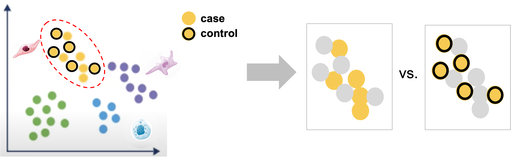
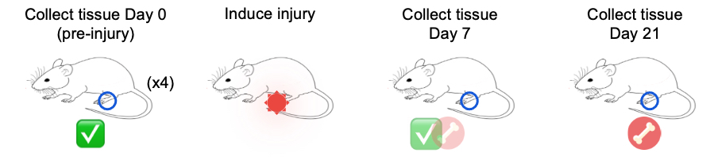
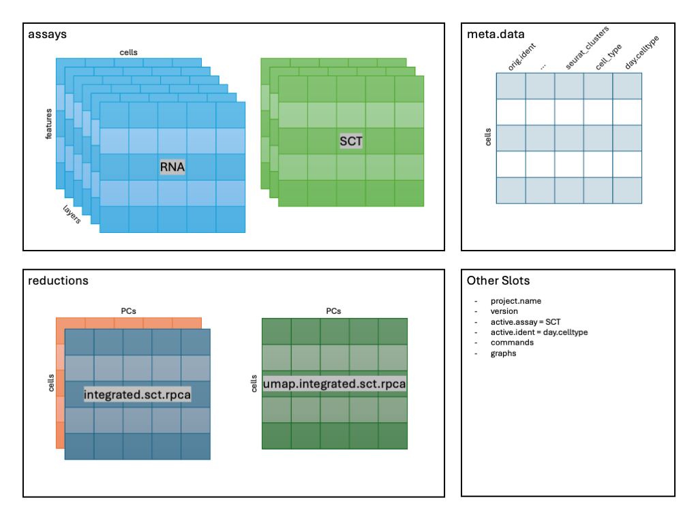

<style type="text/css">
body {
   font-size: 18px;
}
code.r{
  font-size: 12px;
}
pre {
  font-size: 12px
}

table.fig, th.fig, td.fig {
  border: 1px solid lightgray;
  border-collapse: collapse;
  padding: 12px;
}
</style>

```{r klippy, include=TRUE, echo=FALSE, message=FALSE, warning=FALSE}
klippy::klippy(lang = c("r", "markdown", "bash"), position = c("top", "right"))
library(kableExtra)
```

```{r, include = FALSE}
source("../bin/chunk-options.R")
knitr_fig_path("08-DifferentialExpression/08-")
```

# Workflow Overview {.unlisted .unnumbered}

<br/>

<br/>
<br/>

# Introduction

<br/>
<table class='fig'><tr><td class='fig'>

</td></tr><tr><tr class='fig'><td class='fig'>Starting with labeled clustered data, for each labeled cluster, we can compare between case and control within that cluster to identify genes that are impacted by the experimental perturbation(s) for that cell-type or subtype.
</td></tr>
</table>
<br/>

After identifying what cell-types are likely present in our data, we can finally consider experimental conditions and use differential expression comparisons to address the biological question at hand for an experiment.
<br/>

## Objectives

<!--Add specific goals for section-->
- Run "standard" differential expression comparisons with cells as replicates
- Run "pseudobulk" differential expression comparisons with samples as replicates

We already introduced DE comparisons in the [marker identification section of this workshop](06-MarkerVisualization.html), but here we will show how to run comparisons between experimental conditions for each annotated cluster.

As a reminder, our data includes cells isolated from issue from day 0 (prior to injury) as controls, and days 7 and 21 post-injury as experimental conditions.



<br/>

----

```{r, read_rds_hidden, echo = FALSE, warning = FALSE, message = FALSE}
if(!exists('geo_so')) {
  library(Seurat)
  library(BPCells)
  library(tidyverse)

  options(future.globals.maxSize = 1e9)

  geo_so = readRDS('results/rdata/geo_so_sct_integrated_with_catch.rds')
}
```

# Differential Expression

For single-cell data there are generally two types approaches for running differential expression - either a cell-level or sample-level approach. 

For cell-level comparisons, simpler statistical methods like a t-test or the Wilcoxon rank-sum test or single-cell specific methods that models cells individually like [MAST](https://doi.org/10.1186/s13059-015-0844-5) can be used. 

As mentioned earlier, many of the tools developed for bulk RNA-seq have been shown to have good performance for single-cell data, such as EdgeR or DESeq2, particularly when the count data is aggregated into sample-level "pseudobulk" values for each cluster [source](https://www.sc-best-practices.org/conditions/differential_gene_expression.html). 

As discussed in the [single-cell best practices book](https://www.sc-best-practices.org/conditions/differential_gene_expression.html) and in the [Ouyang Lab's marker gene identification materials](https://ouyanglab.com/singlecell/clust.html#sec:diffexpr), there are active benchmarking efforts and threshold considerations for single-cell data.

<!-- add more in depth model comparisons options later?
## Model options

Wilcoxon (default), DESeq2, MAST, etc.
-->

## Standard comparisons

First we'll run cell-level comparisons for our data for the pericyte cluster, starting with cells from the D21 vs D7 conditions. We'll need to ensure our cells are labeled to reflect both the cluster and condition identities before running our comparison using `FindMarker()` and summarizing the results:

<!-- add UMAP with facets by groups to show what's being compared? -->

```{r, de_make_contrast, eval = FALSE}
##### Day 3  - Differential Expression Analysis

# Make a day-celltype contrast --------------------------------------------

# set up combined label of day + celltype & assign as identities
geo_so$day.celltype = paste(geo_so$time, geo_so$cell_type, sep = '_')
# check labels
unique(geo_so$day.celltype)

```


```{r, de_make_contrast_hidden, message = FALSE, warning = FALSE, echo=FALSE}
# Make a day-celltype contrast --------------------------------------------

# set up combined label of day + celltype & assign as identities
geo_so$day.celltype = paste(geo_so$time, geo_so$cell_type, sep = '_')
# check labels
unique(geo_so$day.celltype) %>%
  kable("html") %>%
  kable_styling(font_size = 14,
                html_font = '"Arial Narrow", arial, helvetica, sans-serif') %>%
  scroll_box(height='400px', width='100%')
```

```{r, de_pericyte_d21vd7, message = FALSE, warning = FALSE}
# Consider pericyte cluster D21 v D7 --------------------------------------

# Reset cell identities to the combined condition + cluster label
Idents(geo_so) = 'day.celltype'

# run comparison for D21 vs D0, using wilcoxon test
de_cell_pericyte_D21_vs_D7 = FindMarkers(
    object = geo_so,
    slot = 'data', test = 'wilcox',
    ident.1 = 'Day21_Pericyte', ident.2 = 'Day7_Pericyte')

head(de_cell_pericyte_D21_vs_D7)

```

```{r, de_add_genes, message = FALSE, warning = FALSE}
# Add gene symmbols names and save ----------------------------------------

# Add rownames as a column for output
de_cell_pericyte_D21_vs_D7$gene = rownames(de_cell_pericyte_D21_vs_D7)

# save
write_csv(de_cell_pericyte_D21_vs_D7, 
          file = 'results/tables/de_standard_pericyte_D21_vs_D7.csv')

# summarize diffex results
table(de_cell_pericyte_D21_vs_D7$p_val_adj < 0.05 & 
        abs(de_cell_pericyte_D21_vs_D7$avg_log2FC) > 1.5)

```

In the first 3 lines of the above code block we can see the changes to the schematic:



Note - the `avg_log2FC` threshold of 1.5 we use here are quite stringent as the default log2FC threshold for the function is 0.25. However the default threshold corresponds to only a 19% difference in RNA levels, which is quite permissive. 

If there is enough time - we can also compare between cells from the D7 and D0 conditions.

```{r, de_wilcox2, message = FALSE, warning = FALSE}
# Compare pericyte cluster D7 v D0 ----------------------------------------
de_cell_pericyte_D7_vs_D0 = FindMarkers(
    object = geo_so,
    slot = 'data', test = 'wilcox',
    ident.1 = 'Day7_Pericyte', ident.2 = 'Day0_Pericyte')

head(de_cell_pericyte_D7_vs_D0)

```

``` {r, de_wilcox2_b, message = FALSE, warning = FALSE}
# Add rownames for D7 v D0 results ----------------------------------------
de_cell_pericyte_D7_vs_D0$gene = rownames(de_cell_pericyte_D7_vs_D0)

# summarize results
table(de_cell_pericyte_D7_vs_D0$p_val_adj < 0.05 & 
        abs(de_cell_pericyte_D7_vs_D0$avg_log2FC) > 1.5)
```

This same approach can be extended to run pairwise comparisons between conditions for each annotated cluster of interest.

<!-- add code to loop through all clusters and generate comparisons -->

## Pseudobulk comparisons

<!-- [10x analysis guide for differential expression with biological replicates](https://www.10xgenomics.com/analysis-guides/differential-gene-expression-analysis-in-scrna-seq-data-between-conditions-with-biological-replicates) -->

<!-- [Ouyang](https://ouyanglab.com/singlecell/clust.html#sec:diffexpr) For (ii), single-cell studies are now more complex, often including samples from multiple donors. It is possible that there are more cells being profiled from a specific donor than others and this can skew the DE results. For example, consider a study where there are three diseased samples (D1,D2,D3) and three healthy samples (H1,H2,H3_ and there are a lot more cells from sample D1. In this scenario, a gene that is specifically expressed in D1 may be identified as differentially expressed when comparing diseased and healthy single-cells. In fact, Squair et al. have shown that ignoring biological replicates can often result in false discoveries in single-cell DE (Squair et al. 2021). To circumvent this, Squair et al. suggested the use of pseudo-bulk profiles where the single-cell profiles from each individual is being collected and then subjected to bulk RNA-seq based DE methods. Another possible approach is to downsample the number of single cells such that each individual have roughly a similar number of cells. -->

With advances in the technology as well as decreased sequencing costs allowing for larger scale single-cell experiments (that include replicates), along with a study by [Squair et al (2021)](https://www.nature.com/articles/s41467-021-25960-2) that highlighted the possibility of inflated false discovery rates for the cell-level approaches since cells isolated from the same sample are unlikely to be statistically independent [source](https://www.sc-best-practices.org/conditions/differential_gene_expression.html) the use of sample-level or "psuedobulk" can be advantageous. 

<!-- add UMAP with facets by sample to show what's being compared? -->

We'll run psuedobulk comparisons for our data for the monocyte cluster, starting with the D21 vs D0 conditions. We'll need to generate the aggregated counts first (ensuring that we are grouping cells by replicate labels), before labeling the cells to reflect the cluster and condition. Then we will run our comparison using `FindMarker()` but specifying DESeq2 as our method before summarizing the results:

```{r, de_pseudobulk_a, message = FALSE, warning = FALSE}
# Create pseudobulk object -------------------------------------------------
pseudo_catch_so = 
  AggregateExpression(geo_so, 
                      assays = 'RNA',
                      return.seurat = TRUE,
                      group.by = c('cell_type', 'time', 'replicate'))

# Set up labels to use for comparisons & assign as cell identities
pseudo_catch_so$day.celltype = paste(pseudo_catch_so$time, pseudo_catch_so$cell_type, sep = '_')
Idents(pseudo_catch_so) = 'day.celltype'
```

```{r, de_pseudobulk_b, message = FALSE, warning = FALSE}
# Run pseudobulk comparison between Day 21 and Day 0, using DESeq2 ----------
de_pseudo_pericyte_D21_vs_D7 = FindMarkers(
    object = pseudo_catch_so, 
    ident.1 = 'Day21_Pericyte', ident.2 = 'Day7_Pericyte', 
    test.use = 'DESeq2')

# Take a look at the table
head(de_pseudo_pericyte_D21_vs_D7)

```


```{r, de_pseudobulk_c, message = FALSE, warning = FALSE}
# Add genes and review pseudobulk results ----------------------------------

# Add rownames as a column for output
de_pseudo_pericyte_D21_vs_D7$gene = rownames(de_pseudo_pericyte_D21_vs_D7)

# save results
write_csv(de_pseudo_pericyte_D21_vs_D7,
          file = 'results/tables/de_pseudo_pericyte_D21_vs_D7.csv')

# look at results, using the same thresholds
table(de_pseudo_pericyte_D21_vs_D7$p_val_adj < 0.05 & 
        abs(de_pseudo_pericyte_D21_vs_D7$avg_log2FC) > 1.5)

```


Since we're working with pseudobulk data, unlike in the marker identification section, there is no percentage of cells expressing to need to represent so we can summarize our DE results with a volcano plot:

```{r, de_pseudobulk_volcano, warning = FALSE, message = FALSE}
# Make a volcano plot of pseudobulk diffex results ------------------------
pseudo_pericyte_D21_vs_D7_volcano = 
  ggplot(de_pseudo_pericyte_D21_vs_D7, aes(x = avg_log2FC, y = -log10(p_val))) + 
  geom_point()

ggsave(filename = 'results/figures/volcano_de_pseudo_pericyte_D21_vs_D0.png', 
       plot = pseudo_pericyte_D21_vs_D7_volcano,
       width = 7, height = 7, units = 'in')

pseudo_pericyte_D21_vs_D7_volcano

```
<!--- 
### Iterating over all clusters

Add code to generate pseudobulk results for each cluster for all Day 7 vs Day 21 comparisons
--->

### Further examining DE results

We can also overlay the expression of interesting differentially expressed genes back onto our UMAP plots to highlight the localization and possible function, again using the `FeaturePlot` function. 

```{r, show_DE_featurePlot, warning = FALSE, message = FALSE, fig.height = 4}
# UMAP feature plot of Cd55 gene ------------------------------------------
FeaturePlot(geo_so, features = "Cd55", split.by = "time")
```
So we found Cd55 based on differential expression comparison in the Pericyte population between Day 7 and Day 21 but in looking at the Feature plot of expression, we also see high expression in a subset of cells on Day 0. This interesting, since according to [Shin et al (2019)](https://onlinelibrary.wiley.com/doi/full/10.1002/jbmr.3861), CD55 regulates bone mass in mice.

It also looks like there is a high percentage of expression in some of the other precursor populations on the top right of our plots, which is interesting and might suggest an interesting subpopulation that we might try to identify, particularly given the role of this gene and our interest in determining why abberant bone can form after injury.

## Next steps 

While looking at individual genes can reveal interesting patterns like in the case of Cd55, it's not a very efficient process. So after running 'standard' and/or psuedobulk differential expression comparisons, we can use the same types of tools used downstream of bulk RNA-seq to interpret these results, such as GO term enrichment, KEGG pathway enrichment, and GSEA with mSigDB. 


# Save our progress

```{r}
# Discard all ggplot objects currently in environment ---------------------
# Ok since we saved the plots as we went along
rm(list=names(which(unlist(eapply(.GlobalEnv, is.ggplot))))); 
gc()
```

We'll save the scCATCH object. The Seurat object has not been changed in this module.

```{r, save_rds_hidden, echo = FALSE}
if(!file.exists('results/rdata/geo_so_sct_integrated_with_final.rds')) {
  saveRDS(geo_so, file = 'results/rdata/geo_so_sct_integrated_final.rds')
}
```

```{r, save_rds, eval=FALSE}
# Save Seurat object ------------------------------------------------------
saveRDS(geo_so, file = 'results/rdata/geo_so_sct_integrated_final.rds')
```


---

# Downstream approaches

Beyond differential expression within clusters and , there are many other possible avenues of exploration and analysis for scRNA-seq data. Including, but not limited to:

- Integration with other modalities (e.g. ATAC-seq, VDJ, etc.)

- Subclustering clusters of interest, see [HBC's summary on subclustering](https://hbctraining.github.io/scRNA-seq_online/lessons/seurat_subclustering.html), [Seurat's findSubcCluster documentation](https://satijalab.org/seurat/reference/findsubcluster) and [this related issue thread](https://github.com/satijalab/seurat/issues/1883)  

- Trajectory or Pseudotime analysis, see[Ouyang Lab's trajectory analysis](https://ouyanglab.com/singlecell/dimrd.html) or [Broad Institute's materials on trajectory analysis](https://broadinstitute.github.io/2020_scWorkshop/trajectory-analysis.html), among other resources    

- Cell - Cell communication network inference, see [review by Wilk et al (2023)](https://www.nature.com/articles/s41587-023-01782-z)

- Velocity analysis (note: not compatible with the flex probe based kits), see [the chapter from the single-cells best practices book](https://www.sc-best-practices.org/trajectories/rna_velocity.html) for detailed theory/modeling or the [10x data vignette for velocyto](https://pklab.med.harvard.edu/velocyto/notebooks/R/SCG71.nb.html) for a practical example in R

We would recommend looking for studies in similar tissues or experimental questions and see what kind of approaches and tools were used to answer questions related to your biological question

<br/>
<br/>

# Summary

<br/>
<table class='fig'><tr><td class='fig'>

</td></tr><tr><tr class='fig'><td class='fig'>Starting with labeled clustered data, for each labeled cluster, we can compare between case and control within that cluster to identify genes that are impacted by the experimental perturbation(s) for that cell-type or subtype.
</td></tr>
</table>
<br/>

Reviewing these results should allow us to identify genes of interest that are impacted by injury and in the context of the cell-types in which they are differentially expressed, formalize some hypotheses for what cell-types or biological processes might be contributing to aberrant bone formation. 

----

These materials have been adapted and extended from materials listed above. These are open access materials distributed under the terms of the [Creative Commons Attribution license (CC BY 4.0)](http://creativecommons.org/licenses/by/4.0/), which permits unrestricted use, distribution, and reproduction in any medium, provided the original author and source are credited.

<br/>
<br/>
<hr/>
| [Previous lesson](07-CellTypeAnnos.html) | [Top of this lesson](#top) | [Workshop Wrap Up](workshop_wrap_up.html) |
| :--- | :----: | ---: |
