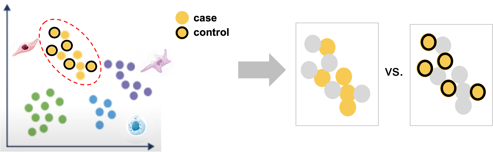

<style type="text/css">
body {
   font-size: 18px;
}
code.r{
  font-size: 12px;
}
pre {
  font-size: 12px
}

table.fig, th.fig, td.fig {
  border: 1px solid lightgray;
  border-collapse: collapse;
  padding: 12px;
}
</style>

```{r klippy, include=TRUE, echo=FALSE, message=FALSE, warning=FALSE}
klippy::klippy(lang = c("r", "markdown", "bash"), position = c("top", "right"))
library(kableExtra)
```

```{r, include = FALSE}
source("../bin/chunk-options.R")
knitr_fig_path("08A-DifferentialExpression/08A-")
```

# Workflow Overview {.unlisted .unnumbered}

<br/>

<br/>
<br/>

# Introduction

<br/>
Now that we've successfully analyzed single-cell RNA-seq data, including:     
* Secondary filtering to identify healthy, single-cells for downstream analysis.    
* Normalization to separate biological effects from technical effects.
* Integration to 
<br/>

## Objectives

<!--Add specific goals for section-->
- Summarize key decision points in workflow
- 


---

# Downstream approaches

Beyond differential expression within clusters and , there are many other possible avenues of exploration and analysis for scRNA-seq data. Including, but not limited to:

- Integration with other modalities (e.g. ATAC-seq, VDJ, etc.)

- Subclustering clusters of interest, see [HBC's summary on subclustering](https://hbctraining.github.io/scRNA-seq_online/lessons/seurat_subclustering.html), [Seurat's findSubcCluster documentation](https://satijalab.org/seurat/reference/findsubcluster) and [this related issue thread](https://github.com/satijalab/seurat/issues/1883)  

- Trajectory or Pseudotime analysis, see[Ouyang Lab's trajectory analysis](https://ouyanglab.com/singlecell/dimrd.html) or [Broad Institute's materials on trajectory analysis](https://broadinstitute.github.io/2020_scWorkshop/trajectory-analysis.html), among other resources    

- Cell - Cell communication network inference, see [review by Wilk et al (2023)](https://www.nature.com/articles/s41587-023-01782-z)

- Velocity analysis (note: not compatible with the flex probe based kits), see [the chapter from the single-cells best practices book](https://www.sc-best-practices.org/trajectories/rna_velocity.html) for detailed theory/modeling or the [10x data vignette for velocyto](https://pklab.med.harvard.edu/velocyto/notebooks/R/SCG71.nb.html) for a practical example in R

We would recommend looking for studies in similar tissues or experimental questions and see what kind of approaches and tools were used to answer questions related to your biological question

<br/>
<br/>

# Summary

<br/>
<table class='fig'><tr><td class='fig'>

</td></tr><tr><tr class='fig'><td class='fig'>Starting with labeled clustered data, for each labeled cluster, we can compare between case and control within that cluster to identify genes that are impacted by the experimental perturbation(s) for that cell-type or subtype.
</td></tr>
</table>
<br/>

Reviewing these results should allow us to identify genes of interest that are impacted by injury and in the context of the cell-types in which they are differentially expressed, formalize some hypotheses for what cell-types or biological processes might be contributing to aberrant bone formation. 

----

These materials have been adapted and extended from materials listed above. These are open access materials distributed under the terms of the [Creative Commons Attribution license (CC BY 4.0)](http://creativecommons.org/licenses/by/4.0/), which permits unrestricted use, distribution, and reproduction in any medium, provided the original author and source are credited.

<br/>
<br/>
<hr/>
| [Previous lesson](07-CellTypeAnnos.html) | [Top of this lesson](#top) | [Workshop Wrap Up](workshop_wrap_up.html) |
| :--- | :----: | ---: |
