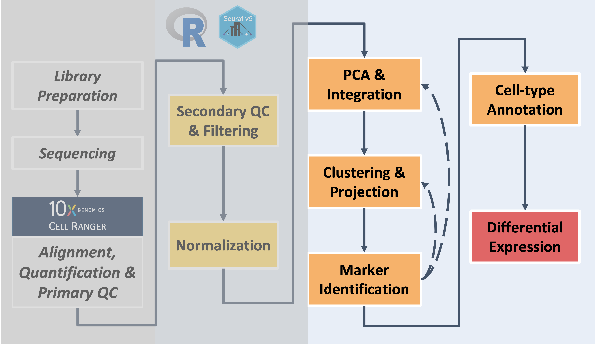

<style type="text/css">
body, td {
   font-size: 18px;
}
code.r{
  font-size: 12px;
}
pre {
  font-size: 12px
}
</style>

```{r klippy, echo=FALSE, include=TRUE}
klippy::klippy(lang = c("r", "markdown", "bash"), position = c("top", "right"))
```

```{r, include = FALSE}
source("../bin/chunk-options.R")
knitr_fig_path("XX")
```

<br/>
{title="Wayfinder: Independent Exercise"}
<br/>
<!-- Revise wayfinder image if Day 1 exercises are included -->


Build on the content and analysis steps covered in the workshop sessions by working through these independent exercises. **Note - if you work on the exercises make sure to restart R session to clear out environment before closing the window (like we have at the end of each session) to avoid lags when logging in the next day**
<br/>


# Day 1 Exercises

```{r, Day1_startup, eval = FALSE}
# =========================================================================
# Independent Exercise - Day 1 Startup
# =========================================================================

# After restarting our R session, load the required libraries & input data
library(Seurat)
library(BPCells)
library(tidyverse)

# TO ADD - loading corresponding R object for Day 1 exercises

## NOTE - BEFORE STOPPING WORK ON THE EXERCISES REMEMBER TO POWER DOWN AND RESTART R SESSION !!!!
```

<br/>

# Day 2 Exercises

```{r, Day2_startup, eval = FALSE}
# =========================================================================
# Independent Exercise - Day 2 Startup
# =========================================================================

# After restarting our R session, load the required libraries & input data
library(Seurat)
library(BPCells)
library(tidyverse)

# Use provided copy of integrated data
geo2_so = readRDS('inputs/prepared_data/rdata/geo_so_sct_integrated.rds')

## NOTE - BEFORE STOPPING WORK ON THE EXERCISES REMEMBER TO POWER DOWN AND RESTART R SESSION !!!!
```

## Day 2 Exercise 1 - Clustering with reduced number of PCs

<!--- expect to shift clustering testing to same code that Chris used to generate examples of alt clustering --->

```{r, Day2_clustering1, eval = FALSE}
## -----------------------------------------
## Round 1: try with fewer PCs included

# look at elbow plot to check PCs and alternatives to the number selected today
ElbowPlot(geo2_so, ndims = 50, reduction = 'unintegrated.sct.pca')

# select smaller value to try (we used 6)
pcs = 6

# generate nearest neighbor (graph), using selected number of PCs
geo2_so = FindNeighbors(geo2_so, dims = 1:pcs, reduction = 'integrated.sct.rpca')

# Round 2: adjust resolution after testing PCs (remember this only impacts the how the boundaries of the neighbors are drawn, not the underlying NN graph/structure)
# start with one resolution, but can see impact of changing this parameter by changing which commands are commented out/run
res = 0.2
# res = 0.4
# res = 1.0

# generate clusters, using `pcs` and `res` to make a custom cluster name that will be added to the metadata
geo2_so = FindClusters(geo2_so, resolution = res, 
                       cluster.name = paste0('int.sct.rpca.clusters_fewer'))

# look at meta.data to see cluster labels
head(geo2_so@meta.data)

# Prep for UMAP plots by creating reduction (using the reduction name we assigned in the last step)
# Note - only want to include the `pcs` in the reduction name since `res` changes the cluster divisions but not reduction run at this step
geo2_so = RunUMAP(geo2_so, dims = 1:pcs, 
                  reduction = 'integrated.sct.rpca', 
                  reduction.name = paste0('umap.integrated.sct.rpca_fewer'))
# check object ot see if named reduction was added
geo2_so

# plot clustering results
post_integration_umap_clusters_testing = 
  DimPlot(geo2_so, group.by = 'seurat_clusters', label = TRUE, 
          reduction = paste0('umap.integrated.sct.rpca_fewer')) + NoLegend()
post_integration_umap_clusters_testing # look at plot

# output to file, including the number of PCs and resolution used to generate results
ggsave(filename = paste0('results/figures/umap_int_sct_clusters_', 
                         pcs,'PC.',res,'res','.png'),
       plot = post_integration_umap_clusters_testing, 
       width = 8, height = 6, units = 'in')

## Discard all ggplot objects currently in environment to manage memory usage
# Ok since we saved the plots as we went along
rm(list=names(which(unlist(eapply(.GlobalEnv, is.ggplot))))); 
gc()

## Save a copy of the Seurat object in its current state
saveRDS(geo2_so, file = paste0('results/rdata/geo_so_sct_integrated_alt.rds'))

```

#### Check-in Questions - UMAP with fewer PCs
How does the UMAP plot look when fewer PCs are used? How is the plot impacted if different resolution parameters are used?


### Clean up session 

```{r, cleanup_day1, eval=FALSE}
## -------------------
## Clean up session 

rm(list=names(which(unlist(eapply(.GlobalEnv, is.ggplot))))); 
rm(catch_celltypes, catch_markers, geo2_catch, geo2_markers, new_metadata, top_5); 
gc()

## Save copy of geo2_seo in current state to use for future exercises
saveRDS(geo2_so, file = paste0('results/rdata/geo_so_sct_integrated_alt.rds'))
```
<br/>

**If stopping here - make sure to clear environement and restart R session!!!**
<br/>

## Day 2 Exercise 2 - Clustering with increased number of PCs

```{r, Day2_clustering2, eval = FALSE}
## -----------------------------------------
## Round 2 - choose a larger number of PCs

pcs = 20 # can use this provided value or select a different value
res = 0.8 # Set resolution (may need to test other values)

# Run code (copied from above) - outputs will use pcs and res parameters set above
# Reductions and metadata labels for clusters will be added to the existing geo2_so, with the set pcs and res values. Objects with the same name will be overwritten if code is adjusted and re-run

# generate nearest neighbor (graph) & clusters, with custom naming for metasata
geo2_so = FindNeighbors(geo2_so, dims = 1:pcs, reduction = 'integrated.sct.rpca')
geo2_so = FindClusters(geo2_so, resolution = res, 
                       cluster.name = paste0('int.sct.rpca.clusters_more'))
head(geo2_so@meta.data)

# Prep for UMAP plots by creating reduction (using the reduction name we assigned in the last step)
geo2_so = RunUMAP(geo2_so, dims = 1:pcs, 
                  reduction = 'integrated.sct.rpca', 
                  reduction.name = paste0('umap.integrated.sct.rpca_more'))
geo2_so
```
<br/>

#### Extension Challenge
Using the code from above, how would you generate a new ggplot named `post_integration_umap_clusters_testing` that uses the larger number of PCs and the clusters defined with the resolution you defined in the previous code block?

```{r, eval = FALSE}

# plot clustering results for new parameters
post_integration_umap_clusters_testing = {add your own code here}

## Remove ggplots and clean up environment 
rm(list=names(which(unlist(eapply(.GlobalEnv, is.ggplot))))); 
gc()

## Save a copy of the Seurat object in its current state to use for future exercises
saveRDS(geo2_so, file = paste0('results/rdata/geo_so_sct_integrated_alt.Rmd'))
```
<br/>

#### Check-in question - UMAP with more PCs
How does the UMAP plot look when more PCs are used? Was a higher or lower resolution needed to better align the cluster divisions to the structure observed in the UMAP plot compared to the resolution used in the workshop session?

<br/>

# Day 3 Exercises

```{r, Day3_startup, eval = FALSE}
# =========================================================================
# Independent Exercise - Day 3 Startup
# =========================================================================

# After restarting our R session, load the required libraries
library(Seurat)
library(BPCells)
library(tidyverse)

## NOTE - BEFORE STOPPING WORK ON THE EXERCISES REMEMBER TO POWER DOWN AND RESTART R SESSION !!!!
```

<br/>


## Day 3 Exercise 1 - examine impact of more or fewer PCs on marker genes and cell type predictions

Now that we've covered how to generate emperical marker genes and use a prediction tool to identify possible cell-type labels, let's start by extending the exercise from yesterday to check what our results would look like if we had proceed with fewer or more PCs.

```{r, eval=FALSE}
# Load in seurat object with your alternative clustering results from yesterday's exercises
geo2_so = readRDS('results/rdata/geo_so_sct_integrated_alt.Rmd')

# If you didn't generate your own, load the provided copy which uses XX and XX parameters
## TO ADD - copy of seurat object with "fewer" and "more" PC results added

# Check loaded object and what identities are set
geo_so
Idents(geo2_so)

## Note - in the example code, we use the results from "fewer" but can swap to "more" instead
geo2_so = SetIdent(geo2_so, value = paste0('int.sct.rpca.clusters_fewer'))
```

```{r, eval=FALSE}
## Generate cluster markers to see how that changes with new parameters 
geo2_so = PrepSCTFindMarkers(geo2_so, assay = "SCT") # NOTE - this step will take some time to run
geo2_markers = FindAllMarkers(geo2_so, only.pos = TRUE)

# Create table of top 5 markers per cluster (using default ranking)
top_5 = geo2_markers %>% filter(p_val_adj < 0.01) %>% group_by(cluster) %>% slice_head(n = 5)
head(top_5, n = 10) # look at results
write_csv(top_5, file = paste0('results/tables/top5_marker_genes_fewer.csv'))
```
<br/>

#### Check-in Question - clustering impact on marker genes
After you generate markers for the "fewer" `pcs` option, how do the results differ from the markers found for `pcs=10` in the workshop session? What do you think would happen if you tried this with the "more" results?

<br/>

```{r, eval=FALSE}
## ----------------------------------------------------
## Next - run scCATCH predictions for alternative clustering results
geo2_catch = createscCATCH(data = geo2_so@assays$SCT@counts, cluster = as.character(Idents(geo2_so)))
catch_markers = geo2_markers %>% rename('logfc' = 'avg_log2FC')
geo2_catch@markergene = geo2_markers
geo2_catch@marker = cellmatch[cellmatch$species == 'Mouse' & cellmatch$tissue %in% c('Blood', 'Peripheral Blood', 'Muscle', 'Skeletal muscle', 'Epidermis', 'Skin'), ]
geo2_catch = findcelltype(geo2_catch)

# Check predictions
geo2_catch@celltype %>% select(cluster, cell_type, celltype_score)
```

```{r, eval=FALSE}
## ------------------------------------------------------
## Use predictions to label clusters and UMAP plot

catch_celltypes = geo2_catch@celltype %>% select(cluster, cell_type)
colnames(catch_celltypes)[2] = paste0('cell_type.',pcs,'PC.',res,'res')
new_metadata = geo2_so@meta.data %>% 
  left_join(catch_celltypes, 
            by = c('seurat_clusters' = 'cluster')) # using `seurat_clusters`, which will store the most recently generated cluster labels for each cell
rownames(new_metadata) = rownames(geo2_so@meta.data) #  We are implicitly relying on the same row order!
geo2_so@meta.data = new_metadata # Replace the meta.data
head(geo2_so@meta.data)

# Create UMAP plot with new cluster labels
catch_umap_plot = DimPlot(geo2_so, group.by = paste0('cell_type.',pcs,'PC.',res,'res'), 
                          label = TRUE, reduction = paste0('umap.integrated.sct.rpca_',pcs,'PC'))
catch_umap_plot
#### Question: How did the number of pcs and/or resolution change the predictions? Do you think the predictions correspond better or worse to the cluster structure we see in the UMAP?

# Save the plot to file
# output to file, including the number of PCs and resolution used to generate results
ggsave(filename = paste0('results/figures/umap_int_catch-labeled_', 
                         pcs,'PC.',res,'res','.png'),
       plot = catch_umap_plot, 
       width = 8, height = 6, units = 'in')

## Clean up session 
rm(list=names(which(unlist(eapply(.GlobalEnv, is.ggplot))))); 
rm(catch_celltypes, catch_markers, geo2_catch, geo2_markers, new_metadata, top_5); 
gc()

## (Optional) - Save copy of geo2_so
saveRDS(geo2_so, file = paste0('results/rdata/geo_so_sct_integrated_alt.rds'))

## BEFORE PROCEEDING TO THE NEXT SECTION or closing window - POWER DOWN AND RESTART R SESSION

```
<br/>

## Day 3 Challenge - Run additional DE comparisons using session results

```{r, eval=FALSE}
## BEFORE PROCEEDING, MAKE SURE SESSION HAS BEEN restarted and environment is clear

# After restarting our R session, load the required libraries
library(Seurat)
library(BPCells)
library(tidyverse)

# load a copy of the final Seurat object (from end of Day 3)
geo_so = readRDS('/home/workshop/damki/ISC_R/results/rdata/geo_so_sct_integrated_final.rds')

# check what identities are set for the loaded Seurat object
Idents(geo_so) # expect to see Day + Cluster labels; if different identities are set, how would you change them?
## add code to change identities if needed
```

Once the cluster identities are set to the combined Day + Cluster labels, generate additional DE comparisons using the provided "psuedocode" which are comments that outline what steps are expected/needed to guide adding code to complete those outlined steps.
```{r, eval = FALSE}
## ---------------------------------------------------
## Further extension - how might you generate DE comparisons between D21 and D7 for all annotated clusters?

# check the unique cluster labels - how many clusters are present?
unique(geo_so$cell_type)

## Below is comments to help guide you though the process of looping through all the comparisons of interest, for all labeled clusters
## This section from the HBC materials could be a helpful reference to aid in filling in the code: https://hbctraining.github.io/scRNA-seq_online/lessons/pseudobulk_DESeq2_scrnaseq.html

# Create list(s) of pair-wise comparisons of interest between conditions, ideally specifying Case and Control 
# (e.g. Day 7 vs Day 0, Day 21 vs Day 7, Day 21 vs Day 0)

# Use list of comparisons and cluster identities to loop through comparisons of interest (for standard DE comparisons) and save results to files
# Try to use an outer `for` loop step though the comparisons listed in previous step and an inner `for` loop to cycle through all the clusters

# Bonus - summarize the DE results for the comparison, choosing a reasonable set of thresholds to call the number of DE genes, & save summary to file

# Clean up session. Caution - this next command clears your environment of all objects
rm(list = ls())
gc()

## BEFORE CLOSING WINDOW - POWER DOWN AND RESTART R SESSION !!!!

```


----

These materials have been adapted and extended from materials listed above. These are open access materials distributed under the terms of the [Creative Commons Attribution license (CC BY 4.0)](http://creativecommons.org/licenses/by/4.0/), which permits unrestricted use, distribution, and reproduction in any medium, provided the original author and source are credited.

<br/>
<br/>
<hr/>
| [Previous lesson](08-DifferentialExpression.html) | [Top of this lesson](#top) | [Workshop Wrap-up](workshop_wrap_up.html) |
| :--- | :----: | ---: |

