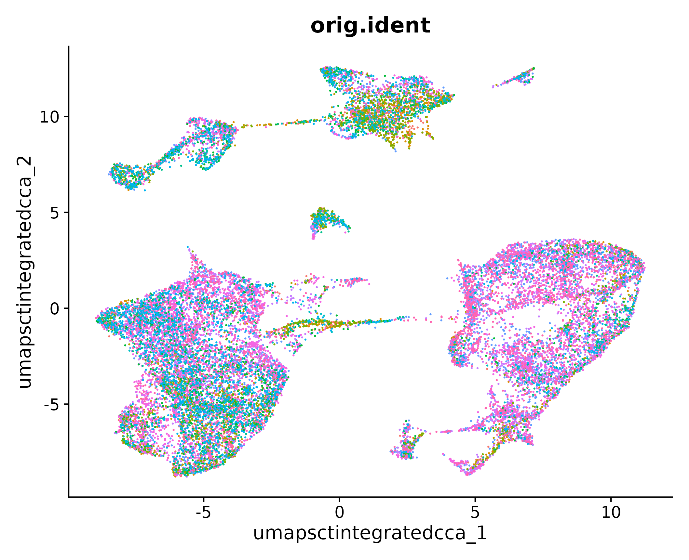
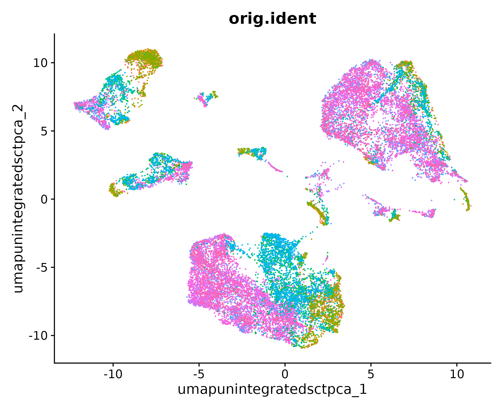

<style type="text/css">
body, td {
   font-size: 18px;
}
code.r{
  font-size: 12px;
}
pre {
  font-size: 12px
}
</style>

```{r, include = FALSE}
source("../bin/chunk-options.R")
knitr_fig_path("XX")
```

# Workflow Overview {.unlisted .unnumbered}

<br/>

<br/>
<br/> 

# Objectives

- Normalize the counts.
- Perform dimension reduction and determine number of PCs to keep.
- Understand when integration of samples might be needed.
- Execute integration of samples, and evaluate if it was "successful".
- Discuss different integration techniques offered in Seurat v5.

# Introduction 

For larger scRNA-seq projects, data may unavoidably by generated across multiple batches. As with bulk RNA-seq, some steps during <!-- add - sample and --> library preparation can be taken to avoid confounding batch effects with biological variables of interest. But it will remain necessary to correct for technical variation in the sample integration step. <!-- More here? --> <!--From DK: For 3' gene expression assays, every sample will inheriantly be a batch (since each sample must be run separately on the Chromium instrument). For methods that allow samples to be multiplexed (like the flex fixed kit), we would expect less sample to sample variablity. However in practice, we observe similar amount of variablity, likely as sample isolation and cell suspension preparation steps are likely to at least some degree of variablity. -->

In this section, we will demonstrate the steps to evaluate whether integration is needed (it usually is), and will walk through integrating the data and evaluating the effectiveness thereof. 

Like in the previous section, one integration method might be reported in a research paper but several options might have been tested before determining which approach sufficiently corrected batch effects without removing expected biological variability.

# Normalization

As with bulk RNA-seq, differences in sequencing depth is a contributing factor to technical variation in single-cell RNA-seq data. Moreover, variance stabilization in gene counts can greatly improve downstream analysis steps. Regardless of whether or not scRNA-seq data is to be integrated, it is important to normalize the count data.

Here we will use the `SCTransform()` method that is part of the Seurat package. [This manuscript](https://genomebiology-biomedcentral-com/articles/10.1186/s13059-021-02584-9) describes the initial approach, and [this updated manuscript](https://link.springer.com/article/10.1186/s13059-021-02584-9) describes the v2 version of `SCTransform()`.

> #### Other normalizations {.unlisted .unnumbered}
> 
> From the Seurat documentation, the `SCTransform()` function "replaces `NormalizeData()`, `ScaleData()`, and `FindVariableFeatures()`". You may see these three commands in other vignettes, indeed even in other Seurat vignettes ([source](https://satijalab.org/seurat/articles/sctransform_vignette)).

As we discussed when describing the structure of a `Seurat` object, the assay data is stored in layers. To conform to this convention, we will run the following command, which splits the "RNA" assay into a list of samples, each with its own layers.

```{r, eval = FALSE}
geo_so[['RNA']] = split(geo_so[['RNA']], f = geo_so$orig.ident)
```

We will now run `SCTransform()`, which will result in a new assay, the `SCT` assay.

```{r, eval = FALSE}
geo_so = SCTransform(geo_so)
```

And we can see the additional assay by viewing the `geo_so` object:

```{r, eval = FALSE}
geo_so
```
~~~
An object of class Seurat 
38503 features across 22320 samples within 2 assays 
Active assay: SCT (17129 features, 3000 variable features)
 3 layers present: counts, data, scale.data
 1 other assay present: RNA
~~~

> #### Regressing out sources of variation {.unlisted .unnumbered}
> 
> In the `SCTransform()` function there is a parameter, `vars.to.regress`, which allows us to regress out sources of variation that we don't want to play a role in downstream analyses. A common variable to regress out is `percent.mt`.

We observe at this point that `SCTransform()` performed its normalization and variable feature identification for each batch independently, and a consensus set of variable features is automatically identified for later use ([source](https://satijalab.org/seurat/articles/seurat5_integration)).

<<<<<<< HEAD
<!-- DMK - Should remaining content in this section be moved to later sections? -->

# Pre-integration evaluation
=======
We also note that within the "SCT" assay, the `counts` layer contains the corrected counts, the `data` layer contains the log(1 + counts), and the `scale.data` layer contains the pearson residuals from the SCT models.
>>>>>>> fa34027d356b508a191623c5b3b4a2fd9539c750

# Dimension reduction

In our data, we have seen our 12 samples contain 1K - 3K cells each, with measurements across 21K genes. One of our ultimate goals is to cluster the cells according to their expression profiles, and determine what cell types correspond to these clusters for the purposes of differential expression between clusters and/or between conditions within clusters.

If we only had two genes, we would make a two-dimensional plot where each axis is the expression of a gene, and each point represents a cell. We could use the Euclidean distances to determine cells that were more similar to each other than others. But as we've observed, our data contains 21K genes, which doesn't immediately lend itself to a two-dimensional plot.

Dimension reduction helps us reduce the number of separate dimensions by grouping multiple features into a single dimension. This makes downstream analyses like nearest neighbor finding and clustering more computationally feasible.

## Principal component analysis

Principal component analysis (PCA) determines axes in high-dimensional space that capture the most variation. By definition, the PCs capture the greatest factors of heterogeneity in the data set, and we can use the top PCs to approximate the full data set in downstream analysis.

Here we're assuming that biological processes affect multiple genes in a coordinated way. Therefore the top PCs likely represent biological structure rather than random tehcnical or biological noise, which affects each gene independently [(source)[https://bioconductor.org/books/3.12/OSCA/dimensionality-reduction.html#principal-components-analysis]].

<!-- An image of how PCA works? -->

Let's run PCA on the SCT normalized assay. We will name the reduction in an informative way to keep them clear for us in the future. In this case, our data has not yet been integrated, but it has been SCT normalized. So we will name the reduction `unintegrated.sct.pca`. Note that `SCTTransform()` returned a set of highly variable genes, and the `RunPCA()` function will use this subset to determine the PCs and genes associated therewith.

```{r, eval = FALSE}
geo_so = RunPCA(geo_so, reduction.name = 'unintegrated.sct.pca')
```
<<<<<<< HEAD
<!-- DMK - would suggestion removing UMAP plotting step here & we can show it as a comparisons after diving into UMAP etc later-->
After running these commands, we can visualize the cells in a UMAP plot, which projects the high-dimensional gene expression into two dimensions.
=======

In the console, the first 5 PCs are listed along with the associated genes. If we look at the `geo_so` object, we'll see our dimension reduction:
>>>>>>> fa34027d356b508a191623c5b3b4a2fd9539c750

```{r, eval = FALSE}
geo_so
```
~~~
An object of class Seurat 
38503 features across 22320 samples within 2 assays 
Active assay: SCT (17129 features, 3000 variable features)
 3 layers present: counts, data, scale.data
 1 other assay present: RNA
 1 dimensional reductions calculated: unintegrated.sct.pca
~~~

### Choosing the number of PCs

For downstream analysis, we need to make the decision of how many PCs to include. The trade-off is that including more PCs includes more of the biological signal but at the cost of including more technical variation. One way to determine how many PCs to include is by looking at an elbow plot, which shows the percent variance explained by successive PCs.

```{r, eval = FALSE}
ElbowPlot(geo_so, ndims = 50, reduction = 'unintegrated.sct.pca')
ggsave(filename = 'ISC_R/results/figures/qc_sct_elbow_plot.png')
```


In this plot, we could arbitrarily choose a number along the x-axis that looks like a sharp change in the variance from one PC to the next, that is, an elbow. Of course, the choice is not always obvious, and this plot is no different. We could also quantify our choice a bit with a helpful function:


```{r, eval = FALSE}
# Function to determine optimal PCs after RunPCA(). Thanks Dana!
optimal_pcs = function(so, reduction) {
  # quantitative check for number of PCs to include
  pct = so@reductions[[reduction]]@stdev / sum(so@reductions[[reduction]]@stdev) * 100
  cum = cumsum(pct)
  co1 = which(cum > 90 & pct < 5)[1]
  co2 = sort(which((pct[1:length(pct)-1] - pct[2:length(pct)]) > .1), decreasing = T)[1] + 1
  pcs = min(co1, co2) 
  
  return(pcs)
}
```

This function takes in a `Seurat` object and the name of a reduction. It then determines two quantities:

1. At which PC is 90% of the variation cumulatively explained, while also explaining <5% itself?
2. Where is the last difference in variation explained from one PC to the next greater than 0.1?

Of these two, the minimum number can be selected as the "elbow" in the plot. In our case, that number is 23, which we can round up to 25 for good measure.

```{r, eval = FALSE}
optimal_pcs(geo_so, 'unintegrated.sct.pca')
```
~~~
23
~~~

# Integrate Layers

<<<<<<< HEAD

In the workflow above, `SCTransform() > RunPCA() > FindNeighbors() > FindClusters()` we have what we need to run `IntegrateLayers()`:
=======
Having normalized the data with `SCTransform()` and performed the dimension reduction with `RunPCA()`, we are now able to run `IntegrateLayers()`:
>>>>>>> fa34027d356b508a191623c5b3b4a2fd9539c750


```{r, eval = FALSE}
geo_so = IntegrateLayers(
    object = geo_so, 
    method = CCAIntegration, 
    orig.reduction = 'unintegrated.sct.pca',
    normalization.method = 'SCT',
    new.reduction = 'integrated.sct.cca')
```

Note we have specified the unintegrated reduction `unintegrated.sct.pca`, which is what `IntegrateLayers()` operates on, along with the `SCT` assay. Let's take a look to see what's different about the `Seurat` object:

```{r, eval = FALSE}
geo_so
```
~~~
An object of class Seurat 
38503 features across 22320 samples within 2 assays 
Active assay: SCT (17129 features, 3000 variable features)
 3 layers present: counts, data, scale.data
 1 other assay present: RNA
 2 dimensional reductions calculated: unintegrated.sct.pca, integrated.sct.cca
~~~

Observe that we now have a new reduction, `integrated.sct.cca`, which we will use downstream.

## Alternate integration methods

New to Seurat v5 is the improved `IntegrateLayers()` function which makes selecting different integration methods much easier. The results of each alternative integration method are stored within the same `Seurat` object to make comparing downstream effects much easier. [This](https://satijalab.org/seurat/articles/seurat5_integration#perform-streamlined-one-line-integrative-analysis) Seurat vignette on integrative analysis in Seurat v5 provides examples of each integration method. Note, that the code in this vignette assumes the `NormalizeData() > ScaleData() > FindVariableFeatures()` pipeline was used. So, for example, if we wanted to run the slightly faster `RPCAIntegration` method, we would run:

```{r, eval = FALSE}
geo_so = IntegrateLayers(
  object = geo_so, 
  method = RPCAIntegration, 
  orig.reduction = 'unintegrated.sct.pca',
  normalization.method = 'SCT',
  new.reduction = 'integrated.sct.rpca')
```

Note the sepcification of `normalization.method = 'SCT'` is different than the vignette.

# Move to later sections?

<!-- This stuff belongs in Dana's section on projection and clustering... But we'll keep it here for now... -->

We now run `FindNeighbors() > FindClusters() > RunUMAP()` for the new reduction `integrated.sct.cca`:

<!-- DMK - Or is this a better break point, adding that we will delve into more detail on the `RunPCA`, `FindNeighbors() > FindClusters() > RunUMAP()` steps? -->

```{r, eval = FALSE}
geo_so = FindNeighbors(geo_so, dims = 1:25, reduction = 'integrated.sct.cca')
geo_so = FindClusters(geo_so, resolution = 1, cluster.name = 'integrated.sct.cca.clusters')
geo_so = RunUMAP(geo_so, dims = 1:25, reduction = 'integrated.sct.cca', reduction.name = 'umap.sct.integrated.cca')
```

Which sets us up to see the UMAP and evaluate whether we've reduced the condition effect on the cluster membership.

```{r, eval = FALSE}
post_integration_umap_plot_orig.ident = DimPlot(geo_so, group.by = 'orig.ident', label = FALSE, reduction = 'umap.sct.integrated.cca') + NoLegend()
ggsave(filename = 'ISC_R/results/figures/umap_integrated_sct_orig.ident.png', plot = post_integration_umap_plot_orig.ident)
```



```{r, eval = FALSE}
post_integration_umap_plot_day = DimPlot(geo_so, group.by = 'day', label = FALSE, reduction = 'umap.sct.integrated.cca') + NoLegend()
ggsave(filename = 'ISC_R/results/figures/umap_integrated_sct_day.png', plot = post_integration_umap_plot_day)
```


Indeed, it looks like we've succeeded in reducing the effect of condition on cluster membership by integrating the data.

# Rewind: Pre-integration evaluation

Prior to integration, we would like to know if there are any batch effects that carry through to the cell clusters. Most importantly, we would like to know if clusters tend to be determined by sample or condition (in this case, the day). In order to figure this out we have already run the following three commands, which we will describe in more detail later.

```{r, eval = FALSE}
# DefaultAssay(geo_so) = 'RNA'

geo_so = RunPCA(geo_so, reduction.name = 'unintegrated.sct.pca')
geo_so = FindNeighbors(geo_so, dims = 1:25, reduction = 'unintegrated.sct.pca')
geo_so = FindClusters(geo_so, resolution = 0.5, cluster.name = 'unintegrated.sct.clusters')
geo_so = RunUMAP(geo_so, dims = 1:25, reduction = 'unintegrated.sct.pca', reduction.name = 'umap.unintegrated.sct.pca')
```

After running these commands, we can visualize the cells in a UMAP plot, which projects the high-dimensional gene expression into two dimensions.

```{r, eval = FALSE}
pre_integration_umap_plot = DimPlot(geo_so, group.by = 'orig.ident', label = FALSE, reduction = 'umap.unintegrated.sct.pca') + NoLegend()
ggsave(filename = 'ISC_R/results/figures/umap_unintegrated_sct_orig.ident.png', plot = pre_integration_umap_plot)
```



From this image, we can qualitatively see that some clusters seem to be driven by the original identity. We can see this even more clearly if we use `group.by = 'day'`:

```{r, eval = FALSE}
pre_integration_umap_plot = DimPlot(geo_so, group.by = 'day', label = FALSE, reduction = 'umap.unintegrated.sct.pca') + NoLegend()
ggsave(filename = 'ISC_R/results/figures/umap_unintegrated_sct_day.png', plot = pre_integration_umap_plot)
```


We can also evaluate cluster membership by `orig.ident` or by `day` using the `table()` function:

```{r, eval = FALSE}
table(geo_so@meta.data$day, geo_so@meta.data$unintegrated.sct.clusters)
```

~~~
           0    1    2    3    4    5    6    7    8    9   10   11   12   13   14   15   16   17   18
  Day0     0   17    4 1147   50   85   46 1022  311   36   26  270  145  106   37   66   34  159    0
  Day21  108   46  195 1346   50 1239  685   15  604  384   60   95  195  176   40   41   59    5    2
  Day7  3190 2894 2428  132 1827   51  613    2   35  470  684  166   87   78  274  223  117    9  134
~~~

We can see that many clusters appear to be wholly made up of cells from one or two days. Integrating the data may solve this issue.

```{r, eval = FALSE}
DefaultAssay(geo_so) = 'SCT'
```

# Summary

Next steps: Projection and clustering


----

These materials have been adapted and extended from materials listed above. These are open access materials distributed under the terms of the [Creative Commons Attribution license (CC BY 4.0)](http://creativecommons.org/licenses/by/4.0/), which permits unrestricted use, distribution, and reproduction in any medium, provided the original author and source are credited.

<br/>
<br/>
<hr/>
| [Previous lesson](02-QCandFiltering.html) | [Top of this lesson](#top) | [Next lesson](PCAandDimReduction.html) |
| :--- | :----: | ---: |


