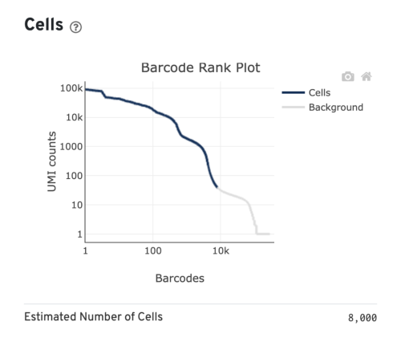

<style type="text/css">
body, td {
   font-size: 18px;
}
code.r{
  font-size: 12px;
}
pre {
  font-size: 12px
}
</style>

```{r, include = FALSE}
source("../bin/chunk-options.R")
knitr_fig_path("XX")
```

# Workflow Overview {.unlisted .unnumbered}

<br/>

<br/>
<br/>

# Introduction

As discussed at the start of the workshop, single-cell experiments using 10x Chromium instrument aim to have droplets with one cell plus one bead. However this is an inherently imperfect process and there are other important considerations like how healthy or intact the cell was at the time of measurement.

In this section, our goal is to use filtering thresholds to remove "cells" that were poorly measured or either not cells at all or included more than one cell. 

<!-- Add specific goals for section --> 

Similar to many other areas of research, there are often gaps between how single-cell data is presented versus the reality of running an analysis. 

For example, only the final filtering thresholds might be reported in a paper but our process for choosing those is likely to be more iterative and include some trial and error.

<!-- Challenge for instructors: Every vignette uses different filters, how to harmonize/give guidance? Related, how much to discuss arbitrary cutoffs and continued maturation of field?--> 
<!-- Add links to relevant resources throughout --> 

# Quality Control evaluation

<!-- Before this section - Getting started (project setup and reading in data)

<General guidance - likely to be moved to earlier section:
- Note with each function call what gets added to the Seurat object.
- Adding checks to ensure object is updated by learners since want to avoid generating copied objects
- Note what layers should be used for what, for example, counts used for FeaturePlots. RNA vs SCT assay.

Main idea: What measures and visualizations will be helpful for deciding what cells to keep?-->

## What is in our data?

Along with the expression matrices, our Seurat object also holds "meta" data, which is stored in the meta data slot of our object and can <!--objectname@meta.data--> be used to hold the following information about a single-cell dataset:

- Sample name
- Batch or sample for each cell
- Summary statistics
- Cell cycle phase for each cell
- Cluster membership for each cell
- Other custom annotations for each cell

```{r, eval = FALSE}
# Look at our meta data - edit code here

# Example from Griffith lab tutorial:
scrna[[]];
scrna@meta.data;
str(scrna@meta.data); # Examine structure and contents of meta data
levels(x=scrna); # List the items in the current default cell identity class
length(unique(scrna@meta.data$seurat_clusters)); # How many clusters are there? Note that there will not be any clusters in the meta data until you perform clustering.
unique(scrna@meta.data$Batch); # What batches are included in this data set?
scrna$NewIdentity <- vector_of_annotations; # Assign new cell annotations to a new "identity class" in the meta data
```

What are `nFeature` and `nCount`?

### nFeatures and nCounts

For single-cell RNA-seq, `nFeatures` represents the total number of genes measured per cell (non-zero rows in expression table), while `nCounts` represents the total number of UMIs / molecules measured per cell (sum of column for that cell in expression table).

> Note: for other single-cell data types, `nFeatures` would represent what's being measured in that experiment. For single-cell ATAC-seq, `nFeatures` would represents the total number of peaks (e.g. accessible areas of DNA) per cell.

Since `nFeature` and `nCount` are already stored within our Seurat object, we can look at these metrics:
```{r, eval = FALSE}
head(scrna@meta.data$nFeature_RNA); # Access genes (“Features”) for each cell
head(scrna@meta.data$nCount_RNA); # Access number of UMIs for each cell:
```

<!--Consider moving violin plots to this section-->

### Why do we count total UMIs instead of total reads? 

Since a single-cell inherently contains a limited amount of RNA molecules, a higher amount of PCR amplification is required to generate the final sequencing library. 

Since PCR can skew proportions of initial input materials, specific sequences are included in the initial capture probes called unique molecule identifiers (UMIs). As each initial probe has a different UMI sequence, each RNA captured will be tagged with a different UMI, which allows those initial RNAs and subsequent PCR duplicates to be identified and duplicates collapsed as part of the initial processing by CellRanger.  

<!--Matt may have discussed UMIs as part of CellRanger processing and Liv/Tricia may touch on as part of library generation at end of Day 2 (today)-->

### Percent Mitochondrial 

To get a sense of how many cells in each sample might have been stressed or dead, we will need to manually calculate the percentage of reads from mitochondrial sequences for each cell and manually add that to the `meta.data` slot of our Seurat object.

```{r, eval = FALSE}
# add flag to ignore capitalization OR point out difference in species?
geo_so[['percent.mt']] = PercentageFeatureSet(geo_so, pattern = '^mt-')

summary(geo_so$percent.mt)
```

> Note: we wan also generate similar stats <!--add link to code or a drop down below?--> for ribosomal RNA. However, the % ribosomal counts may not always used for filtering. In addition for a probe based library, such as the fixed FLEX kit, if there are no probes targeting ribosomal RNAs then this metric can't be generated at all

<!--code for calculating % ribo - move to a separate page or dropdown within this section-->

```{r, eval = FALSE}
ribo.genes <- grep(pattern = "^RP[SL][[:digit:]]", x = rownames(x = scrna), value = TRUE); # update to include flag to ignore case
percent.ribo <- Matrix::colSums(x = GetAssayData(object = scrna, slot = 'counts')[ribo.genes, ]) / Matrix::colSums(x = GetAssayData(object = scrna, slot = 'counts'));
scrna[['percent.ribo']] <- percent.ribo;
```


## QC visualizations

Generating visualizations for our QC metrics can be useful for choosing our thresholds. One option for visualization is a violin plot and Seurat has built in functions to generate violin plots for a single-cell data. 

<!--Consider density plots instead and recommend look at the bounds on the empirical distribution that captures X% of the cells, where that's a relatively high number-->

```{r, eval = FALSE}
VlnPlot(geo_so, features = 'nFeature_RNA')
VlnPlot(geo_so, features = 'nCount_RNA')
```

{width=75%}

{width=75%}

For choosing thresholds for each dataset, we generally use a starting point of 200-500 on low end but also look at our summary plots to determine if that fits well with the data and usually base any cutoff for the high end of `nCount` on the distributions as well.

We can also plot the percent of mitochondrial counts:
<!--consider adding histogram or density plot-->

```{r, eval = FALSE}
VlnPlot(geo_so, features = 'nCount_RNA')
```

{width=75%}

Thinking back to our goal of filtering to keep the real and healthy cells, what might be a reasonable threshold for these data? 

Generally, many tutorials use a cutoff of 5-10% mitochondrial. However, for some experiments high mitochondrial reads would be expected (such as in cases where the condition/treatment or genotype increases cell death), then a relaxed threshold would be necessary to preserve biologically relevant cells.


# Filtering

## Choosing Filtering thresholds

Since this data was downloaded from GEO, we have limited visibility on how the initial FASTQ files were processed to create the CellRanger output files uploaded for this dataset.

However, we would generally expect to use the CellRanger outputs with the `_filtered` label as our initial input for a single-cell experiment. 

Since we expect to use "filtered" CellRanger outputs, it's important to understand what prior filtering was performed by CellRanger and why would want to filter the data further? <Note - may want to skip some of this context/review depending on Matt's section>

<!--As Matt may have discussed--> CellRanger tries to draw a line between cells and empty beads (or equivalent), which we can see in the barcode rank plot from the web summary. However, we want and have the ability to draw lines between single, well measured cells and doublets or poorly measured cells/non-cells.



<!--Future idea: Wanted poster for “one good single cell”-->

Before we filter the data, how many cells are we starting with?

```{r, eval = FALSE}
# add table or plot for cells per sample
```

<!--Ideally add plot for cells per sample; consider adding summary of total number of cells per sample AND moving earlier in section?-->

Looking at the total number of cells per sample is helpful to understand both how the called "cells" compare to what was expected for the experiment. It also allows us to determine the impact of our filtering thresholds.

<!--What thresholds would we start with based on the plots alone? How does that compare to the thresholds reported in paper?-->

<!--Other “advanced” methods: out of scope for this workshop but there are packages  specifically developed to detect "doublets", e.g. droplets that contained more than one cell, such as DoubleFinder-->

<!--Additional aside - For single-nuclei experiments removing background/ambient RNA with CellBlender OR DecontX is an important additional step since nuclei are both sticky and porous-->

## Filtering data

Now that we understand our goals, let's apply our chosen filtering thresholds to our data:

```{r, eval = FALSE}
geo_so = subset(geo_so, subset = nFeature_RNA > 500 & percent.mt < 25)
```

## Evaluating filtering thresholds

To evaluate our filtering threshold choices, let's generate plots for our filtered data:

```{r, eval = FALSE}
# consider changing to panel style option, instead of three separate plots?
VlnPlot(geo_so, features = 'nFeature_RNA')
VlnPlot(geo_so, features = 'nCount_RNA')
VlnPlot(geo_so, features = 'percent.mt')
```

It can also be useful to compare the number of cells per sample before and after filtering, particularly if our input data had a larger number of "cells" than expected based on the preparation of the cells. 

<!--Add post-filter cell count table and/or barplot visualization?-->

# Summary

<br\>
<br\>

Next steps: dimensionality reduction using PCA

----

These materials have been adapted and extended from materials listed above. These are open access materials distributed under the terms of the [Creative Commons Attribution license (CC BY 4.0)](http://creativecommons.org/licenses/by/4.0/), which permits unrestricted use, distribution, and reproduction in any medium, provided the original author and source are credited.

<br/>
<br/>
<hr/>
| [Previous lesson](XXXX.html) | [Top of this lesson](#top) | [Next lesson](XXXX.html) |
| :--- | :----: | ---: |


