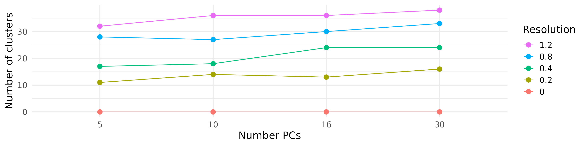

<style type="text/css">

body, td {
   font-size: 18px;
}
code.r{
  font-size: 12px;
}
pre {
  font-size: 12px
}

</style>

```{r setup, include=FALSE}
# Note that a table ande several images referenced by this page are generated in
# a separate script /images/cluster_matrix/matrix.R

library(tidyverse)
library(kableExtra)
```
---

### Why do we cluster on Principle Components (PC) instead of genes?

Most genes show little variance at all (boring). Thise that do often behave
in concert, regulating up and down in a coherent experssion program. 
Directly clustering on genes would create a lot of noise and redundancy; it
would be harder to see the most important patterns.

---

### How can such a small number of PCs faithfully represent so many genes? Aren't we throwing away a ton of information?

Selecting a few PCs helps by bringing the most important parts of the picture into focus. 

| Clustering on Genes | Clustering on PCs | 
|:-:|:-:|
|  |  |

Recall that almost all the variance (signal) in the dataset is captured in
the first handful of PCs and over 99% is captured in the first 50 PCs.

---

### What's the correct numbers of PCs and cluster resolution?

That depends on **how many cell types/cell states do you expect.** 
And the answer to that depends on:

  - the tissue/bio-fluid of origin
  - the quality of the sample / suspension
  - your experimental design
  - your research question
  - the number of cells profiled
  - the number of genes detected

For our sample data (bone biopsies from mice), we anticipate about 20 cell types.
  
---

### Couldn't the computer figure out the best PCs and resolution?

In the absence of biological context, the computer could make clusters, 
and the clusters might look good numerically, but they wouldn't be the best
representation of the different cells types.

---

### So how do we pick the right PCs and resolution?

You will want to iterate through a few cluster params. It helps to know how PCs
and resolution work together. Here's a graph of several iterations of clustering
with different PCs and resolutions.

Note that PCs have a modest effect on the number of clusters; resolution has
a strong effect on the number of clusters.



---

Consider the table of UMAPs below.

- Each UMAP was made with a different num of PCs and different resolution. (You can click on any UMAP to make it larger.)
- The first row (in black and white) shows the UMAP projection 
  without any clustering. Note that as PCs increase, the UMAPs go from "blobby" to 
  "spiky". (They gain local structure.)
- As you go down the rows, the UMAP projection is the same for a given PC, but 
  the resolution increases, making more clusters.


---

### Matrix of UMAPs

```{r render_matrix, echo=FALSE, warning=FALSE}
base_dir = "images/cluster_matrix"
cluster_stats <- read_csv(sprintf("%s/pc_res_cluster.csv", base_dir), show_col_types = FALSE) %>%
  arrange(included_pcs, resolution)

# This gnarly block generates a the html to render a table (grid) of UMAPS
# across different PCs and resolutions. We use the raw HTML for the images.
# The hover-shadow and dbox tags enable the click-to-expand lightbox effect.
df = cluster_stats %>%
    mutate(img_title=sprintf('clusters=%s : pcs=%s res=%s ', cluster_count, included_pcs, resolution)) %>%
    mutate(img_src=sprintf('%s/%s', base_dir, umap_filename)) %>%
    mutate(img=sprintf("", img_title, img_title, img_src)) %>%
    mutate(anchor=sprintf("<a class='dbox' href='%s'>%s</a>", img_src, img)) %>%
    rename(pcs=included_pcs) %>%
    select(pcs, resolution, anchor) %>%
    pivot_wider(names_from=pcs, values_from=anchor)

# Setting escape = FALSE allows kable to pass through the raw HTML so those cells
# render as images.
df %>%
  kbl(booktabs = T, align = "c", format = "html", escape = FALSE) %>%
  column_spec(1,extra_css = "vertical-align:middle;", bold=TRUE) %>%
  kable_styling()
```

```{=html}
<dialog id="js-dbox" class="dbox-dialog">
  <div class="dbox-dialog--content">
    <div class="dbox-dialog--container">
      <p class="dbox-dialog--caption" style="font-size:x-large"></p>
        <button type="button"  class="dbox-dialog--close" style="font-size:x-large">&times;</button>
    </div>
    
  </div>
</dialog>
```

```{js, echo=FALSE}
    document.addEventListener("DOMContentLoaded", function() {
        let lightbox = new Dbox();
        lightbox.run();
    });
```