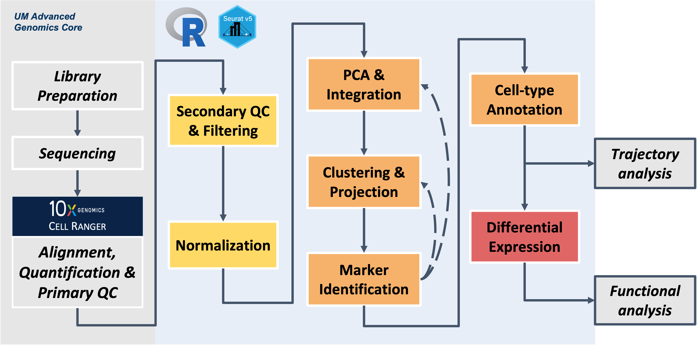

<style type="text/css">

body, td {
   font-size: 18px;
}
</style>


```{r klippy, echo=FALSE, include=TRUE}
klippy::klippy(lang = c("r", "markdown", "bash"), position = c("top", "right"))
```

```{r, include = FALSE}
source("../bin/chunk-options.R")
knitr_fig_path("XX")
```

# Workflow Overview {.unlisted .unnumbered}

<br/> 
 
<br/> 
<br/>

# Workshop exercises

Build on the content and analysis steps covered in the workshop sessions by working through these independent exercises. **Note - if you work on the exercises make sure to restart R session to clear out environment before closing the window (like we have at the end of each session) to avoid lags when logging in the next day**
<br/>


::: {.pro_tip .pro_tip_icon data-latex="{pro_tip}"}
## Reminder: RStudio, Seurat, and Memory Management

```{r, child='memory_management_tips.Rmd'}
```

:::


## Day 1

<!-- Add Rmd version of exercises with smaller code blocks --> 

<!-- Use R script as key in hidden dropdown --> 

```{r day1, file='exercises/day1.R', eval=FALSE}
```


## Day 2

<!-- link out to `clusters_faq.Rmd` to show examples? -->

```{r day2_exercise, child='exercises/day2_ex.Rmd'}
```

<!-- Use R script as key in hidden dropdown --> 

```{r day2_solution, file='exercises/day2.R', eval=FALSE}
```


## Day 3

<!-- Add Rmd version of exercises with smaller code blocks --> 

```{r day3_exercise, child='exercises/day3_ex.Rmd'}
```

<!-- Use R script as key in hidden dropdown --> 
```{r day3, file='exercises/day3.R', eval=FALSE}
```
