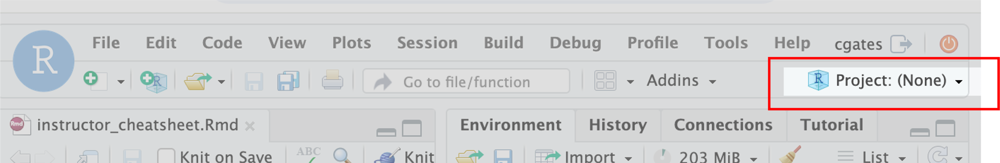

<style type="text/css">

body, td {
   font-size: 18px;
}
code.r{
  font-size: 12px;
}
pre {
  font-size: 12px
}

</style>

```{r klippy, echo=FALSE, include=TRUE}
klippy::klippy(lang = c("r", "markdown", "bash"), position = c("top", "right"))
```

## Day 2 startup

Following login to R/Studio confirm that R/Studio is set to the **ISC_R** project.
If it shows **Project: (None)**, you can either:

- select **ISC_R** from the Project dropdown, or alternatively
- Click on **Home** and **ISC_R** in the **Files** tab and then click **ISC_R.Rproj**


```{r day_2_setup, eval = FALSE}
# =========================================================================
# Day 2 set up
# =========================================================================

# -------------------------------------------------------------------------
# Set working directory
# Confirm you are in the right working directory; should be ~/ISC_R
getwd()
# Reset if necessary
setwd("~/ISC_R")

# -------------------------------------------------------------------------
# Load libraries
library(Seurat)
library(BPCells)
library(tidyverse)
options(future.globals.maxSize = 1e9)


# Load data  ---------------------------------------------------
geo_so = readRDS('~/ISC_R/inputs/prepared_data/geo_so_sct_normalized.rds')

# Alternatively, this starts from the data you saved yesterday
#geo_so = readRDS('~/ISC_R/results/rdata/geo_so_filtered.rds')
#geo_so = readRDS('~/ISC_R/results/rdata/geo_so_sct_normalized.rds')


```

## Day 3 startup
Following login to R/Studio confirm that R/Studio is set to the **ISC_R** project.
If it shows **Project: (None)**, you can either;

- select **ISC_R** from the Project dropdown, or alternatively
- Click on **Home** and **ISC_R** in the **Files** tab and then click **ISC_R.Rproj**


```{r day_3_setup, eval = FALSE}
#### Day 3 setup -----------------
# Confirm you are in the right working directory
# Should be ~/ISC_R
getwd()
# Reset if necessary
setwd("~/ISC_R")

# Load libraries  ----------------------------------------------
library(Seurat)
library(BPCells)
library(tidyverse)
options(future.globals.maxSize = 1e9)
pcs = 10

# Load data  ---------------------------------------------------
# This starts from the data you saved yesterday
geo_so = readRDS('~/ISC_R/results/rdata/geo_so_sct_clustered.rds')

#   load data --------
# read in Dana's output file from yesterday so we are all starting with the same data
geo_so = readRDS('/home/workshop/damki/ISC_R/results/rdata/geo_so_sct_clustered.rds')

#### setup end --------------------

```

## Leiden clustering, FWIW

```{r leiden_clustering, eval = FALSE}
# ==============================================================
# Leiden clustering is an alternative to Louvain clustering ----
# Note that these code blocks are specific to the workshop 
# compute environent. A different install would need some 
# customization.

# Setup python dependencies (leidenalg is implemented in python)
library(reticulate)
options(reticulate.conda_binary = "/efs/workshop/conda/base/condabin/conda")
use_condaenv('/efs/workshop/conda/isc1.1')
py_config()


# Cluster PCAs ------------------------------------------------------------
# Create KNN graph with `FindNeighbors()`
geo_so = FindNeighbors(geo_so, dims = 1:pcs, reduction = 'integrated.sct.rpca')

# generate clusters
# algorithm 4 = Leiden; using method igraph to reduces memory footprint and speed things up 
geo_so = FindClusters(geo_so,
                      resolution = 0.4,
                      cluster.name = 'integrated.sct.rpca.clusters',
                      algorithm = 4,
                      method="igraph")

# look at meta.data to see cluster labels
head(geo_so@meta.data)

```
