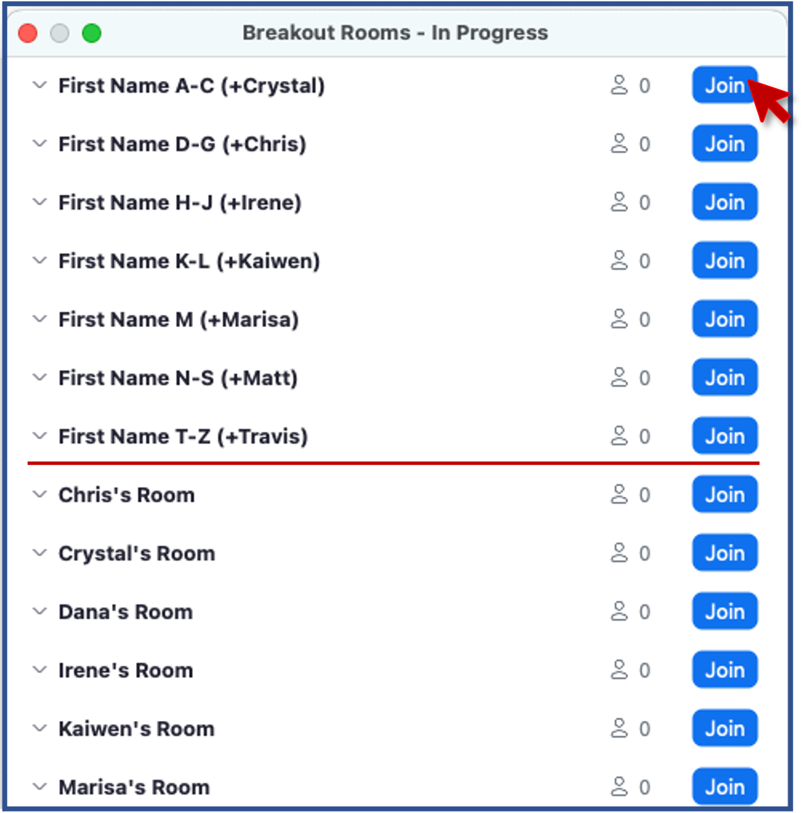

# Workshop goals and topics

 - By the end of the workshop, attendees will be able to
    - Describe (at a high level) how sc samples are sequenced along with strengths of a few popular library preps.
    - Create and interpret preliminary QC visualizations from a sc experiment.
    - Use Seurat, PCA, and UMAP to create cell-type clusters and projections.
    - Identify marker genes and annotate clusters based on gene expression.
    - Execute and visualize differential expression across clusters.

 - This workshop is targeted toward researchers who would like to be able to run
   scRNA-Seq analysis independently. This workshop assumes some experience working with 
   R/R-Studio.  Basic understanding of NGS sequencing protocols and/or familiarity with
   bulk RNA-Seq analysis is desirable.

 - Please let us know if there is anything we can do to improve the workshop experience.

 - Our purpose is not to be exhaustive, there is a lot that we cannot cover in
   the allotted time, and we don't expect anyone to be an expert at the end of
   the workshop. But we hope you will have a familiarity with key concepts, data types,
   tools, and how they all connect to one another in the service of a biological question.

## About the workshop team
|  |  |  |  | 
|:-:|:-:|:-:|:-:|
| **Chris** | **Marci** | **Raymond** | **Dana** |
|  |  |  | 
| **Travis** | **Olivia** | **Ram** |
|  |  |  |
|  **Matt** |  **Joe** | **Nick** |
 

# Code of Conduct

- Be kind to others. Do not insult or put down others. Behave professionally. Remember that
  harassment and sexist, racist, or exclusionary jokes are not appropriate for the workshop.

- All communication should be appropriate for a professional audience including people of many
  different backgrounds. Sexual language and imagery is not appropriate.

- The Bioinformatics Core is dedicated to providing a harassment-free community for everyone,
  regardless of gender, sexual orientation, gender identity and expression, disability, physical
  appearance, body size, race, or religion. We do not tolerate harassment of participants in any
  form.

- Thank you for helping make this a welcoming, friendly community for all.

- If you have questions about the CoC please reach out to the hosts during the workshop, or
  email us at bioinformatics-workshops@umich.edu.

- To report a CoC incident/concern, please email Chris Gates (Bioinformatics Core, Managing
  Director) at cgates@umich.edu or contact the University of Michigan Office of Institutional
  Equity at institutional.equity@umich.edu.
 
 

# Using Zoom and Slack

- We will be recording this session. Recordings will be available to participants  
  following the workshop.

## 

- Zoom controls are at the bottom of the Zoom window:

- To minimize distractions, we encourage participants to keep their audio muted
  (unless actively asking a question).
- To maximize engagement, we encourage participants to keep their video on.
- Slack works better than Zoom's Chat function so avoid Zoom Chat for now.
- You can enable transcription subtitles for your view.
- We will be using Breakout Rooms occasionally for ad-hoc 1-1 helper support.
  We will review this in detail together in a few minutes.
- Zoom's "Reactions" are a useful way to interact. You can access these from the **React** button.

  - **Raise Hand** to request clarification or ask a question. (Same an in-person workshop.)
  - Instructors will use **Green check** and **Red X** to poll the group
    at checkpoints along the way.
 
 

### Exercise: Use Zoom non-verbals
  - Everyone use Zoom to raise your hand. 
 
 

### Exercise: Using Zoom Breakout Rooms
Take a moment to briefly introduce yourself (name, dept/lab, area of study) in a
breakout room.

  - Zoom: Click Breakout Rooms
  - Find the room corresponding to the first letter of your first name
  - Click **Join** button to the right of the room.
  - When you have completed introductions, you can leave the breakout room to rejoin the main room.

  
 
 

## 

- **Slack** can be used to communicate to the group or to individuals and has a
  few features/behaviors that we prefer over Zoom's Chat functionality.

  - Slack messages will be posted to the **2024-02-intro-single-cell** channel.  
    Click on the channel in the left pane (1) to select this channel.
  - You can type in the **message field** (2); click **send** (3) to
    post your message to everyone.
  - Helpers will respond in a Slack thread (or pose the question to the instructor)
  - You can respond in a message thread by hovering over a message to trigger
    the message menu and clicking the **speech bubble** (4).

### Exercise: Responding in Slack thread
In your scRNA-Seq experiment, what do/did you hope to find? 
 
 

## Review of Key communication patterns
| |  |  |
|-|:-:|-|
| "I have an urgent question" |  | **Post a question** |
| "I have a general question" | | **Post a question** |
| "I'm stuck / I need a hand" | | **Post a note** |
| Instructor check-in |  -or-  | |
| Instructor Slack question | | **Respond in Slack thread** |
 
 

### Exercise: Group checkpoint
  - Using Zoom, give me a **green-check** if you feel like you understand
    communication patterns or **red-X** if you need clarification.
 
 

## Logging in to the shared server

To start, we will access our shared RStudio server by opening a web browser to the following URL:

<!--[https://bfx-workshop02.med.umich.edu/](https://bfx-workshop02.med.umich.edu/){target="_blank"}-->

**(The correct URL will be supplied by the instructor via Slack.)**

You should now be looking at a page that will allow you to login to the RStudio server:

Enter your user credentials and click <kbd>Sign In</kbd>. Your username and password were provided via email, but if you need help, a helper can retrieve it for you if you ask in Slack.

Once you click <kdb>Sign In</kbd>, your screen will go blank for a few seconds. 
This sometimes will feel like a longer delay (possibly up to **60 seconds**);
this is ok.

Once logged in, you should now see the RStudio interface:

 
 

## Arranging your screens
It is important that you can see:

 - Zoom (instructor's shared screen + reactions)
 - Your R/Studio screen
 - Slack
 - Lesson plan web page

 
 

# Any questions?
 -
 -

---

# Thank you to our sponsors/contributors

## [UM BRCF Bioinformatics Core](https://brcf.medicine.umich.edu/bioinformatics){target="_blank"}

- The University of Michigan BRCF Bioinformatics Core is a team of analysts that help
  researchers **design, analyze, and interpret** high-throughput genomics experiments.
- Last year we helped about 60 researchers design and execute about 100 projects
  including gene expression, epigenetic, variant identification, functional
  enrichment and many other kinds of analyses.
- We provide letters of support for grant proposals.
- We are creating a series of bioinformatics-focused workshops.

## [Biomedical Research Core Facilities](https://brcf.medicine.umich.edu/){target="_blank"}

  Biomedical Research Core Facilities (BRCF) helps researchers economically take advantage of
  the latest technology and collaborate with top experts in the field. Established in 1986, the
  BRCF was formed to offer centralized access to research services and equipment.
 
 

## [University of Michigan Library](https://www.lib.umich.edu/){target="_blank"}

  Our mission is to support, enhance, and collaborate in the instructional, research, and
  service activities of faculty, students, and staff, and contribute to the common good by
  collecting, organizing, preserving, communicating, sharing, and creating the record of human
  knowledge.

 
 

## Acknowledgements

* Sections of the workshop were extended/adapted from or inspired by sources
below. These and other specific references are cited throughout the text and/or
in the __References__ section of each lesson.
  * [Harvard Chan Bioinformatics Core Single-cell RNA-seq data analysis workshop](https://hbctraining.github.io/scRNA-seq_online/){target="_blank"}
  * [Orchestrating Single-Cell Analysis with Bioconductor](https://bioconductor.org/books/3.15/OSCA/){target="_blank"}
  * [Satija lab @ New York Genome Center](https://satijalab.org/){target="_blank"}
  * [10x Genomics](https://www.10xgenomics.com/support/single-cell-gene-expression/documentation){target="_blank"}

* The workshop Code of Conduct has been adapted the NumFocus Code of Conduct (https://numfocus.org/code-of-conduct) which itself draws from from numerous sources, including the Geek Feminism wiki, created by the Ada Initiative and other volunteers, which is under a Creative Commons Zero license, the Contributor Covenant version 1.2.0, the Bokeh Code of Conduct, the SciPy Code of Conduct, the Carpentries Code of Conduct, and the NeurIPS Code of Conduct.

* These workshop lesson plans have been adapted and extended from materials 
listed above. These are open access materials distributed under the terms of the
[Creative Commons Attribution license (CC BY 4.0)](http://creativecommons.org/licenses/by/4.0/), 
which permits unrestricted use, distribution, and reproduction in any medium,
provided the original author and source are credited.
